<div align="center">

# RapidLLM

**RapidLLM (Registry · Attention · Pipeline · Inference · Dispatch) — A production-grade LLM inference serving framework with pluggable Triton/CUDA kernels.**

[](https://github.com/harleyszhang/rapid_llm/blob/main/README.md)
[](https://github.com/harleyszhang/rapid_llm/blob/main/README.zh.md)


<pre>
<b>Acceleration Features</b>
         ✅ Flash attention     ✅ Cuda Graph Optimize   ✅ Chunked Prefill         ✅ Prefix Caching
         ✅ W8A16 (fp8/int8)    ✅ W4A16 (AWQ/GPTQ)      ✅ SmoothQuant W8A8        ✅ FP8 KV Cache (2×)
         ✅ NVFP4 weight-only   ✅ FP8 W8A8 Fused MoE    ✅ TP + CUDA Graph
         ✅ Kernel Autotune     ✅ Fused MoE             ✅ Tensor Parallel         ✅ Data Parallel
         ✅ Comm-Compute Overlap ✅ Tile-Signaling       ✅ DP × CUDA Graph         ✅ DeepSeek V4 (mHC)

<b>Framework Design</b>
         ✅ Continuous batching ✅ OpenAI API server     ✅ Preemption              ✅ Ops Backend Registry
</pre>

</div>

## Features

Up to **6.5×** speedup over HuggingFace `transformers` (Qwen3-0.6B, A10, greedy) — see the [benchmark table](#qwen3-06b-benchmark) below. The list is grouped by what each part does for a deployment; deep dives with figures and on/off measurements live in [Optimize Features](#optimize-features) and [Observability](#observability).

**Serving and scheduling**

- **Continuous batching**: requests join and leave a running batch, so an arrival never waits for the current generation to finish. On one A10 with Qwen2.5-1.5B-Instruct and requests arriving 250 ms apart, throughput goes from 93 → 644 tok/s (**6.9×**) and mean latency from 19.1 s → 2.3 s (**8.3×**) — see [docs/continuous_batching.md](./docs/continuous_batching.md).
- **Chunked Prefill** (v0.7): long prompts split into 512-token chunks so per-step prefill work is bounded (2000 → 512 tokens, 3.9× lower peak) — decode requests interleave instead of waiting behind a whole prompt.
- **Prefix Caching** (v0.7): block-hash chained prefix reuse — shared system prompts are prefilled once and reused by later requests; LRU-evicted under capacity pressure (aligned with vLLM's `BlockPool`).
- **Preemption** (v0.7): opt-in recompute-based eviction (`enable_preemption`) when the running set exceeds slot capacity; evicted requests re-queue with a progress quantum that prevents livelock.
- **OpenAI-compatible server** (`rapid-llm serve`): `/v1/completions` and `/v1/chat/completions` with streaming — the official `openai` client works unchanged. See [docs/online_serving.md](./docs/online_serving.md).
- **Streaming reasoning & tool-call parsing** (v0.11): `reasoning_parser` / `tool_parser` are **request fields**, not server flags — one deployment serves R1-style and direct models side by side. Streamed frames concatenate to the one-shot message by construction (tested as an axiom); DeepSeek/Qwen tool marker families; ~1.2 µs/token. Details in [Structured Streaming Output](#structured-streaming-output).

**Parallelism and overlap**

- **Tensor Parallelism**: split a 30B MoE model across 2× A10 (24 GB) with one all-reduce per block.
- **Data Parallelism**: replicate the model across GPUs and route requests between them — **2.00×** throughput on 2 GPUs (100% linear). Every replica captures and replays its own decode graph (tp=1 per replica, so no collective lands inside a graph): TPOT 25.9 → 5.2 ms and 618 → 6162 tok/s on 2× A10 with Qwen3-0.6B.
- **CUDA graph**: decode-stage capture (within batch-size limits), including under tensor parallelism — gated by a grid-agreement all-reduce and a graph-vs-eager numerical check, because a mismatched graph under TP hangs in a collective instead of raising; `RAPID_LLM_TP_CUDA_GRAPH=0` restores eager. A graph × TP × quant cross-validation suite (bf16/fp8/nvfp4) runs every combination and demands byte-identical greedy output.
- **Compute–communication overlap** (v0.11.5): five primitives that hide transfers and collectives behind compute, each behind its own switch — L1 pinned-copy uploads (on by default), L2 two-batch ping-pong, L3 chunked all-reduce, SBO single-batch MoE overlap, L4 tile-signaling kernels. Every one is measured on/off on the same workload, and the regressions ship in the same table as the wins — see [docs/release-v0.11.5.md](./docs/release-v0.11.5.md).

**Memory and quantization**

- **Weight quantization**: W8A16 — fp8 checkpoints with 128×128 block scales (auto-detected from `config.json`) and runtime int8 (`--quantization int8`); W8A8 — true fp8 and SmoothQuant int8 with dynamic per-token/per-channel scales, dense and MoE experts (`--quantization fp8` / `smoothquant`); W4A16 — AWQ/GPTQ group-128 checkpoints; NVFP4 weight-only — 2.85× smaller weights than bf16. Up to **6.9×** decode speedup over HF fp16; the 4-bit schemes trade speed for footprint on an H100, and the per-shape numbers are in [docs/quantization.md](docs/quantization.md).
- **FP8 KV Cache** (v0.6): `--kv-cache-dtype fp8` halves KV memory — **1.91× capacity** (282K vs 148K tokens on A10) with only 9% throughput cost.
- **MLA — DeepSeek-V2-Lite end-to-end** (v0.11): every token caches one 576-element latent row instead of per-head K and V (5120 for the same architecture uncompressed), through the same `(dim,)` KV row every other model uses; under TP the latent is replicated, not sharded. On 2× A10: **33.6k vs 9.3k KV tokens per GiB** of pool memory vs a GQA model on the same card, golden-gated against `transformers` token by token.

**Kernel layer**

- **Attention backends**: `flashattention2`, `flashdecoding` (with `NopadAttention` for unpadded sequences and GQA support); dynamic KV-cache management via paged `TokenAttention` slots.
- **Operator fusion**: SwiGLU runs the silu gate and the elementwise multiply in one Triton launch; residual-add + RMSNorm fuse into `skip_rmsnorm` (a zero residual degrades to plain RMSNorm); K/V projections fuse into a single GEMM; hand-written Triton kernels for `rmsnorm`, `rope`, `softmax`, and element-wise multiply.
- **Fused MoE**: top-k routed experts run as one grouped-GEMM pipeline — `moe_align_block_size` → gate-up GEMM → `silu_and_mul` → down GEMM with the router weight folded in → `moe_sum` — in fp16, fp8, int8, and int4 variants; DeepSeek's grouped routers (V2 `group_limited_greedy`, V3 `noaux_tc`) run as single kernels.
- **Kernel Autotune** (v0.5): offline search persists optimal tile configs per `(GPU, op, shape)` to `~/.cache/rapid_llm/autotune/`; kernels auto-load on startup.
- **Backend registry & declarative dispatch** (v0.8/v0.9): every kernel is a `KernelSpec` row (availability / capability / dtype+scheme / shape / layout / golden); selection is `filter → rank → cache` with availability checks, a per-rejection reason, and `explain_selection()`; a frozen measured ranking replaces hand-written priorities; environment-variable override and graceful degradation when a backend's dependency is missing. One dispatch costs 27 µs at construction time and nothing per step.

**Observability**

- **Token scores** (v0.10): `logprobs=k` reports the chosen token and its top-k alternatives, `prompt_logprobs=k` scores every prompt position — both out of the forward pass that was happening anyway, no rescoring run. Verified against `transformers` on every position.
- **Metrics and tracing** (v0.10): Prometheus `/metrics` (queue time, TTFT, TPOT, token counters) with no `prometheus_client` dependency, plus one OTLP span per request when a collector is configured. Measured cost is below the 0.5% run-to-run noise.

**Models**

- `llama3`, `Qwen2.5/Qwen3`, `Qwen3-MoE`, `LLaVA-1.5`, `Qwen3-VL`; `top-p` / `top-k` sampling and streaming output.
- **DeepSeek-V4 (trimmed) end-to-end** (v0.11.5): mHC residual, Compressor + Lightning Indexer, SWA/CSA hybrid attention and Hash MoE run through the engine with per-module golden tests; prefill reaches **1.06×** `transformers` at seq 2048 while decode stays CPU-bound — both numbers published. See [DeepSeek-V4](#deepseek-v4-v0115).

## Setup and Installation

> If you don't have a physical server, you can try using [VirtAI Cloud remote server](https://growthdata.virtaicloud.com/t/hK).

Requires Python 3.13+, CUDA-capable PyTorch 2.13.0+ and Triton 3.7.1+.

```bash
uv pip install -e .           # runtime deps
uv pip install -e . --group dev
pre-commit install
```

Development:

```bash
make lint      # ruff check + ruff format --check
make format    # ruff --fix + ruff format
make test-cpu  # runs everything not marked gpu/weights
make test-gpu  # requires CUDA
```

`pre-commit` bundles ruff, typos, markdownlint, actionlint, a filename-space guard, and a custom hook that rejects hard-coded absolute paths in library code. The `tests` GitHub Actions workflow runs the CPU test subset on 3.13+ for every PR; the `pre-commit` workflow runs every hook against the whole tree.

## Quick start

### Get the weights

Point `--model-dir` at a HuggingFace checkpoint directory — the one holding `config.json` and `*.safetensors` — exactly as `modelscope download` leaves it.

There is no conversion step: `config.json` is parsed by `AutoConfig`, and the weights are streamed from the safetensors shards straight into the model, with the K/V projections fused and the MoE experts stacked on the way in (see `rapid_llm/models/weights.py`).

```bash
modelscope download Qwen/Qwen2.5-0.5B         --local-dir my_weight/Qwen2.5-0.5B
modelscope download Qwen/Qwen3-0.6B           --local-dir my_weight/Qwen3-0.6B
modelscope download llava-modelscope/llava-1.5-7b-modelscope  --local-dir my_weight/llava-1.5-7b-modelscope
modelscope download Qwen/Qwen3-VL-4B-Instruct --local-dir my_weight/Qwen3-VL-4B-Instruct
modelscope download Qwen/Qwen3-30B-A3B-Instruct-2507-FP8 \
    --local-dir my_weight/Qwen3-30B-A3B-Instruct-2507-FP8
```

Legacy `pytorch_model*.bin` checkpoints still load; safetensors wins when both are present.

### Offline Batched Inference

Text generation:

```python
from rapid_llm import TextGenerator, SamplingParams

gen = TextGenerator(checkpoints_dir="my_weight/Qwen2.5-0.5B")
params = SamplingParams(temperature=0.0, max_gen_len=64)
print(gen.generate(["The capital of France is"], params))
```

Streaming:

```python
for step in gen.stream(["The capital of France is"], params):
    print(step[0], end="", flush=True)
```

**Image conditioned generation**:

```python
from PIL import Image
from rapid_llm import VisionGenerator, SamplingParams

gen = VisionGenerator(checkpoints_dir="my_weight/llava-1.5-7b-modelscope")
img = Image.open("docs/images/llava_test/dog.jpeg").convert("RGB")
prompt = "USER: <image>\nDescribe the animal in one sentence. ASSISTANT:"
print(gen.generate(prompt, [img], SamplingParams(temperature=0.0, max_gen_len=48)))
```

### CLI

llava-1.5-7b-modelscope default inference:

```bash
export RAPID_LLM_MODEL_DIR=my_weight/Qwen2.5-0.5B
rapid-llm chat                              # interactive multi-turn chat (/clear resets)
rapid-llm serve --port 8000                 # OpenAI-compatible API server
rapid-llm batch --show-stats                # a prompt set through the scheduler
rapid-llm vl-chat --model-dir my_weight/llava-1.5-7b-modelscope \
                   --image docs/images/dog.jpeg \
                   --prompt "USER: <image>\nWhat animal is this? ASSISTANT:"
```

llava-1.5-7b-modelscope default inference:

```bash
python -m rapid_llm.cli chat --model-dir my_weight/Qwen3-30B-A3B-Instruct-2507-FP8
```

Qwen3-VL model, single pictures inference:

```bash
cd /home/honggao/projects/open_source/rapid_llm
python -m rapid_llm.cli vl-chat \
    --model-dir my_weight/Qwen3-VL-4B-Instruct \
    --image docs/images/llava_test/dog.jpeg \
    --prompt "What animal is in this picture? Answer in one sentence." \
    --temperature 0.0 --max-gen-len 48
```

Qwen3-VL-4B-Instruct, Multi-image + Sampling mode:

```bash
# 多图 + 采样模式
python -m rapid_llm.cli vl-chat \
    --model-dir my_weight/Qwen3-VL-4B-Instruct \
    --image docs/images/llava_test/dog.jpeg docs/images/llava_test/dog2.png \
    --prompt "Compare the animals in these pictures." \
    --temperature 0.7 --top-p 0.9

# 默认 prompt(Describe this image.)
python -m rapid_llm.cli vl-chat \
    --model-dir my_weight/Qwen3-VL-4B-Instruct \
    --image docs/images/llava_test/extreme_ironing.jpg
```

Multimodal decode can also replay a captured CUDA graph — the vision tokens
sit in the KV cache by then, so the decode step is the same graph a text
model replays. Like `chat`, the REPL defaults to eager (one turn in flight
never amortises capture latency); pass `--cuda-graph` for long replies:

```bash
python -m rapid_llm.cli vl-chat \
    --model-dir my_weight/Qwen3-VL-4B-Instruct \
    --image docs/images/llava_test/dog.jpeg \
    --prompt "What animal is in this picture? Answer in one sentence." \
    --temperature 0.0 --max-gen-len 48 --cuda-graph
```

### Evaluation

After `cli.py` runs successfully, the terminal displays the interface as shown below, and you can enter your question in the terminal.

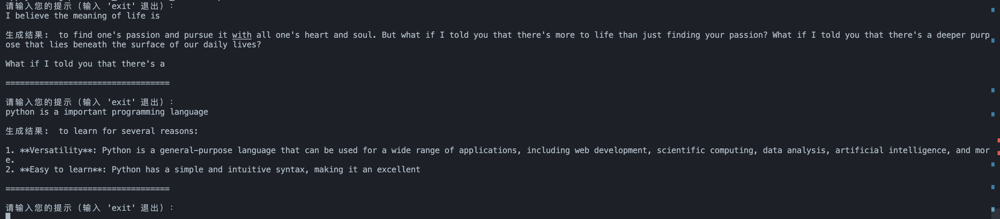

After `generate.py` runs successfully, the terminal displays the interface as shown below, and you can enter your question in the terminal.

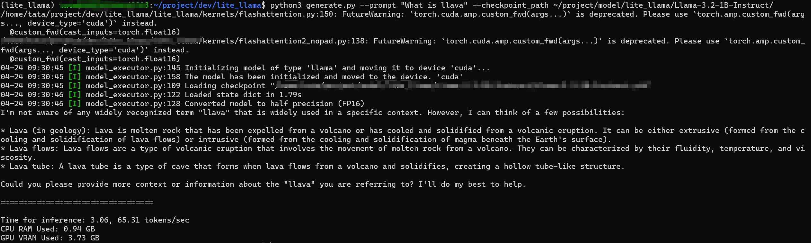

After `cli_llava.py` runs successfully, the terminal displays the interface as shown below, enter your picture and prompt word in the terminal, and then enter.

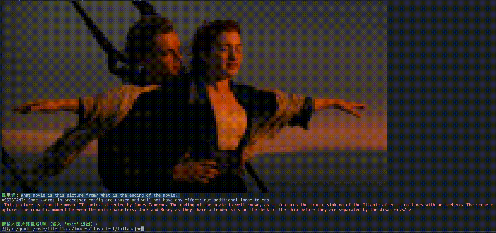

For performance test, after changing your model weight path, run `rapid_llm/examples/benchmark.py` file directly, it will output the latency and throughput performance comparison between rapid_llm and transformers libraries, the result of the first run is not very accurate, so we suggest you to take the second run as a reference. For example, for the Llama-3.2-3B model with `prompt_len = 25`, `batch_size = 12`, and `max_gen_len = 1900`, the result of benchmark:

```bash
rapid_llm inference time: 31.3463 s
Transformers inference time: 69.1433 s
rapid_llm throughput: 730.45 tokens/s
Transformers throughput: 183.95 tokens/s
rapid_llm per token latency: 1.369015 ms/token
Transformers per token latency: 5.436221 ms/token
```

## Optimize Features

### Continuous Batching

Six requests, three slots. Watch the slot column: when a request finishes, the slot it held is decoding a queued request on the very next step.

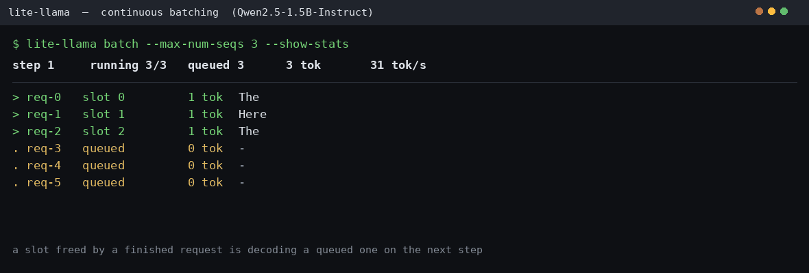

Serve an OpenAI-compatible API:

```bash
pip install 'rapid-llm[serve]'
rapid-llm serve --model-dir my_weight/Qwen2.5-1.5B-Instruct --port 8000
```

```bash
curl localhost:8000/v1/chat/completions -H 'Content-Type: application/json' \
  -d '{"model": "Qwen2.5-1.5B-Instruct",
       "messages": [{"role": "user", "content": "Explain a GPU in one sentence."}],
       "max_tokens": 64}'
```

Or drive the engine directly — every prompt is an independent request, and each carries its own sampling parameters:

```python
from rapid_llm import ContinuousBatchingEngine, SamplingParams

engine = ContinuousBatchingEngine.from_pretrained(
    "my_weight/Qwen2.5-1.5B-Instruct", max_num_seqs=16
)
engine.add_request("Name the capital of Japan.", SamplingParams(max_gen_len=32))
engine.add_request("Write a haiku about rain.", SamplingParams(temperature=0.8, max_gen_len=64))

while engine.has_unfinished_requests():
    for request in engine.step():
        print(f"[{request.request_id}] {request.delta}", end="", flush=True)
```

Asynchronously, with concurrent coroutines sharing one batch:

```python
import asyncio
from rapid_llm import AsyncLLMEngine, SamplingParams

async def main():
    async with AsyncLLMEngine.from_pretrained("my_weight/Qwen2.5-1.5B-Instruct") as engine:
        async def ask(prompt):
            async for chunk in engine.generate(prompt, SamplingParams(max_gen_len=64)):
                print(chunk.delta, end="", flush=True)
        await asyncio.gather(ask("Hello"), ask("Goodbye"))

asyncio.run(main())
```

### Tensor Parallelism

Where data parallelism replicates the model, **tensor parallelism** splits the weights themselves — the only option when one card cannot hold the checkpoint. Pass `--tensor-parallel-size N` and the engine spawns the extra ranks itself; one GPU stays in one process, so a breakpoint in the engine loop is still a breakpoint in the kernel.

```bash
# 30B MoE on 2x A10
python -m rapid_llm.cli chat \
    --model-dir my_weight/Qwen3-30B-A3B-Instruct-2507-FP8 \
    --tensor-parallel-size 2
```

```python
from rapid_llm.engine.continuous_engine import ContinuousBatchingEngine

engine = ContinuousBatchingEngine.from_pretrained("my_weight/Qwen3-8B", tensor_parallel_size=2)
```

The engine never learns how many processes run its model: it hands a plan to an `Executor` (`UniProcExecutor` for one GPU, `MultiprocExecutor` for many) and gets sampled tokens back. Because the plan is pure data, driver and follower ranks run one code path rather than two — no mirror process re-deriving the batch from a broadcast prompt, which is what used to turn any disagreement into an NCCL hang. Plans travel on a CPU (gloo) group so the control plane never stages through GPU memory, while the vocabulary-parallel sampler exchanges **two scalars per row** instead of gathering logits, keeping per-step traffic independent of vocabulary size.

That last claim is not an argument — it is measured. Every collective reports its payload to a **collective ledger**, so you can ask a step what it cost:

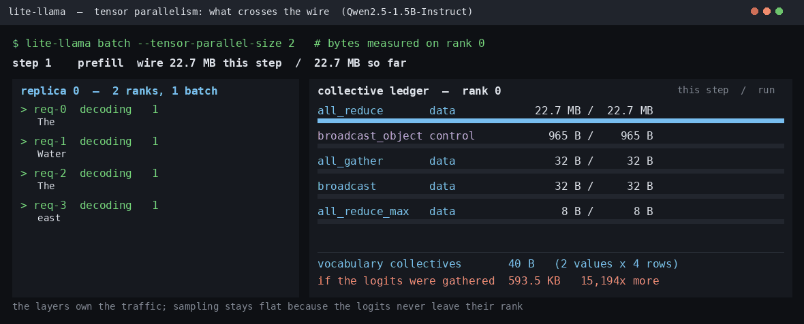

```python
from rapid_llm.tools.observability import CollectiveStats

with CollectiveStats.collect() as stats:
    engine.step()
print(stats.report())          # per-op calls and bytes, split data / control plane
```

Recording is windowed, so the default path costs one `if`; windows nest, so a per-step window inside a whole-run window comes out of a single pass. Regenerate the GIF above with `python scripts/gen_collective_gif.py` — it drives a real `tp=2` engine and every byte in it is a measurement.

See [docs/tensor_parallel.md](docs/tensor_parallel.md) for the design, the sharding rules (including why QKV is split per segment under GQA), and what byte-exact parity between `tp=1` and `tp=2` can and cannot assert under fp16.

### Multi-head Latent Attention (v0.11)

DeepSeek-V2-Lite runs end-to-end (`rapid-llm serve --model-dir my_weight/DeepSeek-V2-Lite --tensor-parallel-size 2`): every token caches one 576-element latent row (512 lora + 64 rope) instead of per-head K and V, through the same `(dim,)` KV row every other model uses. Under TP the latent is **replicated, not sharded** — it is single-KV-head, so splitting it would leave no rank able to compute attention alone; the consequence is that a per-rank pool IS the whole-model pool, and the benchmark reports it under that convention.

On 2× A10 (batch=8, gen=128, eager decode): TTFT 64.8 ms, TPOT 63.01 ms; KV density **33.6k tokens/GiB** of pool memory vs 9.3k for Qwen3-1.7B's GQA on the same card — the 3.6× is the config-parsed 30.4 vs 112.0 KiB/token showing up in a real pool. `python benchmarks/bench_mla.py` prints the honest version of this table: two models that are not the same size, labeled as such, with the latency columns run on one identical workload.

Accuracy is a gate, not a hope: `pytest tests/golden/test_deepseek_v2_tp2.py` compares greedy tokens and per-step logprobs against `transformers` on 2× A10, with drift budgets calibrated from a parity probe — the BOS investigation showed a single-layer max-abs threshold can flag a 1-ULP arithmetic tie as a hotspot, so the budget is what the noise floor actually measured, not a round number.

### DeepSeek-V4 (v0.11.5)

V4 has no public weights, so the end-to-end path is verified against a randomly-initialised trimmed checkpoint built from its `config.json`: mHC residual (Sinkhorn mixing), the Compressor + Lightning Indexer pair, SWA/CSA hybrid attention over a 512-dim latent KV, O-LoRA grouped projections and Hash MoE. Eight module-level tests plus a TP2 consistency test carry the numerics; `python benchmarks/bench_deepseek_v4.py` measures the speed side against `transformers`.

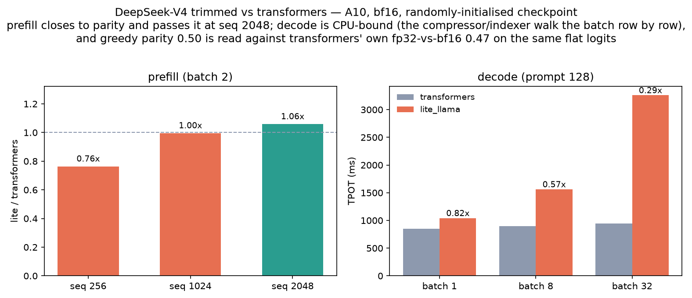

Prefill closes to parity and passes it at seq 2048 (1.06×); decode is CPU-bound rather than kernel-bound — the compressor and indexer walk the batch row by row in Python, so a batch-32 step issues ~8.7k kernel launches for ~22 ms of GPU work. That is on the chart, not hidden behind it, and fp4 weights are not supported yet.

### Cross-Stream Overlap (L1)

A continuous-batching step can hold up to three passes — prefill, extend, decode — and each pass needs its input tensors on the GPU. With L1 overlap (on by default, `RAPID_LLM_OVERLAP=0` to disable) the next pass's upload leaves on a dedicated copy stream while the current forward is still running, so the H2D transfer hides inside the compute instead of serialising behind it. The engine step harvests tokens once at the end rather than synchronising after every pass, which is what makes the overlap structurally possible at all.

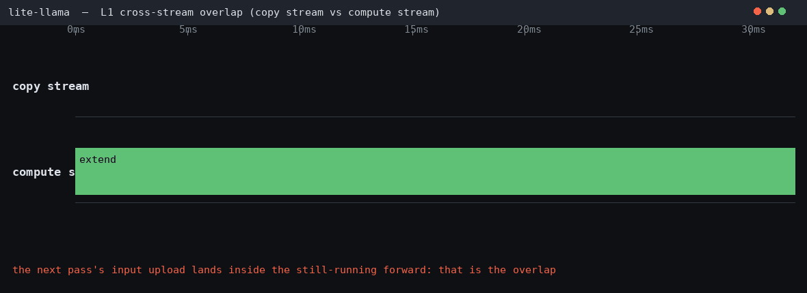

The GIF is rendered from the engine's own CUDA-event timeline (`RAPID_LLM_OVERLAP_TIMELINE=1`): the extend forward fills the window on the compute stream while the next pass's upload lands inside it on the copy stream — the intersection is the overlap, not a rendering trick. Measure both sides with `python -m benchmarks.overlap.levels --level l1 --timeline`; regenerate the picture with `python scripts/gen_overlap_l1_gif.py`.

### Decode Host-Overhead Cuts (v0.11.1)

Two things every layer did every decode step now happen once per engine: the MoE router's fp32 gate widen (a cast kernel per layer per step for a weight that is frozen after load) and the attention K/V half-view slicing (the paged layout packs K and V in one row; both kernels want halves, so each step cut two views of a buffer that never changes identity). Both are host-side costs, so the win grows with depth and shrinks with batch: Qwen3-30B-A3B eager TPOT **-3.5%** at batch 1, -2.6% at batch 8; graphs +2.0% throughput with byte-identical greedy output.

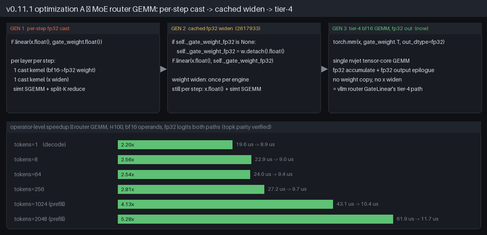

The router kept evolving after the release: the cached fp32 widen gave way to vllm's tier-4 path — `torch.mm(x, gate_weight.T, out_dtype=fp32)`, a single bf16 tensor-core GEMM whose epilogue emits fp32 logits directly, dropping both the weight copy and the per-step activation widen. Operator-level (H100, topk parity verified before timing): 2.2× at decode, 5.28× at 2048 tokens, geomean 3.23×; e2e A/B on the same tree: graph TPOT another **-2.6%** / TPS +2.7%.

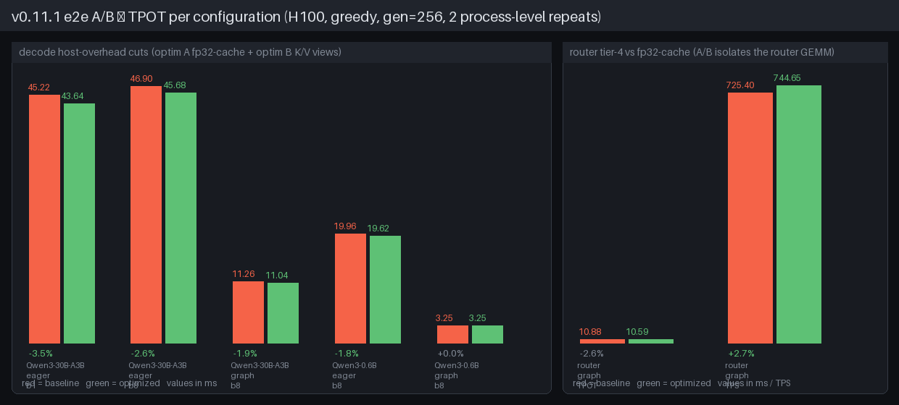

The same release fixed a TP=2 + captured-graph shutdown deadlock: `ncclCommAbort` on a graph-captured communicator parks in a futex, and the old teardown ordered the two ranks' aborts one after another instead of side by side. Teardown now rendezvouses every rank at a gloo barrier, destroys before joining followers, and carries a 15 s deadline whose last resort is abandoning the wedged group to die with the process. The graph × TP × quant cross-validation suite went from a 900 s timeout to 11/11 green.

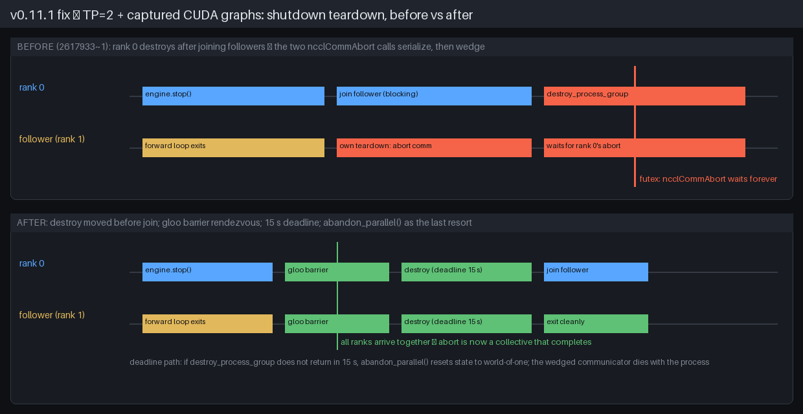

All three figures are generated from the shipped benchmark logs — `python scripts/gen_v0111_release_figs.py` re-renders them; numbers and method in [docs/release-v0.11.1.md](docs/release-v0.11.1.md).

### Compute–Communication Overlap (L2 / L3 / L4)

L1 covers the host↔device axis. Three more primitives hide communication and kernel boundaries, each behind its own switch, so a deployment adopts them one at a time and can attribute any change to a single flag.

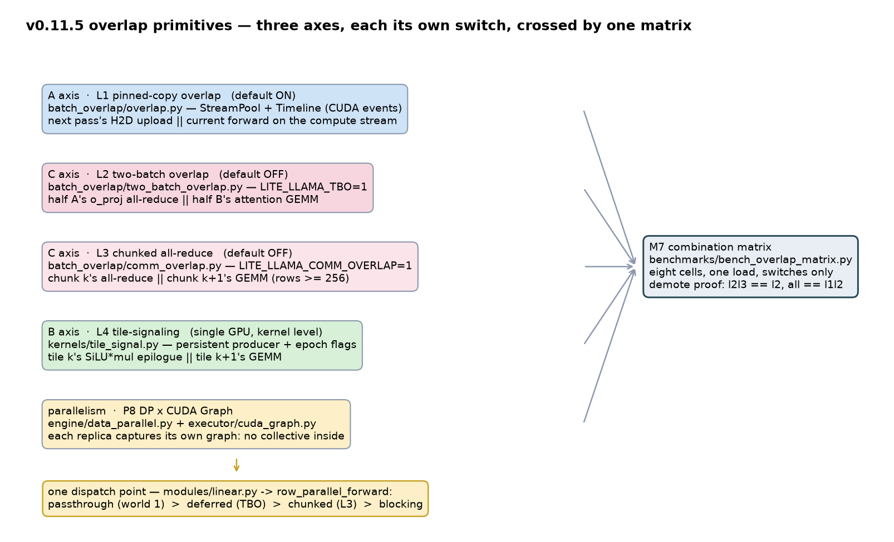

**L2 two-batch overlap** (`RAPID_LLM_TBO=1`, off by default) splits a TP decode step into two halves that ping-pong at layer-segment granularity: while half A's `o_proj` all-reduce is on the comm stream, half B's attention GEMMs hold the SMs.

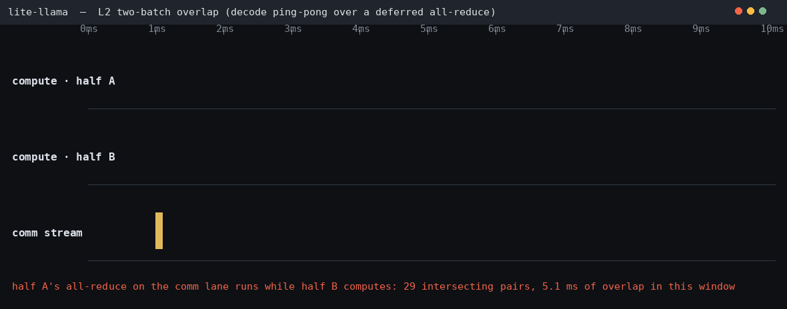

The GIF is the engine's own CUDA-event timeline — two compute lanes for the halves, one comm lane for the deferred reductions, and the red band is their intersection on a single device clock. The overlap does happen: the benchmark's timeline counts 792 intersecting pairs totalling 65.5 ms, and the GIF shows one such window. Eager TBO still loses on 2× A10 PCIe (+134% TPOT), because an eager TP decode step costs ~27 ms of Python launch time that a graphed reference of the same load cuts to 6.2 ms — the primitive saves GPU time inside a step whose cost is CPU time. Graph-captured TBO is now implemented (the engine wires `enable_cuda_graph(tbo=True)` through `TboPolicy.capture_eligible`, per captured batch): replay is numerically identical to the eager interleave and the launch floor drops from 60 ms to ~10 ms — but on this dense 1.5B TP2 PCIe shape the interleave itself is net-negative (+47-61% TPOT vs a plain graph), because the all-reduce it can hide is ~3-5% of the step while the half-batch efficiency it pays is more. The switch stays off by default, and the full four-arm regression is published next to the evidence (`python -m benchmarks.overlap.levels --level l2 --timeline`).

**L3 chunked all-reduce** (`RAPID_LLM_COMM_OVERLAP=1`, off by default) splits one row-parallel GEMM by rows: chunk k's reduction goes on the wire the moment its GEMM lands, while chunk k+1 computes.

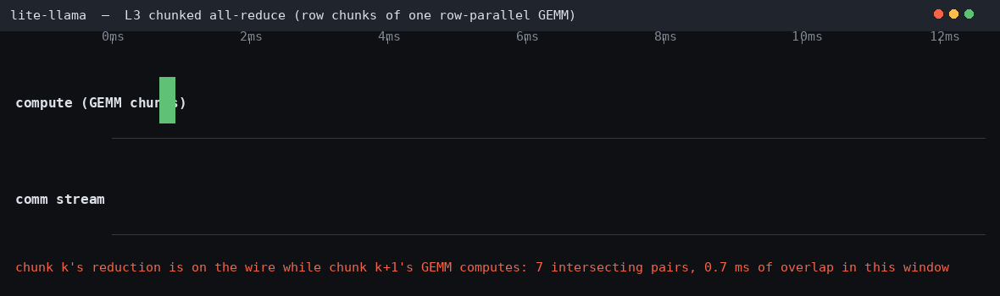

Row independence is what makes this legal — the sum a chunk reduces is the sum the unsplit GEMM would have produced for those rows. `RAPID_LLM_L3_MIN_ROWS` (512) plus a 256-row-per-chunk floor keep small GEMMs on the blocking path, where one collective beats two. Prefill is where it earns: TTFT 33.25 → 33.07 ms on a TP2 chunked-prefill load, with 111 real overlaps recorded in the timeline.

**SBO single-batch overlap** (`RAPID_LLM_SBO=1`, off by default) covers the case TBO cannot: an EP decode step with only one batch, so no second half to ping-pong against. It overlaps inside the MoE layer instead — the dispatch exchange goes on the wire first, and the shared MLP moves onto an alternate compute stream, so it computes while the tokens travel. Without it the shared MLP runs *after* dispatch, experts and combine, hiding neither exchange. Verified on two ranks: identical output with the switch on and off, and the two regions intersecting on one device clock.

**L4 tile-signaling** (`rapid_llm/kernels/tile_signal.py`) works inside one device: a persistent Triton producer publishes each output tile with a release-semantics flag write, and a consumer kernel acquires that flag with a bounded spin, so tile k's SiLU·mul epilogue runs while tile k+1's GEMM is still computing.

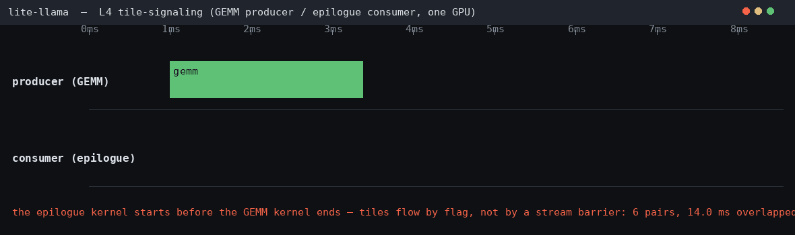

Nothing here touches the interconnect, so these numbers say nothing about NVLink: +8.0~13.7% on large shapes (4096×4480×1536: 5.85 → 5.05 ms) and a loss on small ones, where the persistent kernel's resident occupancy is pure overhead. Producer and consumer grids together are capped at the SM count, and a host-side watchdog backs the bounded spin up.

L2 and L3 aim at the same all-reduce, so only one can own it: `row_parallel_forward` dispatches passthrough → deferred (TBO) → chunked (L3) → blocking, and the demotion is tested rather than documented. The eight-cell matrix runs one workload with nothing but the switches moving — it is what caught a TBO numerical regression that every per-feature parity test had passed:

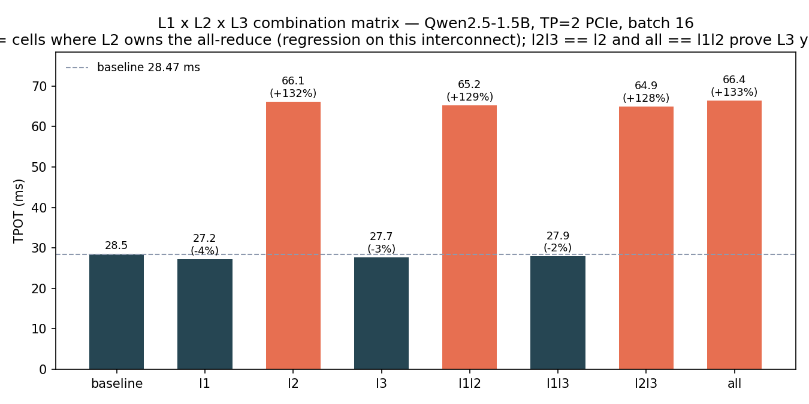

Full tables, the nsys kernel-level evidence, and the negative results sit in [docs/release-v0.11.5.md](./docs/release-v0.11.5.md); `python scripts/gen_overlap_gifs.py` regenerates the three timelines above straight from a live engine.

### Quantization

rapid_llm supports multiple weight quantization schemes (architecture aligned with [sglang](https://github.com/sgl-project/sglang)). See [docs/quantization.md](docs/quantization.md) for the full design and API.

|  Scheme  |  CLI Flag  |  Weight  |  Activation  |  Speedup vs HF  |
| -------- | ---------- | -------- | ------------ | --------------- |
| fp8 (checkpoint) | auto-detected | fp8-e4m3 | fp16 | 6.4× |
| int8 (runtime) | `--quantization int8` | int8 | fp16 | 6.3× |
| fp8 W8A8 (runtime) | `--quantization fp8` | fp8-e4m3 | fp8-e4m3 | 3.1× |
| int4 AWQ/GPTQ | auto-detected | int4 | fp16 | — |
| smoothquant | `--quantization smoothquant` | int8 | int8 | — |
| nvfp4 | `--quantization nvfp4` | fp4-e2m1 | bf16 | smallest weights, **slower than bf16** |
| fp8 KV cache | `--kv-cache-dtype fp8` | — | — | 2× KV capacity |

fp8 W8A8 covers MoE experts too: `fused_moe` quantises activations per token, worth
1.18× over fp16 at 512 tokens and **33% slower** at decode width, where the two extra
quantisation launches land on an already launch-bound layer. NVFP4 is weight-only
(sm90 has no fp4 MMA), so it buys memory and costs time. Both, with the measured
numbers behind them, are in [docs/quantization.md](docs/quantization.md); the full
2×H100 matrix — kernel, offline, online, TP/DP/graph/KV — is in
[docs/benchmark_logs/quant_matrix_20260901.md](docs/benchmark_logs/quant_matrix_20260901.md).

**FP8 checkpoint** (auto-detected from `config.json`):

```bash
python -m rapid_llm.cli chat --model-dir my_weight/Qwen3-30B-A3B-Instruct-2507-FP8
```

**Runtime int8 quantisation** (halve memory of any fp16 model):

```bash
python -m rapid_llm.cli chat --model-dir my_weight/Qwen2.5-0.5B --quantization int8
```

**True W8A8 fp8** (no weight dequantisation, per-token fp8 activations):

```bash
python -m rapid_llm.cli chat --model-dir my_weight/Qwen3-0.6B --quantization fp8
```

**FP8 KV cache** (halve decode memory footprint):

```bash
python -m rapid_llm.cli chat --model-dir my_weight/Qwen3-0.6B --kv-cache-dtype fp8
```

**Vision-language models** (Qwen3-VL / LLaVA, single GPU):

```bash
# Qwen3-VL vision chat
python -m rapid_llm.cli vl-chat \
    --model-dir /data/shared/llm_weights/Qwen3-VL-4B-Instruct \
    --image photo.jpg

# LLaVA with INT8 quantisation
python -m rapid_llm.cli vl-chat \
    --model-dir /data/shared/llm_weights/llava-hf/llava-1.5-7b-hf \
    --image photo.jpg --quantization int8
```

> `vl-chat` is single-GPU: tensor parallelism runs through the continuous-batching
> engine, which hosts text checkpoints only, so `--tensor-parallel-size > 1` exits with
> that message rather than pretending.

#### Qwen3-0.6B Benchmark

Environment: (A10, batch=4, greedy)

How to run Benchmarks:

```bash
# Single model
python benchmarks/bench_quant.py --model-dir /data/shared/llm_weights/Qwen3-0.6B \
    --schemes fp16 int8 fp8 --json docs/benchmark_logs/bench_quant_Qwen3-0.6B.json

# All representative models (Qwen3-0.6B, 0.6B-FP8, VL-4B, 30B-MoE)
python benchmarks/bench_quant.py --all
```

Quantization Benchmark Result (A10, Qwen3-0.6B, batch=4, seq_len=25, gen_len=64, greedy):

|  Config  |  Model Mem  |  KV Capacity  |  TPOT (ms)  |  TPS  |  vs HF fp16  |
| -------- | ----------- | ------------- | ----------- | ----- | ------------ |
| HF fp16 (baseline) | 1.17 GB | — | 28.19 | 141.7 | 1.0× |
| lite fp16 | 1.40 GB | 147,875 tok | 4.14 | 918.8 | **6.5×** |
| lite int8 | 0.99 GB | 141,549 tok | 4.16 | 904.1 | **6.4×** |
| lite int8-blockwise | 1.00 GB | 138,385 tok | 4.44 | 849.4 | **6.0×** |
| lite fp8 (W8A8) | 0.99 GB | 139,153 tok | 8.35 | 448.1 | **3.2×** |
| lite smoothquant (W8A8) | 0.99 GB | 135,642 tok | 3.70 | 983.8 | **6.9×** |

> Model Mem = model weights only; KV Capacity = max cached tokens (paged pool fills remaining GPU memory).
> Benchmark logs: [`docs/benchmark_logs/`](docs/benchmark_logs/)

Quantization benchmark visualization (Qwen3-0.6B, A10, all schemes vs HF fp16):

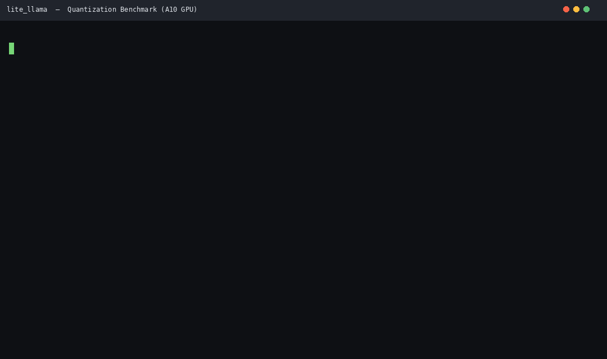

#### Qwen3-VL-4B-Instruct Benchmark

A10, batch=4, seq_len=25, gen_len=64, greedy benchmark result:

|  Config  |  Model Mem  |  KV Capacity  |  TPOT (ms)  |  TPS  |
| -------- | ----------- | ------------- | ----------- | ----- |
| lite fp16 | 8.99 GB | 73,676 tok | 23.36 | 170.7 |
| lite int8 | 5.61 GB | 93,559 tok | 27.47 | 145.3 |
| lite int8-blockwise | 5.71 GB | 92,748 tok | 27.97 | 142.7 |
| lite fp8 (W8A8) | 5.61 GB | 93,345 tok | 59.25 | 67.4 |
| lite smoothquant (W8A8) | 5.61 GB | 93,559 tok | 34.00 | 117.5 |

> Vision tower stays fp16 (not quantised); only language model projections are quantised.

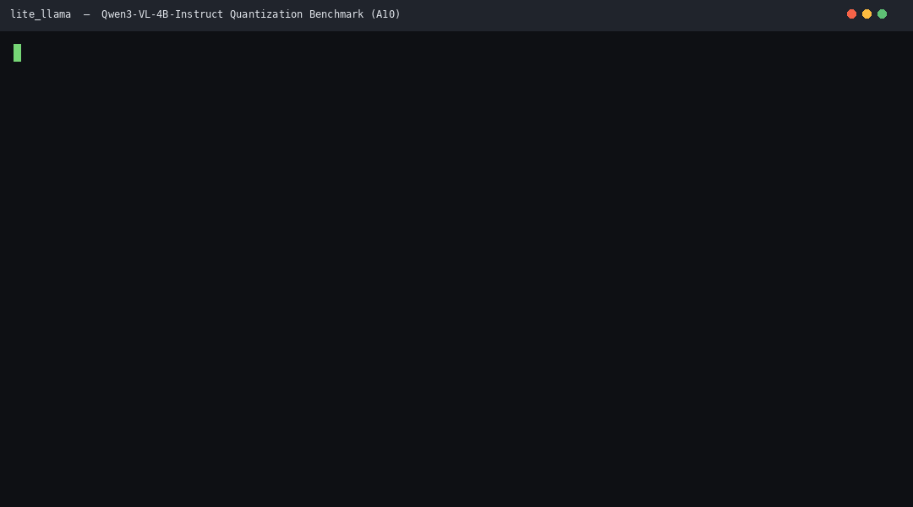

### Data Parallelism

Where tensor parallelism splits one model across GPUs, data parallelism replicates the whole model onto each GPU and routes the request stream between the replicas — for throughput once one card is saturated. Each prompt is dealt to a replica by a load balancer (round-robin or least-loaded), and the replicas decode their own batches concurrently. See [docs/data_parallel.md](docs/data_parallel.md) for the design (it mirrors vLLM's `DPEngineCoreProc` / `DPLBAsyncMPClient` and SGLang's `DataParallelController`) and the benchmarks.

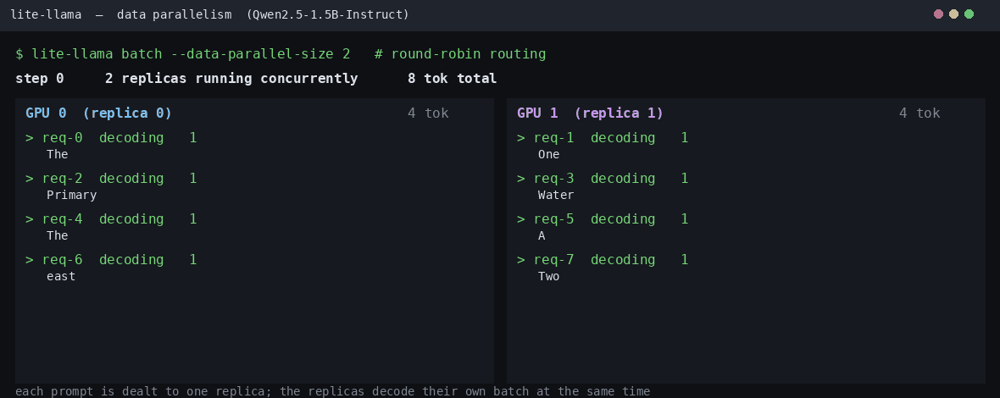

```python
from rapid_llm import DataParallelEngine, SamplingParams

# Two whole-model replicas, one per GPU; requests routed round-robin.
with DataParallelEngine(model="my_weight/Qwen2.5-1.5B-Instruct", data_parallel_size=2) as engine:
    outputs = engine.generate(prompts, SamplingParams(temperature=0.0))
```

For serving, `rapid-llm serve --data-parallel-size 2 --load-balancer total_tokens` swaps in `AsyncDataParallelEngine`, which streams each request's chunks from whichever replica the balancer picks and aborts a request whose connection drops.

On 2× A10 (Qwen2.5-1.5B-Instruct): **weak scaling 2.00x** (100% linear, 1857 → 3716 tok/s) with byte-identical outputs, and **1.64x** on a fixed 256-prompt batch. Compose it with TP — `data_parallel_size=2, tensor_parallel_size=2` — on a 4-GPU box.

Each replica can also replay a captured decode graph. A replica is tp=1, so no collective is captured inside its graph and the replicas never lockstep through a replay — DP scaling and graph replay compose instead of fighting:

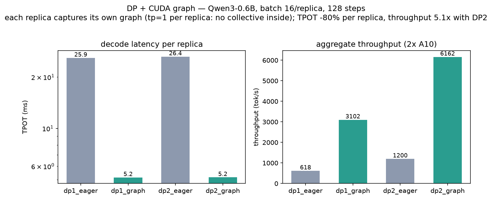

Qwen3-0.6B, batch 16 per replica, 128 steps: TPOT 25.9 → 5.2 ms per replica (**-80%**) and 618 → 6162 tok/s aggregate (**5.1×**) at DP2, with the +2.4 s capture cost and the per-GPU memory delta recorded in the log. `python benchmarks/bench_data_parallel.py --mode graph --model my_weight/Qwen3-0.6B` reproduces it; `tests/engine/test_dp_cuda_graph.py` asserts both replicas hold captured graphs and agree greedily.

## Observability

### Token Scores (`logprobs` / `prompt_logprobs`)

A sampled token on its own tells you what the model said, not how close the call was. `logprobs=k` returns the drawn token's log-probability together with the `k` most likely alternatives it outranked; `prompt_logprobs=k` does the same for every position of the prompt, which is what perplexity scoring and prompt debugging need. Both come out of the forward pass the request was already paying for — there is no second scoring pass — and both are off by default.

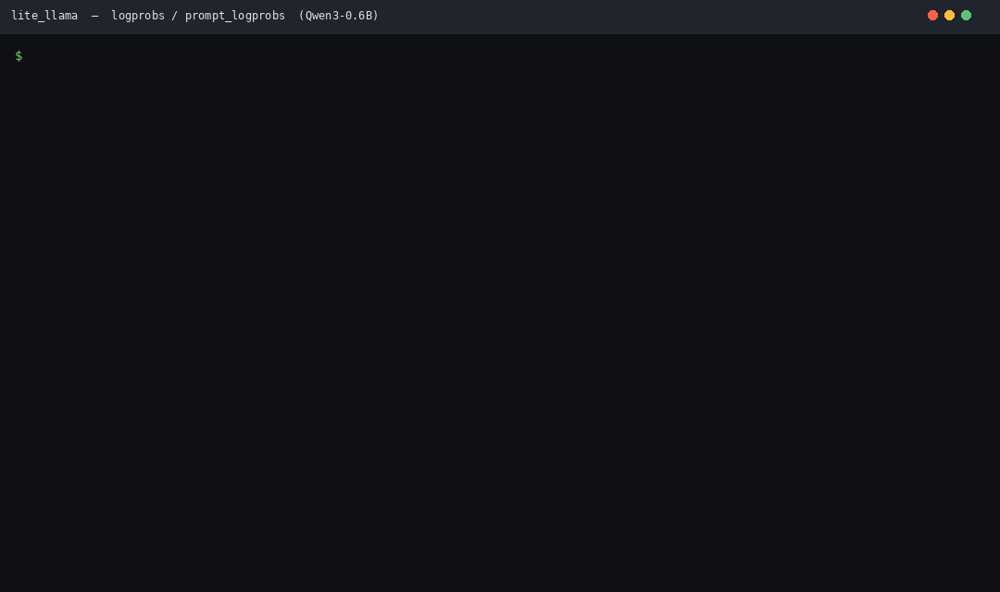

The GIF is a real Qwen3-0.6B run (`python scripts/gen_logprobs_gif.py`): position 1 of the prompt shows `' capital'` at -12.8, and the last generated token is a near tie — `' Italy'` at -1.74 beat `' France'` at -1.86, exactly the case a mean-logprob filter is there to catch.

```python
from rapid_llm import LLM, SamplingParams

llm = LLM(model="my_weight/Qwen3-0.6B")
output = llm.generate(["The capital of France is"], SamplingParams(logprobs=5, prompt_logprobs=5))[0]

for record in output.outputs[0].logprobs:      # one per generated token
    print(record.token_id, record.logprob, record.top_token_ids, record.top_logprobs)
print(output.prompt_logprobs[0])               # None: nothing predicts position 0
```

Over the server, `/v1/completions` takes `logprobs` / `prompt_logprobs` directly, and `/v1/chat/completions` follows the OpenAI shape (`logprobs: true` plus `top_logprobs: 5`):

```bash
curl localhost:8000/v1/completions -H 'Content-Type: application/json' -d '{
  "model": "Qwen3-0.6B", "prompt": "The capital of France is",
  "max_tokens": 8, "logprobs": 5, "prompt_logprobs": 5}'
```

Cost, measured with `python benchmarks/bench_observability.py` (A10, Qwen3-0.6B, batch=16, gen=128): `logprobs=5` moves TPOT 4.75 → 5.35 ms (throughput -10.4%) because each step adds a `log_softmax` + `topk` + a device-to-host copy; `prompt_logprobs=5` moves TTFT 23.3 → 32.0 ms and costs -1.5% throughput, since it only touches prefill. Log: [`docs/benchmark_logs/observability_v0.10.json`](docs/benchmark_logs/observability_v0.10.json).

### Metrics and Tracing

`rapid-llm serve` exposes a Prometheus endpoint — request counters, in-flight gauges, and the queue-time / TTFT / TPOT histograms on vLLM's bucket grid. The text format is a few lines per metric, so there is no `prometheus_client` dependency to install:

```bash
rapid-llm serve --model-dir my_weight/Qwen3-0.6B &
curl -s localhost:8000/metrics | grep -A2 time_to_first_token
```

```text
# HELP rapid_llm:time_to_first_token_seconds Arrival to first generated token.
# TYPE rapid_llm:time_to_first_token_seconds histogram
rapid_llm:time_to_first_token_seconds_bucket{le="0.5"} 0
rapid_llm:time_to_first_token_seconds_bucket{le="1"} 3
rapid_llm:time_to_first_token_seconds_sum 1.8414203859865665
rapid_llm:time_to_first_token_seconds_count 3
```

Collection is opt-out (`RAPID_LLM_METRICS=0`) and tracing is opt-in: set `RAPID_LLM_OTLP_ENDPOINT=http://localhost:4318` and each request becomes one span carrying its id, prompt and output token counts, and finish reason. Without the endpoint the tracer is a no-op object — nothing is imported, nothing is timed, and the OpenTelemetry SDK stays an optional install. Both together stay inside the 0.5% run-to-run noise of the same benchmark above, because the work is a handful of float additions per request rather than per token.

### Single-Layer Harness

A whole-network run is a bad place to find out that one decoder layer is wrong. The harness builds exactly one layer, on one GPU, and can mirror the matching `transformers` layer's weights to compare numerically — no checkpoint download needed, which is the point when the model is 671B and the change is one attention variant:

```bash
# timing + which kernel each op dispatched to, random weights
python scripts/layer_harness.py --model-dir my_weight/Qwen3-0.6B --layer 0

# numerical parity against transformers' own layer, as a gate
python scripts/layer_harness.py --model-dir my_weight/Qwen3-0.6B \
    --layer 3 --weights mirror --tolerance 2e-2

# real weights under a decode-shaped load
python scripts/layer_harness.py --model-dir my_weight/Qwen3-0.6B \
    --layer 3 --weights checkpoint --batch 4 --seq-len 512 --decode-steps 32
```

`--tolerance` turns the comparison into a gate (non-zero exit above it), so the harness works as a pre-flight check in CI as well as by hand.

## Structured Streaming Output

What the model is thinking, and which tools it wants to call, are properties of the reply — so they are declared **per request**, not per deployment. vLLM and SGLang pick one reasoning parser at server start (`--reasoning-parser`), which means one deployment serves one output style; here `reasoning_parser` and `tool_parser` are fields of `ChatCompletionRequest` (validated at the schema layer), so the same server streams R1-style and direct models side by side.


The GIF is a real Qwen3-1.7B run (`python scripts/gen_reasoning_gif.py`): the prompt opens the think tag itself, so the splitter is born inside a thinking section (`starts_inside=True`) and has to catch the closing tag mid-stream — every delta lands in its channel and the tags never leak through.

```bash
curl localhost:8000/v1/chat/completions -d '{
  "model": "m", "stream": true,
  "messages": [{"role": "user", "content": "Tokyo weather?"}],
  "reasoning_parser": "deepseek_r1",
  "tool_parser": "deepseek"
}'
```

Two switches, independently composable: `reasoning_parser` routes `<think>…</think>` into `delta.reasoning_content`; `tool_parser` (DeepSeek or Qwen marker families) streams `delta.tool_calls` by call index and flips `finish_reason` to `"tool_calls"`. Three properties hold by construction rather than by luck:

- **Streamed == one-shot is an axiom.** The parsers hold any delta that might complete a tag until it cannot, so an arbitrary chunking of a reply concatenates to what a one-shot parse of the same text says — the parser tests enumerate every two-cut split, and a server-level test asserts the streamed frames merge to the one-shot message on the same request.
- **`finish_reason` is its own frame.** The parser's flush (a tool call cut mid-JSON, a held partial tag) must reach the client before it stops reading, so the terminal frame is an empty delta carrying only the reason — the OpenAI shape.
- **Length does not lie.** A call truncated by `max_tokens` reports the fragments it did get, but `finish_reason` stays `"length"` rather than claiming `"tool_calls"`.

Cost, measured with `python benchmarks/bench_parser.py`: reasoning + tool parsing adds ~1.17 µs/token — 0.002–0.005% of decode TPOT, below run-to-run noise.

## Architecture

One-way layers — user code only ever talks to the Facade; plans flow down, tokens flow up:

```text
┌─────────────────────────────────────────────────────────────────────────────────────────────────┐
│  User Layer        rapid-llm CLI (chat / vl-chat / serve / batch) · examples · tests           │
├─────────────────────────────────────────────────────────────────────────────────────────────────┤
│  Facade            LLM · TextGenerator · VisionGenerator · AsyncLLMEngine · DataParallelEngine  │
├─────────────────────────────────────────────────────────────────────────────────────────────────┤
│  Engine            ContinuousBatchingEngine · Scheduler · Sampler · PrefixCache · Multimodal    │
├─────────────────────────────────────────────────────────────────────────────────────────────────┤
│  Executor          Executor + ModelWorker (picklable ModelInput plan) · ModelRunner             │
│                    KVCacheManager / SlotBatch · CudaGraphManager · OverlapCopyEngine            │
├─────────────────────────────────────────────────────────────────────────────────────────────────┤
│  Models            CausalLM backbone: Llama / Qwen2 / Qwen3 / Qwen3-MoE / LLaVA / Qwen3-VL      │
├─────────────────────────────────────────────────────────────────────────────────────────────────┤
│  Modules           shared blocks: parallel Linear · PagedAttention · RoPE · MLP / MoE · Quant   │
├─────────────────────────────────────────────────────────────────────────────────────────────────┤
│  Kernels           LogicalOp + KernelSpec dispatch → Triton FA2 / flashinfer / deepgemm / ...   │
├─────────────────────────────────────────────────────────────────────────────────────────────────┤
│  Hardware          PlatformInfo · device detection — the device the layers assume               │
└─────────────────────────────────────────────────────────────────────────────────────────────────┘

  Cross-cutting support:
  ┌─────────────────────────┐  ┌───────────────────────────┐  ┌──────────────────────────┐
  │ Platform                │  │ Distributed               │  │ Tools                    │
  │ PlatformInfo / check /  │  │ dp×tp grid · NCCL + gloo  │  │ logger · profiling ·     │
  │ device_utils            │  │ parallel_state · stats    │  │ prompt · image utils     │
  └─────────────────────────┘  └───────────────────────────┘  └──────────────────────────┘
```

The directory below mirrors the upstream layout file-for-file — when reading either codebase, you can go straight to the matching file.

```text
rapid_llm/
├── engine/
│   ├── llm.py               # LLM entry point
│   ├── llm_engine.py        # one-shot batch: a single prefill/decode loop
│   ├── continuous_engine.py # continuous batching: one step at a time
│   ├── scheduler.py         # who prefills, who decodes, who holds which slot
│   ├── async_engine.py      # asyncio front end over a worker thread
│   ├── generator.py         # TextGenerator / VisionGenerator facades
│   ├── sampler.py           # temperature / top-p / repetition penalty, per request
│   ├── detokenizer.py       # incremental text output
│   ├── stop_criteria.py     # EOS, repetition and length stopping
│   ├── multimodal.py        # processor call + mrope position ids
│   └── outputs.py           # RequestOutput / CompletionOutput
├── executor/
│   ├── executor.py          # Executor seam: UniProc (1 GPU) / Multiproc (TP)
│   ├── worker.py            # ModelInput: one model pass described as data
│   ├── model_runner.py      # owns the model, KV cache and per-step forward
│   ├── loader.py            # HF checkpoint -> fp16/8-bit parameters
│   ├── weight_utils.py      # safetensors reading, FP8 passthrough
│   ├── kv_cache_manager.py  # paged KV pool + memory profiler
│   ├── attention_metadata.py # per-step KV bookkeeping handed to the kernels
│   ├── slot_batch.py        # fixed-slot KV layout for continuous batching
│   └── cuda_graph.py        # decode graph capture, replay and batch padding
├── entrypoints/
│   ├── api_server.py        # OpenAI-compatible FastAPI app
│   └── protocol.py          # request/response schemas
├── kernels/                 # Triton kernels used by the models
│   ├── quantization/        # w8a16 / w4a16 / w8a8 / fp8 GEMMs
│   ├── backends/            # availability + priority registry, per op
│   ├── autotune/            # config search, keying and persistence
│   ├── flashattention2_nopad.py / flashdecoding.py
│   └── fused_moe.py         # MoE grouped GEMM (fp16/fp8/int8)
├── modules/                 # layers, reusable across architectures
│   ├── linear.py            # Column / Row / QKVParallelLinear
│   ├── vocab_parallel.py    # VocabParallelEmbedding / ParallelLMHead
│   ├── attention.py         # PagedAttention over the KV pool
│   ├── mlp.py / moe.py      # FusedMLP, sparse MoE block
│   ├── rotary_embedding.py  # RoPE / mrope tables
│   └── quantization/        # QuantConfig registry + per-scheme methods
├── models/
│   ├── config.py            # ModelConfig over the HF AutoConfig
│   ├── registry.py          # model_type -> implementation class
│   ├── weights.py           # HF checkpoint keys -> parameters (+ TP shard)
│   ├── interfaces.py        # MultiModalCausalLM, the multimodal capability
│   ├── base.py              # DecoderLayer, CausalLM, shared forward
│   └── llama.py / qwen2.py / qwen3.py / qwen3_moe.py / llava.py / qwen3_vl.py
├── distributed/
│   └── parallel_state.py    # dp x tp grid, NCCL data plane + gloo control plane
└── utils/                   # chat templates, logger, image and path helpers
```

File and class names follow vLLM's, so the two are easy to read side by side: `model_runner.py` matches `v1/worker/gpu_model_runner.py`, `kv_cache_manager.py` matches `v1/core/kv_cache_manager.py`, `continuous_engine.py` plus `scheduler.py` match `v1/engine/` plus `v1/core/sched/`, `async_engine.py` matches `AsyncLLMEngine`, `entrypoints/` matches `entrypoints/openai/`, `models/interfaces.py` and `models/registry.py` match `model_executor/models/`, and the weight-loading split (key mapping in `models/weights.py`, file reading in `executor/weight_utils.py`) mirrors vLLM's `model_executor/models/utils.py` versus `model_loader/weight_utils.py`.

The per-model files declare only their differences — bias flags, per-head qk-norm, mrope, or DeepStack layer injection — while all shared behaviour lives in `models/base.py`. A new architecture typically means one class body plus one `ModelRegistry` entry; its config is whatever `AutoConfig` already returns.

## Acknowledgement

- [meta-llama/llama-models](https://github.com/meta-llama/llama-models/tree/main)
- [transformers](https://github.com/huggingface/transformers)
- [Liger-Kernel](https://github.com/linkedin/Liger-Kernel/tree/main)
- [kernl](https://github.com/ELS-RD/kernl/tree/main)
- [unsloth](https://github.com/unslothai/unsloth/tree/main)
- [openai-triton](https://triton-lang.org/main/getting-started/tutorials/)
- [lightllm](https://github.com/ModelTC/lightllm)
- [vllm](https://github.com/vllm-project/vllm)
- [sglang](https://github.com/sgl-project/sglang)

## Citation

If you use RapidLLM in your research, please cite the following work:

```bibtex
@misc{rapidllm-2023,
  author       = {RapidLLM AI team},
  title        = {RapidLLM},
  howpublished = {\url{https://github.com/harleyszhang/rapid_llm}},
  year         = {2023},
}
```
