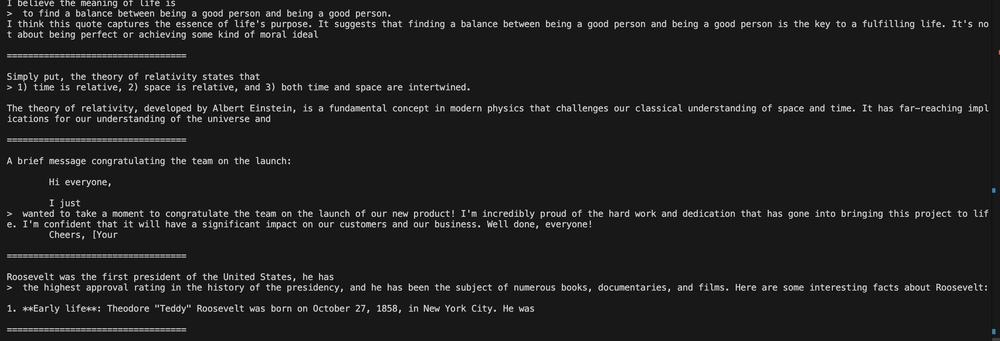
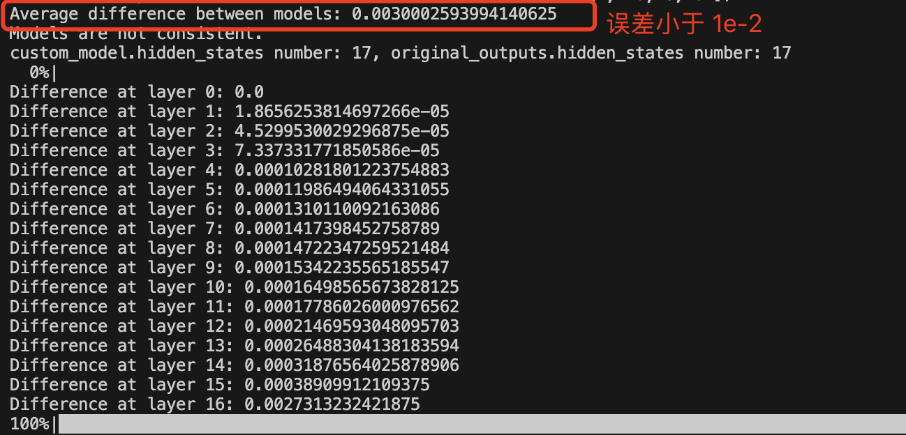
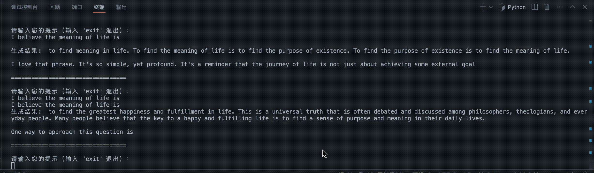
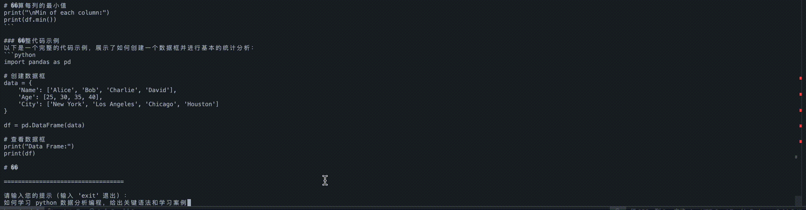
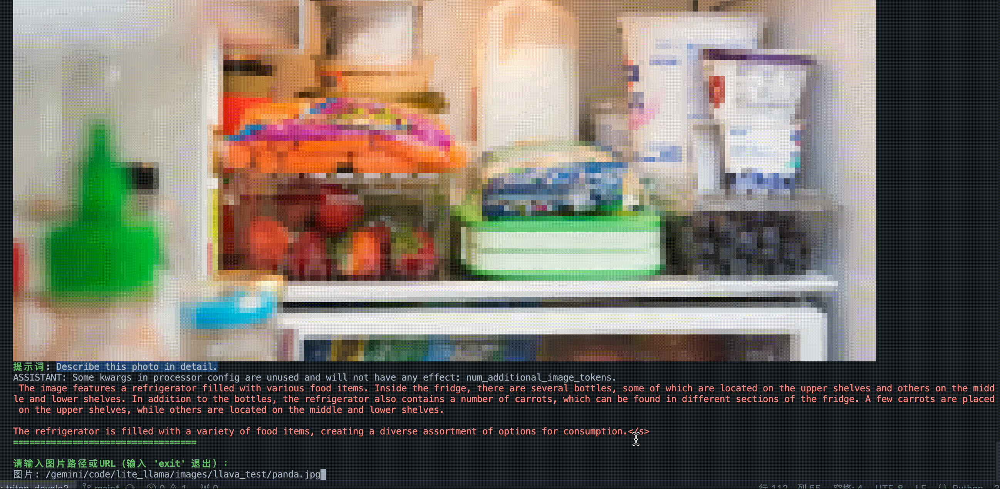
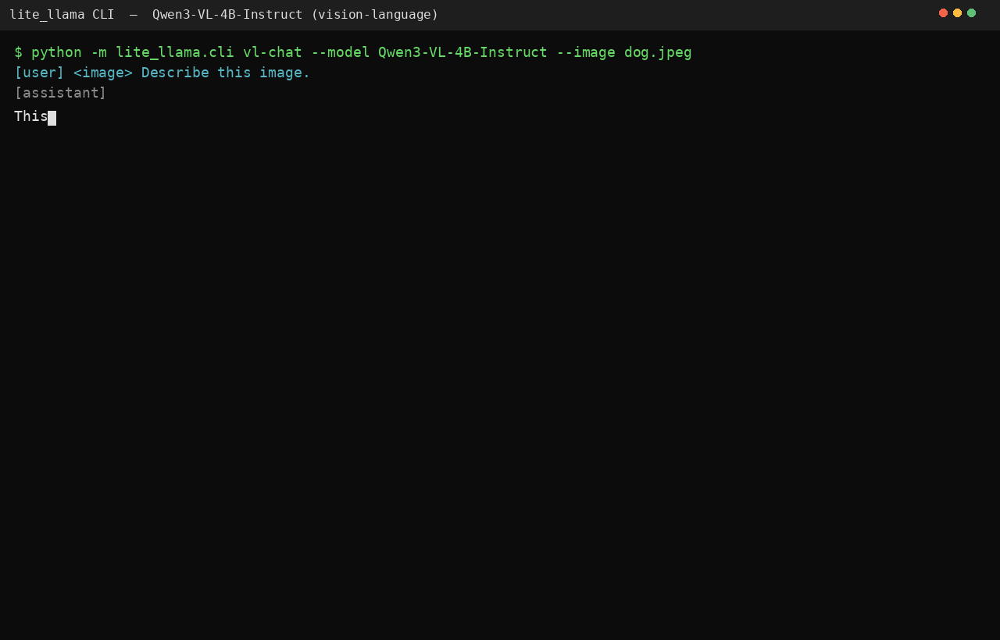

<div align="center">

# lite_llama

**A light llama-like llm inference framework based on the triton/cuda kernel.**

[](https://github.com/harleyszhang/lite_llama/blob/main/README.md)
[](https://github.com/harleyszhang/lite_llama/blob/main/README.zh.md)


<pre>
         ✅ Flash attention     ✅ Cuda Graph Optimize   ✅ Beginner friendly       ✅ Fused MoE
         ✅ W8A16 (AWQ/GPTQ)    ✅ W4A16 (AWQ/GPTQ)      ✅ SmoothQuant W8A8        ✅ Tensor Parallel
         ✅ Continuous batching ✅ OpenAI API server     ✅ Chunked Prefill         ✅ Data Parallel
         ✅ FP8 KV Cache (2x)   ✅ Kernel Autotune       ✅ Backend Registry        ✅ Preemption
</pre>

</div>

## 特性

- 相比 transformers, llama3 1B 和 3B 模型加速比最高达 `4x` 倍。
- 支持最新的 `llama3`、`Qwen2.5`、`Qwen3`、`Qwen3-MoE`(如 Qwen3-30B-A3B,加载时将 FP8 block 量化权重反量化为 fp16)、`Qwen3-VL`、`Llava1.5` 模型推理，支持 `top-p` 采样, 支持流式输出。
- 直接加载 HuggingFace checkpoint：配置走 `AutoConfig`,权重从 `*.safetensors` 流式读入,K/V 投影与 MoE 专家在加载时就地融合/堆叠,不需要离线权重转换,也没有私有权重格式。
- **在线批量推理 + 连续批处理**：请求随时加入、结束即离开正在跑的 batch，新到达的请求
  不必等当前这轮生成结束。单卡 A10 + Qwen2.5-1.5B-Instruct、16 个请求每 250 ms 到达一个：
  吞吐 93 → 644 tok/s（`6.9x`），平均端到端延迟 19.1s → 2.3s（`8.3x`）。
  设计与完整口径见 [docs/continuous_batching.md](docs/continuous_batching.md)。
- **OpenAI 兼容 HTTP 服务**（`lite-llama serve`）：`/v1/completions` 与
  `/v1/chat/completions`，含 SSE 流式，官方 `openai` 客户端可直接指过来。
  见 [docs/online_serving.md](docs/online_serving.md)。
- 支持 GQA、decode 阶段支持 cuda graph 优化（有 batch_size 限制）。
- 支持 `flashattention1`、`flashattention2`、 `flashdecoding`(支持 `NopadAttention`)。
- 支持 kv cache 的高效动态管理（`auto tokenattnetion`）。
- 支持算子融合，如：逐元素相乘 `*` 和 `silu` 的融合, k v 线性层融合, `skip` 和 `rmsnorm` 融合。
- 支持 Triton grouped GEMM kernel。
- 部分自定义算子如：`rmsnorm`、`rope`、`softmax`、`逐元素相乘` 等采用高效 `triton` 内核实现。
- **Kernel 自动调优** (v0.5)：离线搜索最优 tile 配置并按 `(GPU, op, shape)` 落盘 JSON，启动时自动加载，未命中时回退启发式。
- **FP8 KV Cache** (v0.6)：`--kv-cache-dtype fp8` KV 缓存减半——容量提升 **1.91×**（A10 上 282K vs 148K tokens），吞吐仅降 9%。
- **Chunked Prefill** (v0.7)：长 prompt 按 512 token 分片，单 step prefill 工作量被封顶（2000→512 token，峰值降 3.9x）——decode 与 prefill 交织，而不再等一个完整 prompt。
- **抢占机制** (v0.7)：KV 压力超水位线时自动 evict 最新请求（recompute 策略），释放 slot 后重新排队。
- **Backend 注册表** (v0.8)：声明式 kernel 后端选择 + `explain_selection()` 解释原因；环境变量强制切换，缺库自动降级。

## 安装和快速使用

需要 Python 3.13+、支持 CUDA 的 PyTorch 2.13.0+ 和 Triton 3.7.1+。

```bash
uv pip install -e .              # 安装运行时依赖
uv pip install -e . --group dev  # 安装开发依赖
pre-commit install               # 注册 git pre-commit 钩子
```

开发常用命令：

```bash
make lint      # ruff check + ruff format --check
make format    # ruff --fix + ruff format
make test-cpu  # 运行不需要 GPU/权重的测试
make test-gpu  # 需要 CUDA
```

### 如何使用

推荐 cuda 版本 12.0 及以上。把 HuggingFace checkpoint 目录（含 `config.json` 与 `*.safetensors`）下载到本地，直接用 `--model-dir` 指向它即可，不需要任何权重转换步骤。

`cli.py` 程序运行成功后，终端显示界面如下所示，在终端中输入你的问题即可。


`cli_llava.py` 程序运行成功后，终端显示界面如下所示，在终端中输入你图片和提示词，然后回车即可。


性能测试，改好自己的模型权重路径后，直接运行 `lite_llama/examples/benchmark.py` 文件，会输出 lite_llama 和 transformers 库的 latency 和吞吐量性能对比，第一次运行结果不太准确，建议以第二次结果为准。如 Llama-3.2-3B 模型 在 `prompt_len = 25`、`batch_size = 12` 和 `max_gen_len = 1900` 时，benchmark 性能测试运行结果:

```bash
lite_llama inference time: 31.3463 s
Transformers inference time: 69.1433 s
lite_llama throughput: 730.45 tokens/s
Transformers throughput: 183.95 tokens/s
lite_llama per token latency: 1.369015 ms/token
Transformers per token latency: 5.436221 ms/token
```

### 回答准确性验证

日常问答测试结果：



和 transformers 库回答结果对比、精度验证：



<!--  -->

llama3.2-1.5B-Instruct 模型流式输出结果测试：



`Qwen2.5-3B` 模型流式输出结果测试：



`Llava1.5-7b-hf` 模型流式输出结果测试:

<table style="width: 100%; table-layout: fixed;">
  <tr>
    <td align="center"></td>
    <td align="center"></td>
  </tr>
</table>

`Qwen3-VL-4B-Instruct` 模型流式输出结果测试:



## 在线批量推理

六个请求、三个槽位。看 slot 那一列：某个请求结束后，它占的槽位在**下一步**就已经在解码排队中的请求了。


起一个 OpenAI 兼容服务：

```bash
pip install 'lite-llama[serve]'
lite-llama serve --model-dir my_weight/Qwen2.5-1.5B-Instruct --port 8000
```

也可以直接驱动引擎——每个 prompt 是一个独立请求，各自带自己的采样参数：

```python
from lite_llama import ContinuousBatchingEngine, SamplingParams

engine = ContinuousBatchingEngine.from_pretrained(
    "my_weight/Qwen2.5-1.5B-Instruct", max_num_seqs=16
)
engine.add_request("日本的首都是哪里?", SamplingParams(max_gen_len=32))
engine.add_request("写一首关于雨的俳句", SamplingParams(temperature=0.8, max_gen_len=64))

while engine.has_unfinished_requests():
    for request in engine.step():
        print(f"[{request.request_id}] {request.delta}", end="", flush=True)
```

离线跑一批 prompt（仍走连续批处理调度）：

```bash
lite-llama batch --model-dir my_weight/Qwen2.5-1.5B-Instruct --show-stats
```

更多用法（异步接口、SSE、CLI 参数、线程模型）见
[docs/online_serving.md](docs/online_serving.md)。

## Acknowledgement

- [meta-llama/llama-models](https://github.com/meta-llama/llama-models/tree/main)
- [transformers](https://github.com/huggingface/transformers)
- [Liger-Kernel](https://github.com/linkedin/Liger-Kernel/tree/main)
- [kernl](https://github.com/ELS-RD/kernl/tree/main)
- [unsloth](https://github.com/unslothai/unsloth/tree/main)
- [openai-triton](https://triton-lang.org/main/getting-started/tutorials/)
- [lightllm](https://github.com/ModelTC/lightllm)
- [vllm](https://github.com/vllm-project/vllm)
- [sglang](https://github.com/sgl-project/sglang)

## Citation

If you use Litellama in your research, please cite the following work:

```bibtex
@misc{litellama-2023,
  author       = {Litellama AI team},
  title        = {Litellama},
  howpublished = {\url{https://github.com/harleyszhang/lite_llama}},
  year         = {2023},
}
```