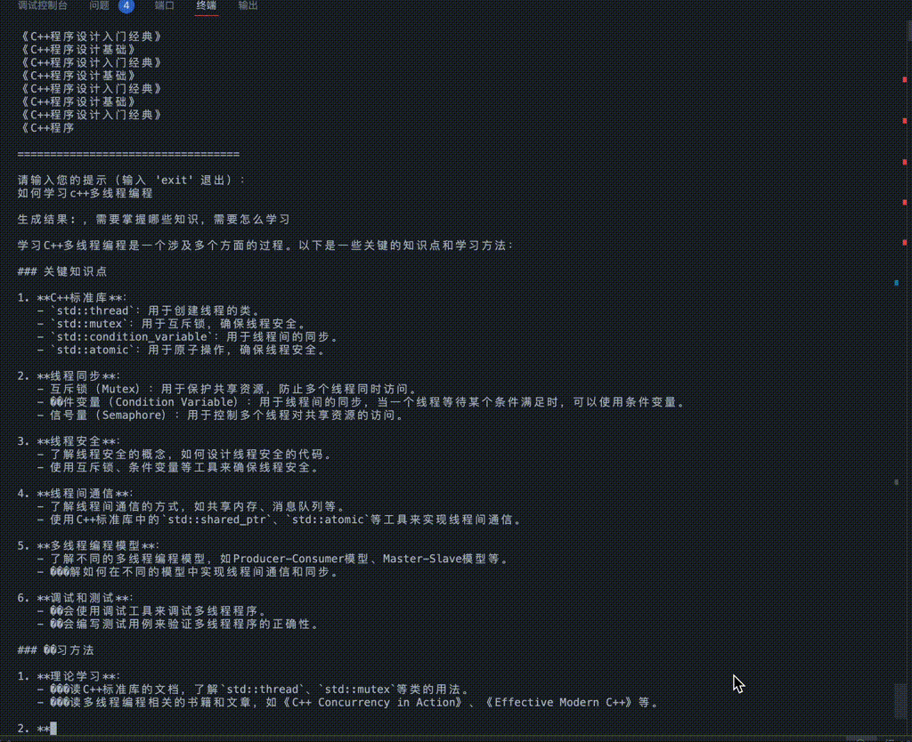

## 一 量化 benchmark 性能测试

### 量化内核性能（W8A16 / W4A16 / SmoothQuant）

两台设备分开记，因为**同一格式在两台机器上可以给出相反的结论**：A10（sm86）的 HBM 约 600 GB/s，decode 档几乎全程在等显存，省下的字节直接兑现；H100（sm90）有 3.35 TB/s，bf16 在中尺寸投影上只占峰值带宽的 43.5%，内核根本没在等显存，反量化的 ALU 开销就是纯增量成本。两节的 shape 也不同（A10 是合成方阵，H100 是 checkpoint 的真实投影），**绝对值不要跨表比较**，只读各表内的相对位置。

#### A10 (24 GB, SM86)

以下为量化 Triton 内核在 `A10` 上的 `triton.testing.do_bench` 实测结果（2026-08-22 口径、合成 shape）。基准为 cuBLAS fp16 `F.linear`；加速来自减半（或减至 1/4）的 HBM 权重读取量。此后内核经过多轮改动（v0.6 重写、`FP8_CVT` 硬件 `cvt` 分叉、0903 按 H100 扫描重定 tile fallback），**A10 未复测**，绝对值仅供参考，下面的 roofline 判据仍然成立。

##### W8A16 (fp8-e4m3, 128×128 block scales)

| Shape (M×N×K) | fp16 (ms) | w8a16 (ms) | 加速比 | 场景 |
|---------------|-----------|------------|--------|------|
| 1×4096×4096 | 0.086 | 0.053 | **1.62×** | decode |
| 1×11008×4096 | 0.199 | 0.116 | **1.71×** | decode (MLP up) |
| 8×4096×4096 | 0.084 | 0.051 | **1.65×** | decode batch |
| 64×4096×4096 | 0.091 | 0.055 | **1.64×** | small prefill |
| 512×4096×4096 | 0.191 | 0.280 | 0.68× | prefill (compute-bound) |

判据（roofline）与 H100 矩阵一致，但 **W8A16 这一行的胜负在两台机器上是反的**。decode（M≤64）算术强度低、卡在 HBM 带宽上，W8A16 把权重字节减半直接缩短搬运，在 A10（~600 GB/s）稳定 1.6–1.7×；prefill（M≥512）算术强度高、卡在算力上，W8A16 反量化后走 fp16-rate dot，算力上限就是 cuBLAS fp16 同档，省下的字节不在瓶颈上，于是 0.68×——此时应回退 cuBLAS fp16。同一格式到 H100 上 decode 档反而输（qkv 的 M=1/8/32 为 0.76–0.79×；24 个 decode 测试点里只有 qwen3-4b/gate_up 的两个还赢，1.21–1.22×，见[下文](#h100-80-gb-sm90)）：3.35 TB/s 的带宽让 bf16 只占峰值 43.5%（gate_up 才到 60.9%），内核没在等显存，删字节省不下时间。A10（sm86）没有原生 fp8 GEMM，所以真 W8A8（激活也量化）在这里只能付量化开销、拿不到 MMA 收益；完整的「量化什么时候赢/输」推导见 [quantization.md](quantization.md) 的 roofline 一节与 [quant_matrix_20260901.md](benchmark_logs/quant_matrix_20260901.md) §1.1a。

##### W4A16 (int4, group_size=128)（初版内核，勿引用）

> ⚠️ 数据来源：本表数字来自 2026-08-22 落地的**初版内核**（逐 word load + `tl.static_range(8)` 解 nibble + 外积累加、tile 硬编码、无 autotune），**并非现版内核的实测**。该内核已被 v0.5（`fe85690`，`tl.dot` 重写 + autotune 收集脚本）与 v0.6（合并字加载 + `BLOCK_K=256` + `GROUP_M=8`）重写取代——当时注记里的三项「后续计划」（向量化 unpack、`tl.dot` 替代 outer product、autotuning）全部已完成。因此这些倍数**勿引用**，请以下方 [H100 实测表](#h100-80-gb-sm90)为准：现版内核的 decode 档是 0.35–0.88×（M=1/8 档 0.50–0.88×），不再是这里的 0.11–0.49×。
> 内存节省与内核版本、设备均无关，仍然有效：30B 模型 int4 权重仅占 ~15 GB（fp16 需 ~61 GB）。

| Shape (M×N×K) | fp16 (ms) | w4a16 (ms) | 加速比 | 场景 |
|---------------|-----------|------------|--------|------|
| 1×4096×4096 | 0.086 | 0.176 | 0.49× | decode |
| 8×4096×4096 | 0.084 | 0.311 | 0.27× | decode batch |
| 64×4096×4096 | 0.091 | 0.832 | 0.11× | small prefill |

##### SmoothQuant W8A8 (dynamic per-token)

| Shape (M×N×K) | fp16 (ms) | smoothquant (ms) | 加速比 | 备注 |
|---------------|-----------|------------------|--------|------|
| 8×256×512 | — | ✓ | — | 精度验证通过 |
| 64×2048×2048 | — | ✓ | — | 精度验证通过 |

精度：相对 fp32 参考的相对误差 < 2%（含激活 + 权重量化双重噪声）。A10 上只做了精度验证（shape 太小，性能读数无意义）；它的性能行就是[下文 H100 矩阵](#h100-80-gb-sm90)的 `int8 W8A8` 列——同一个内核（int8 权重 + 内核内 per-token int8 激活量化）。

#### H100 (80 GB, SM90)

测于 NVIDIA H100 80GB HBM3（3352 GB/s 峰值带宽、989 TFLOP/s dense tensor core），torch 2.13.0+cu130 / triton 3.7.1 / python 3.14.7，2026-09-03 口径，数据来自 [`bench_quant_gemm_h100_20260903d.json`](benchmark_logs/bench_quant_gemm_h100_20260903d.json)，以 `LITE_LLAMA_AUTOTUNE=0` 运行——即用户没有调优缓存时拿到的启发式 tile。shape 是两个 checkpoint 的四个真实投影（qwen3-4b：hidden 2560 / intermediate 9728；qwen3-30b-a3b：hidden 2048 / moe_intermediate 768）× 6 个 token 档（1/8/32/128/512/2048）= 48 个测试点 × 6 个 scheme。括号内为相对 bf16 的加速比（bf16 耗时 ÷ 该格式耗时），大于 1 即快于基线。

##### 中尺寸投影：qwen3-4b/qkv（N=6144, K=2560）

| M | bf16 | fp8 W8A16 | fp8 W8A8 | int8 W8A8 | int4 (awq) | nvfp4 |
|---|---|---|---|---|---|---|
| 1 | 21.6 µs | 28.2 (0.77×) | 22.0 (0.98×) | **20.2 (1.07×)** | 29.8 (0.72×) | 49.1 (0.44×) |
| 8 | 21.4 | 27.2 (0.79×) | 22.6 (0.95×) | **20.7 (1.03×)** | 29.4 (0.73×) | 48.7 (0.44×) |
| 32 | 21.7 | 28.4 (0.76×) | 23.4 (0.93×) | **21.3 (1.02×)** | 38.7 (0.56×) | 50.6 (0.43×) |
| 128 | 21.5 | 49.6 (0.43×) | 27.3 (0.79×) | 24.1 (0.89×) | 58.2 (0.37×) | 67.9 (0.32×) |
| 512 | 30.7 | 81.7 (0.38×) | 37.5 (0.82×) | **30.5 (1.01×)** | 137.5 (0.22×) | 219.2 (0.14×) |
| 2048 | 90.8 | 252.2 (0.36×) | 93.5 (0.97×) | **73.7 (1.23×)** | 512.2 (0.18×) | 728.4 (0.12×) |

##### 最大权重投影：qwen3-4b/gate_up（N=19456, K=2560，bf16 权重 ~100 MB）

| M | bf16 | fp8 W8A16 | fp8 W8A8 | int8 W8A8 | int4 (awq) | nvfp4 |
|---|---|---|---|---|---|---|
| 1 | 48.8 | 40.4 (1.21×) | 34.2 (1.43×) | **33.5 (1.46×)** | 61.3 (0.80×) | 117.4 (0.42×) |
| 8 | 49.0 | 40.0 (1.22×) | 35.0 (1.40×) | **34.1 (1.44×)** | 60.3 (0.81×) | 118.2 (0.41×) |
| 32 | 50.4 | 57.7 (0.87×) | **36.3 (1.39×)** | 36.7 (1.38×) | 112.4 (0.45×) | 122.8 (0.41×) |
| 128 | 50.2 | 142.5 (0.35×) | 50.1 (1.00×) | **44.5 (1.13×)** | 168.4 (0.30×) | 187.0 (0.27×) |
| 512 | 81.7 | 211.5 (0.39×) | 82.1 (0.99×) | **67.7 (1.21×)** | 412.4 (0.20×) | 647.4 (0.13×) |
| 2048 | 304.1 | 789.8 (0.39×) | 276.5 (1.10×) | **210.5 (1.45×)** | 1560.5 (0.19×) | 2254.2 (0.13×) |

##### 胜负统计与判据

- **48 个测试点里 cuBLAS bf16 在 35 个最快**；剩下 13 个有量化行反超，共 20 个 scheme 胜场（int8 W8A8 13 / fp8 W8A8 5 / fp8 W8A16 2），集中在 gate_up 全部 6 档、qwen3-4b/qkv 的 5 档与 30B 的两个 prefill 测试点。int8 W8A8 在 gate_up 六个档上跑 1.46× / 1.44× / 1.38× / 1.13× / 1.21× / 1.45×——**它的胜场活过了 prefill**。
- 门槛按格式分：**int8 W8A8 从 bf16 占峰值 HBM ~44% 起就赢**（qkv M=1 实测 43.5% → 1.07×；30B/qkv 的 38.5% 差一点没赢），fp8 W8A8 与 fp8 W8A16 只在最顶端（gate_up 的 60.9%）赢。int8 门槛更低的原因：scale 全在 epilogue，且 imma 没有 `BLOCK_M ≥ 64` 门槛；fp8 行要付 Triton 的 wgmma codegen 加一个每 token 激活量化 pass（JSON 的 `ablation` 行单独隔离了后者）。
- decode（M≤32）对 bf16 的几何均值差距：int8 W8A8 1.16×、fp8 W8A8 1.29×、**w4a16 1.65×**、w8a16 1.71×、nvfp4 2.83×——这是唯一可能有量化行 outright 赢的区间，因为 M=1 对整张权重矩阵只有 ~2 FLOP/byte，而 H100 的 ridge 在 ~295。int4 的 decode 列要软着读：同一 launch config 在 m=1 的 run-to-run 波动是 22–30 µs。
- prefill（M≥512）算术强度越过 ridge，cuBLAS 开始真正吃 tensor core（m=2048 各投影 390–766 TFLOP/s，中尺寸投影 ~73% 峰值）。epilogue-scale 修复把 fp8 W8A8 的差距拉到 1.34×、int8 W8A8 到 1.12×（两者 outright 赢 gate_up 与 qkv），weight-only 行仍被解包循环钉死：w4a16 4.45×、w8a16 2.70×、nvfp4 6.58×。
- **W4A16 现状**（对照上面 A10 那张初版内核表，那张表勿引用）：decode（M≤32）0.35–0.88×（M=1/8 档 0.50–0.88×，M=32 档掉到 0.35–0.86×；最高 30B/down 的 M=8 0.88×）、prefill（M≥512）0.17–0.47×。内核 docstring 记录了同 shape 家族（N=K=4096）的重写前后：m=1 从 33.9 → 23.2 µs（cuBLAS fp16 23.1 µs，即打平）、m=64 从 49.9 → 31.1 µs。它也是五个 dense 量化内核里唯一读 autotune store 的，`--tune` 后 m≥512 还能再快 13–25%。
- **NVFP4 48 个测试点全输**（包括那 13 个有别的量化行赢的），是结论不是 bug：e2m1 解包每权重元素约 10 条整数运算，比它省下的字节贵一个数量级——读作显存的价格。
- 与 A10 的关键差异：同一个 W8A16 格式，A10 上 decode 稳定赢 1.6–1.7×，H100 上 24 个 decode 测试点只赢 2 个（都在 gate_up，1.21–1.22×）、qkv 档输到 0.76–0.79×——A10 的 600 GB/s 让 bf16 自己就卡在带宽上，删字节直接省时间；H100 的 bf16 只占峰值 43.5%，内核没在等显存。反过来 H100 有 sm90 的 fp8 `wgmma`（`BLOCK_M ≥ 64` 才发射）与 int8 `imma`（`BLOCK_M=16` 起可用），所以真 W8A8 两行在 H100 才有胜机（int8 decode 赢 6/24、fp8 W8A8 赢 3/24，全在 bf16 带宽占比高的投影），而这两行在 A10（sm86 无原生 fp8 GEMM）上付的是纯开销。

#### 量化算子精度汇总

精度与设备无关（只取决于量化粒度与反量化路径）：

| 量化方案 | 相对误差 (vs fp32) | 权重内存节省 |
|----------|-------------------|-------------|
| fp8 blockwise (128×128) | < 0.04% | 2× |
| int8 per-channel | < 0.03% | 2× |
| int4 group-wise (AWQ/GPTQ) | < 5% | 4× |
| smoothquant W8A8 | < 2% | 2× |

复现：

```bash
# 内核精度测试（两台设备同一套用例）
python -m pytest tests/kernels/test_quantization.py tests/kernels/test_w4a16_accuracy.py -v

# A10 口径：单点性能基准（合成 shape）
python -c "
import torch, triton
from lite_llama.kernels.ops.quantization import w8a16_matmul
M, N, K = 1, 4096, 4096
x = torch.randn(M, K, device='cuda', dtype=torch.float16)
qw = torch.randn(N, K, device='cuda').to(torch.float8_e4m3fn).view(torch.uint8)
sc = torch.ones(32, 32, device='cuda')
print(triton.testing.do_bench(lambda: w8a16_matmul(x, qw, sc, group_n=128, group_k=128)))
"

# H100 口径：全格式矩阵（48 个测试点 × 6 scheme，真实投影 shape）
LITE_LLAMA_AUTOTUNE=0 python benchmarks/kernels/bench_quant_gemm.py \
    --json docs/benchmark_logs/bench_quant_gemm_h100_20260903d.json
LITE_LLAMA_AUTOTUNE=0 python benchmarks/kernels/bench_quant_gemm.py --tokens 1 32 2048   # 只测自己服务的宽度
python benchmarks/kernels/bench_quant_gemm.py --tune --dry-run                          # int4 tile 搜索（唯一读缓存的内核）
```

## 二 模型 e2e benchmark 汇总

两节都是**离线推理（offline inference）口径**：全部 prompt 一次性提交、跑完收工，没有 serving 层的请求排队与连续到达。端到端性能从两个互补视角评估：

1. lite_llama 与 HF transformers 同口径对照，回答"比裸 transformers 快多少"；
2. lite_llama 自己关/开 CUDA graph 对照，回答"graph 优化本身值多少"。

测试 1：lite_llama 默认启用 CUDA graph（TextGenerator 和 VisionGenerator 的 use_cuda_graph 均为 True—多模态的 decode 步骤与纯文本结构相同，视觉 token 在 prefill 之后也只是一行普通的 KV cache）。所以两表的 lite_llama 数字同源—只是 gen_len 与 TPOT 统计方式不同（整体摊销中位数 vs 逐步间隔均值），数字接近而不相等，各按原口径保留。

两节的测试矩阵相同：单卡 A10 22 GiB 放得下的全部 checkpoint，纯文本（四种架构 × bf16/FP8/AWQ）以 batch 并行口径测，多模态（llava / qwen3_vl）以逐请求串行口径测（表一末尾 batch=serial 的行）；单卡放不下的 8B b16 档用 `--tensor-parallel-size 2` 开双卡 TP 测（表一中 GPU=A10×2 的行，decode 走 eager——当时 TP 路径尚不能捕获 graph；连续批处理引擎的 TP-safe 捕获落地后该限制已解除，见下文 H100 补测）。当时未包含、现已在 2×H100 上补齐的：**Qwen2.5-0.5B-Instruct**（A10 本机无权重）、**Qwen3-30B-A3B 的 b16 checkpoint**（A10 双卡放不下；H100 单卡即可）、**Qwen3-4B-Thinking-2507**（A10 无权重）——见两节各自的 H100 补测小节。仍未包含：**Qwen-1_8B**（第一代 `qwen` model_type，不在支持列表，加载即被 registry 拒绝）、**Qwen3-Next-80B**（双卡放不下，需 4 卡级 TP）、**Qwen3-MoE-Tiny**（2 层 4 专家的玩具 checkpoint，fp32 存储 547 MB，数字仅证明 qwen3_moe 架构与 fused_moe kernel 在三层 dispatch 下端到端可用，不代表 MoE 吞吐量级）。

### lite_llama vs HF transformers（examples/benchmark.py）

下表是用重构后的 `examples/benchmark.py` **实测**得到的结果（贪心解码、两端同一 tokenizer 统计输出 token、两端自然 EOS 停止、`torch.cuda.synchronize` 计时、取中位数）。指标口径对齐 vLLM/SGLang serving benchmark：

- **TTFT**（首 token 时延，s）= 预填充延迟；
- **TPOT**（每输出 token 时延，ms）= `(latency - ttft) / (output_len - 1)`；
- **TGS**（token 生成速度，tokens/s）= `总输出 token / latency`（聚合吞吐）；
- **TPOT 加速比** = `transformers TPOT / lite_llama TPOT`，标在 lite_llama 行（大于 1 即 lite_llama 更快），单侧跑的组合无对照记 `—`。

多模态四行（batch=serial）由 `examples/benchmark_vision.py` 测得：lite_llama 的多模态路径逐请求串行（processor 单请求），lite 侧 decode 走 CUDA graph 重放（视觉 token 在 prefill 后已是 KV cache 行，捕获的 decode 步与纯文本同构）；TTFT/TPOT 为单请求平均、TGS 为串行循环的聚合吞吐，与纯文本行的 batch 并行口径不同，不要直接比较。TP2 行的 lite_llama 侧走 `ContinuousBatchingEngine`（唯一带 plan 广播的执行路径），transformers 侧 `device_map=auto` 把层均摊到同样的两张卡（模型并行），两端硬件一致。

| 模型 | GPU | batch | gen_len | 引擎 | TTFT (s) | TPOT (ms) | TGS (tok/s) | TPOT 加速比 |
| --- | --- | ---: | ---: | --- | ---: | ---: | ---: | ---: |
| Qwen1.5-0.5B | A10 | 8 | 128 | lite_llama | 0.0180 | 3.04 | 2535.3 | 6.47× |
| Qwen1.5-0.5B | A10 | 8 | 128 | transformers | 0.0215 | 19.65 | 406.8 | — |
| Qwen1.5-0.5B | A10 | 16 | 256 | lite_llama | 0.0192 | 3.55 | 4424.8 | 5.64× |
| Qwen1.5-0.5B | A10 | 16 | 256 | transformers | 0.0238 | 20.02 | 798.4 | — |
| Qwen2.5-1.5B | A10 | 8 | 128 | lite_llama | 0.0219 | 9.36 | 844.5 | 2.53× |
| Qwen2.5-1.5B | A10 | 8 | 128 | transformers | 0.0271 | 23.67 | 337.6 | — |
| Qwen2.5-1.5B | A10 | 16 | 256 | lite_llama | 0.0228 | 8.69 | 1830.1 | 2.79× |
| Qwen2.5-1.5B | A10 | 16 | 256 | transformers | 0.0289 | 24.21 | 660.4 | — |
| Qwen2.5-1.5B-Instruct | A10 | 8 | 128 | lite_llama | 0.0216 | 8.24 | 958.8 | 2.93× |
| Qwen2.5-1.5B-Instruct | A10 | 8 | 128 | transformers | 0.0277 | 24.14 | 331.1 | — |
| Qwen2.5-1.5B-Instruct | A10 | 16 | 256 | lite_llama | 0.0225 | 8.51 | 1868.2 | 2.78× |
| Qwen2.5-1.5B-Instruct | A10 | 16 | 256 | transformers | 0.0278 | 23.62 | 677.0 | — |
| Qwen2.5-3B | A10 | 8 | 128 | lite_llama | 0.0279 | 18.67 | 426.6 | 1.92× |
| Qwen2.5-3B | A10 | 8 | 128 | transformers | 0.0361 | 35.82 | 223.3 | — |
| Qwen2.5-3B | A10 | 16 | 256 | lite_llama | 0.0364 | 19.23 | 828.9 | 1.83× |
| Qwen2.5-3B | A10 | 16 | 256 | transformers | 0.0468 | 35.18 | 454.1 | — |
| Qwen3-0.6B | A10 | 8 | 128 | lite_llama | 0.0253 | 4.23 | 1820.3 | 6.84× |
| Qwen3-0.6B | A10 | 8 | 128 | transformers | 0.0317 | 28.94 | 276.2 | — |
| Qwen3-0.6B | A10 | 16 | 256 | lite_llama | 0.0256 | 4.70 | 3346.7 | 6.10× |
| Qwen3-0.6B | A10 | 16 | 256 | transformers | 0.0329 | 28.65 | 558.2 | — |
| Qwen3-0.6B-FP8 | A10 | 8 | 128 | lite_llama | 0.0293 | 4.09 | 1864.5 | 7.10× |
| Qwen3-0.6B-FP8 | A10 | 8 | 128 | transformers | 0.0311 | 29.08 | 274.9 | — |
| Qwen3-0.6B-FP8 | A10 | 16 | 256 | lite_llama | 0.0291 | 4.53 | 3460.5 | 6.17× |
| Qwen3-0.6B-FP8 | A10 | 16 | 256 | transformers | 0.0308 | 27.92 | 572.8 | — |
| Qwen3-1.7B | A10 | 8 | 128 | lite_llama | 0.0264 | 9.28 | 850.0 | 3.13× |
| Qwen3-1.7B | A10 | 8 | 128 | transformers | 0.0315 | 29.07 | 275.0 | — |
| Qwen3-1.7B | A10 | 16 | 256 | lite_llama | 0.0270 | 9.77 | 1626.2 | 3.04× |
| Qwen3-1.7B | A10 | 16 | 256 | transformers | 0.0342 | 29.68 | 538.8 | — |
| Qwen3-MoE-Tiny | A10 | 8 | 128 | lite_llama | 0.0059 | 0.93 | 8281.3 | 4.20× |
| Qwen3-MoE-Tiny | A10 | 8 | 128 | transformers | 0.0063 | 3.90 | 2043.3 | — |
| Qwen3-MoE-Tiny | A10 | 16 | 256 | lite_llama | 0.0068 | 0.98 | 15934.9 | 4.59× |
| Qwen3-MoE-Tiny | A10 | 16 | 256 | transformers | 0.0071 | 4.51 | 3540.1 | — |
| Llama-3.2-3B-Instruct | A10 | 8 | 128 | lite_llama | 0.0254 | 15.41 | 516.4 | 1.64× |
| Llama-3.2-3B-Instruct | A10 | 8 | 128 | transformers | 0.0309 | 25.33 | 315.3 | — |
| Llama-3.2-3B-Instruct | A10 | 16 | 256 | lite_llama | 0.0514 | 15.96 | 994.1 | 1.74× |
| Llama-3.2-3B-Instruct | A10 | 16 | 256 | transformers | 0.0557 | 27.74 | 574.6 | — |
| Qwen3-8B | A10 | 8 | 128 | lite_llama | 0.0561 | 36.79 | 216.6 | — |
| Qwen3-8B (TP2) | A10×2 | 16 | 128 | lite_llama | 0.0618 | 41.61 | 383.1 | 1.24× |
| Qwen3-8B (TP2) | A10×2 | 16 | 128 | transformers | 0.1021 | 51.52 | 308.2 | — |
| Meta-Llama-3.1-8B-Instruct | A10 | 8 | 128 | lite_llama | 0.0581 | 35.30 | 225.5 | — |
| Meta-Llama-3.1-8B-Instruct (TP2) | A10×2 | 16 | 128 | lite_llama | 0.0684 | 31.99 | 495.7 | 1.46× |
| Meta-Llama-3.1-8B-Instruct (TP2) | A10×2 | 16 | 128 | transformers | 0.1327 | 46.82 | 336.9 | — |
| Qwen3-30B-A3B-Instruct-2507-FP8 (TP2) | A10×2 | 8 | 128 | lite_llama | 0.0829 | 84.03 | 95.2 | — |
| Qwen3-30B-A3B-Instruct-2507-FP8 (TP2) | A10×2 | 16 | 128 | lite_llama | 0.0838 | 84.22 | 190.0 | — |
| Qwen3-14B-AWQ | A10 | 8 | 128 | lite_llama | 0.1499 | 43.49 | 180.5 | — |
| Qwen3-14B-AWQ | A10 | 16 | 128 | lite_llama | 0.2724 | 42.93 | 357.8 | — |
| Qwen3-14B-AWQ | A10 | 16 | 256 | lite_llama | 0.2808 | 45.01 | 348.4 | — |
| llava-1.5-7b-hf | A10 | serial | 128 | lite_llama | 0.1599 | 31.72 | 29.3 | 1.15× |
| llava-1.5-7b-hf | A10 | serial | 128 | transformers | 0.1950 | 36.43 | 25.4 | — |
| Qwen3-VL-4B-Instruct | A10 | serial | 128 | lite_llama | 0.1296 | 19.44 | 48.7 | 1.72× |
| Qwen3-VL-4B-Instruct | A10 | serial | 128 | transformers | 0.1442 | 33.47 | 29.0 | — |

结论（2026-08-31 重测，torch 2.11.0+cu129 / transformers 5.8.0 / Python 3.12，覆盖受支持的全部架构含多模态）：

- lite_llama 的 **decode 全面更快** — TPOT 加速比在 **1.15×～7.1×** 之间，模型越大比值越低（0.6B 档 ~6-7×，3B 档收敛到 ~1.6-1.9×，多模态 7B 档 1.15×；模型越大 decode 越偏 compute-bound，两端都吃满算力）；多模态 4B 档（Qwen3-VL）拿到 **1.72×**—decode 步与纯文本同构，CUDA graph 的收益直接兑现；
- 8B 级 TP2 双卡档同样领先（Qwen3-8B 1.24×、Llama-3.1-8B 1.46×，两端都在同样的两张卡上），说明 TP 切分 + eager decode 在通信开销下仍保住优势；
- 聚合吞吐 TGS 同步放大。每组配置两端输出 token 数一致，工作量对等
- **TTFT** 绝对值小（纯文本 6～50 ms），lite_llama 普遍略优但 run-to-run 抖动明显，不逐行解读；多模态 TTFT（129～200 ms）含视觉塔前向，lite_llama 优 1.11×～1.22×。原始日志见 `docs/benchmark_logs/bench_*.json`（每份含完整 config）。
- 30B 级 MoE（Qwen3-30B-A3B-FP8，TP2 eager decode）：TPOT ~84 ms 与 batch 8/16 无关（~3B 激活参数 + top-8 专家权重读取，A10 带宽主导），batch 8→16 吞吐线性放大（95→190 tok/s）说明带宽还有余量；权重 29.06 GB 分两卡后每卡仍有 ~6 GB KV（104,528 token/卡）。transformers 侧无法对照（fp8 反量化为 bf16 需 ~60 GB，双卡 44 GB 放不下），同 14B-AWQ 一样记 lite_llama 单侧。2026-09-01 在 2×H100 80GB 上用同一 checkpoint 重测（TP1/TP2 均开 graph）：TPOT 13.16 ms、TPS 285.9（单卡），是 A10×2 eager 口径的 5.9×——完整矩阵（KV fp8、DP2、golden 精度列）见 [quantization.md](quantization.md#qwen3-30b-a3b-instruct-2507-fp8-moe-2h100) 与 [`benchmark_logs/bench_quant_Qwen3-30B-A3B-FP8_20260901.json`](benchmark_logs/bench_quant_Qwen3-30B-A3B-FP8_20260901.json)（batch 8 口径的 H100 数字、以及 bf16 checkpoint 的对照组，见下文 2×H100 80GB 补测小节）。

> 本节表中未出现的组合：**8B 级 b16 单卡档**的 KV 预算（16×2048 token ≈ 4.8 GiB + 16 GiB 权重）超出 22 GiB—已用 `--tensor-parallel-size 2` 双卡 TP 补上（GPU=A10×2 行）；**8B 级 b8 档的 transformers 侧**因 transformers 5.8 的 `caching_allocator_warmup` 需要约双倍模型显存，单卡放不下（b16 双卡档已补测，b8 不再用双卡测以保持与 lite_llama 单卡 graph 行的硬件口径一致）；**14B-AWQ 的 transformers 侧**因 AWQ 反量化需要 gptqmodel/autoawq（未安装）标为 lite_llama 单侧。

复现：

```bash
# 全量复现（上表 14 个模型，含各量化路径与多模态的差异化参数）：
PYTHON=/home/honggao/projects/.venv/bin/python ./benchmarks/run_benchmark_suite.sh
# 单模型：
python examples/benchmark.py --model my_weight/Qwen2.5-1.5B-Instruct \
    --batch-size 8 --gen-len 128 --iters 2      # 结果打印并存入 docs/benchmark_logs/*.json
# FP8 checkpoint 的 transformers 基线：--hf-dtype auto（无原生 fp8 的卡上自动 dequant 为 bf16）
# transformers 无法加载的量化（AWQ 需 gptqmodel/autoawq）：--engine lite_llama 单侧
# 8B 单卡 b8 档：--max-gpu-num-blocks 16384 收缩 KV 池（profile 默认值留给 graph 捕获的空间不足）
# 8B 双卡 TP2 b16 档（lite 走 ContinuousBatchingEngine eager，HF 走 device_map=auto）：
python examples/benchmark.py --model my_weight/Qwen3-8B \
    --batch-size 16 --gen-len 128 --iters 2 --tensor-parallel-size 2
# 多模态（llava / Qwen3-VL，逐请求串行口径，decode 走 CUDA graph）：
python examples/benchmark_vision.py --model my_weight/Qwen3-VL-4B-Instruct
# 30B MoE FP8（TP2 双卡，decode eager；transformers 侧放不下 60 GB bf16，单侧）：
python examples/benchmark.py --model my_weight/Qwen3-30B-A3B-Instruct-2507-FP8 \
    --batch-size 16 --gen-len 128 --iters 2 --tensor-parallel-size 2 --engine lite_llama
```

#### 2×H100 80GB 补测（2026-09-03）

同一套 `examples/benchmark.py` 口径（贪心、两端同一 tokenizer 统计输出 token、自然 EOS 停止、`torch.cuda.synchronize` 计时、取中位数），换到 2×H100 80GB（sm90，torch 2.13.0+cu130 / transformers 5.15.1 / triton 3.7.1 / Python 3.14）。覆盖 modelzoo 里**权重完整且架构受支持**的全部 checkpoint：Qwen2.5-0.5B-Instruct、Qwen3-4B-Thinking-2507（两者 A10 本机无权重），以及 Qwen3-30B-A3B-Instruct-2507（bf16，A10 双卡放不下）与它的 FP8 版。与 A10 表的两点口径差异：bf16 checkpoint 的 transformers 侧改用 `--hf-dtype bf16`（与 lite_llama 加载的 dtype 一致；A10 套件用的是脚本默认 fp16），FP8 checkpoint 的 transformers 侧仍是单侧（原因换了，见下）。

三个加速比列全部是**同一行内对同一 checkpoint 的 HF transformers 基线**的比值（`HF / lite_llama`，大于 1 即 lite_llama 更快），不是跨卡型或跨档位的比较：TTFT 加速比 = HF TTFT / lite TTFT，TPOT 加速比 = HF TPOT / lite TPOT，TGS 加速比 = lite TGS / HF TGS。没有 HF 对照行的档位记 `—`。

| 模型 | GPU | batch | gen_len | 引擎 | TTFT (s) | TPOT (ms) | TGS (tok/s) | TTFT 加速比 | TPOT 加速比 | TGS 加速比 |
| --- | --- | ---: | ---: | --- | ---: | ---: | ---: | ---: | ---: | ---: |
| Qwen2.5-0.5B-Instruct | H100 | 8 | 128 | lite_llama | 0.0137 | 1.25 | 5936.5 | 1.40× | 24.98× | 23.11× |
| Qwen2.5-0.5B-Instruct | H100 | 8 | 128 | transformers | 0.0193 | 31.23 | 256.9 | — | — | — |
| Qwen2.5-0.5B-Instruct | H100 | 16 | 256 | lite_llama | 0.0140 | 1.34 | 11552.7 | 1.43× | 25.20× | 24.26× |
| Qwen2.5-0.5B-Instruct | H100 | 16 | 256 | transformers | 0.0200 | 33.65 | 476.2 | — | — | — |
| Qwen3-4B-Thinking-2507 | H100 | 8 | 128 | lite_llama | 0.0228 | 4.86 | 1601.6 | 1.37× | 8.66× | 8.40× |
| Qwen3-4B-Thinking-2507 | H100 | 8 | 128 | transformers | 0.0311 | 42.06 | 190.6 | — | — | — |
| Qwen3-4B-Thinking-2507 | H100 | 16 | 256 | lite_llama | 0.0253 | 5.07 | 3107.8 | 1.31× | 8.83× | 8.68× |
| Qwen3-4B-Thinking-2507 | H100 | 16 | 256 | transformers | 0.0330 | 44.74 | 358.0 | — | — | — |
| Qwen3-30B-A3B-Instruct-2507 | H100 | 8 | 128 | lite_llama | 0.0463 | 10.96 | 712.2 | — | — | — |
| Qwen3-30B-A3B-Instruct-2507-FP8 | H100 | 8 | 128 | lite_llama | 0.0493 | 10.16 | 764.3 | — | — | — |
| Qwen3-30B-A3B-Instruct-2507 (TP2) | H100×2 | 8 | 128 | lite_llama | 0.0627 | 9.97 | 770.8 | 1.43× | 9.90× | 9.50× |
| Qwen3-30B-A3B-Instruct-2507 (TP2) | H100×2 | 8 | 128 | transformers | 0.0897 | 98.71 | 81.1 | — | — | — |
| Qwen3-30B-A3B-Instruct-2507 (TP2) | H100×2 | 16 | 128 | lite_llama | 0.0636 | 11.64 | 1328.3 | 1.29× | 8.52× | 8.22× |
| Qwen3-30B-A3B-Instruct-2507 (TP2) | H100×2 | 16 | 128 | transformers | 0.0820 | 99.19 | 161.5 | — | — | — |
| Qwen3-30B-A3B-Instruct-2507-FP8 (TP2) | H100×2 | 8 | 128 | lite_llama | 0.0641 | 10.08 | 761.5 | — | — | — |
| Qwen3-30B-A3B-Instruct-2507-FP8 (TP2) | H100×2 | 16 | 128 | lite_llama | 0.0674 | 11.23 | 1370.8 | — | — | — |

读法：

- **decode（TPOT）领先 8.5×～25.2×，吞吐（TGS）同量级**：0.5B 档 24.98×/25.20×，4B 档 8.66×/8.83×，30B-A3B bf16 TP2 档 9.90×/8.52×——模型越大比值越低（HF 侧也逐步吃上算力）。A10 同档只有 6.47×/5.64×（0.5B）：两端都换了卡，比值仍放大——lite_llama 的 decode 步已压到接近权重带宽下限（0.5B：1.25 ms，对 0.92 GB 权重 / 3.35 TB/s 的 0.27 ms），而 HF eager decode 的每步固定开销基本不随卡型下降。
- **TTFT 只领先 1.29×～1.43×**，与 A10 表同量级：prefill 是 compute-bound 的大 GEMM，两端都走 cuBLAS，差距只在调度与 KV 分配开销上，与 decode 的 launch-bound 局面不同。
- **TGS 与 TPOT 比值接近但不相等**：TGS 的分母是整轮墙钟（含 TTFT 与采样），batch 越大、gen_len 越长，TTFT 的占比越小，两个比值越靠拢（b16/g256 档：0.5B 25.20× 对 24.26×）。
- **30B-A3B bf16 第一次有了 transformers 对照**：A10 双卡 44 GB 装不下 60 GB 权重，H100 上 `device_map=auto` 摊到两张卡即可跑（HF TPOT 98.71 ms，lite_llama TP2 9.97 ms）。HF 侧跑 MoE 的 128 专家是 Python 循环，这是它 TPOT 的主因，不是硬件差距。
- **30B 级在单张 H100 上就能跑**：bf16 checkpoint 权重 56.87 GB、FP8 版 29.03 GB，所以多出两行 GPU=H100 的 TP1 档（A10 22 GiB 无此档位）；HF 侧的 allocator warmup 要 ~2× 权重，单卡放不下，所以这两行无对照（记 `—`）。TP2 买到的是 KV 容量而不是速度：bf16 从 13.3 万 token/卡 到 86.6 万 token/卡，TPOT 10.96 → 9.97 ms，与 [quantization.md](quantization.md) 的 30B-A3B 结论一致。TP2 行的 lite_llama 侧走 `ContinuousBatchingEngine`，decode **走 graph**（TP-safe 捕获已落地），与 A10 表的 TP2 eager 口径不同。
- **FP8 checkpoint 的 transformers 侧仍是单侧，但原因换了**：A10 是反量化后的 ~60 GB bf16 放不下显存；H100 显存够，缺的是 transformers finegrained-fp8 kernel 的依赖（`kernels` 包，不在本项目依赖表里），加载即 ImportError。

> 环境注记：transformers 的 `device_map` 需要 `accelerate`（已在 `requirement.txt`，本次补装到 `.venv`）；缺它时 `examples/benchmark.py` 的 HF 侧直接 ValueError。

复现（`$LITE_LLAMA_MODELZOO` 为权重根目录）：

```bash
# 小/中模型双引擎两档：
python examples/benchmark.py --model $LITE_LLAMA_MODELZOO/Qwen/Qwen2___5-0___5B-Instruct \
    --batch-size 8 --gen-len 128 --iters 2 --hf-dtype bf16
python examples/benchmark.py --model $LITE_LLAMA_MODELZOO/Qwen3/Qwen3-4B-Thinking-2507 \
    --batch-size 16 --gen-len 256 --iters 2 --hf-dtype bf16
# 30B bf16 单卡 TP1（HF 侧的 allocator warmup 要 ~2× 权重，单卡放不下，故单侧）：
python examples/benchmark.py --model $LITE_LLAMA_MODELZOO/Qwen/Qwen3-30B-A3B-Instruct-2507 \
    --batch-size 8 --gen-len 128 --iters 2 --engine lite_llama
# 30B bf16 双卡 TP2 双引擎对照（HF 走 device_map=auto）：
python examples/benchmark.py --model $LITE_LLAMA_MODELZOO/Qwen/Qwen3-30B-A3B-Instruct-2507 \
    --batch-size 16 --gen-len 128 --iters 2 --tensor-parallel-size 2 --hf-dtype bf16
# 30B FP8 同参数，换 --engine lite_llama（HF 侧缺 fp8 kernel）：
python examples/benchmark.py --model $LITE_LLAMA_MODELZOO/Qwen3-30B-A3B-Instruct-2507-FP8 \
    --batch-size 16 --gen-len 128 --iters 2 --tensor-parallel-size 2 --engine lite_llama
```

原始日志见 `docs/benchmark_logs/bench_Qwen*_20260903_*.json`。

lite_llama 流式输出实录（Qwen2.5-3B，仅演示效果，非并排对比录制）：



### eager vs CUDA graph（benchmarks/bench_e2e.py）

batch 8、greedy、`max_gen_len=256`、A10 22 GiB、torch 2.11.0+cu129 / triton 3.6.0 / Python 3.12，`--mode both` 同时测 eager 与 CUDA graph。一次覆盖全部四种受支持架构、三条优化路径与两个多模态模型（多模态为 8 请求串行口径：TTFT 取每请求首 token 均值、TPS 为串行循环聚合吞吐）：

| 模型 | 架构 / 优化 | TTFT (ms) | TPOT eager (ms) | TPOT graph (ms) | graph 加速 | TPS (tok/s) |
| --- | --- | ---: | ---: | ---: | ---: | ---: |
| Qwen1.5-0.5B | qwen2 / bf16 | 17.6 | 18.07 | 3.39 | 5.3x | 2319.9 |
| Qwen2.5-1.5B | qwen2 / bf16 | 20.9 | 20.47 | 8.54 | 2.4x | 931.7 |
| Qwen2.5-3B | qwen2 / bf16 | 26.4 | 25.85 | 16.68 | 1.55x | 478.4 |
| Qwen3-0.6B | qwen3 / bf16 | 23.0 | 24.00 | 4.61 | 5.2x | 1706.7 |
| Qwen3-0.6B-FP8 | qwen3 / fp8 | 26.2 | 25.94 | 4.49 | 5.8x | 1746.9 |
| Qwen3-1.7B | qwen3 / bf16 | 25.1 | 25.00 | 9.63 | 2.6x | 825.3 |
| Qwen3-8B | qwen3 / bf16 | 57.2 | 38.66 | 37.33 | 1.04x | 213.9 |
| Qwen3-14B-AWQ | qwen3 / w4a16 | 154.7 | 44.49 | 43.90 | 1.01x | 180.4 |
| Qwen3-MoE-Tiny | qwen3_moe / fused MoE | 4.7 | 3.42 | 1.19 | 2.9x | 6620.0 |
| Llama-3.2-3B-Instruct | llama / bf16 | 24.7 | 20.99 | 15.80 | 1.33x | 505.1 |
| Qwen3-VL-4B-Instruct | qwen3_vl / 多模态串行 | 130.7 | 30.30 | 19.46 | 1.56x | 50.3 |
| llava-1.5-7b-hf | llava / 多模态串行 | 169.6 | 30.34 | 29.78 | 1.02x | 32.9 |

统计口径与观察：

- 三项指标：TTFT 取 graph 档从提交到首 token 可见的墙钟（prefill 主导；多模态行为每请求均值），TPOT 取首 token 之后所有步间隔的均值，TPS 为聚合吞吐（`gen_tokens / 总时间`；多模态行为串行循环吞吐）；每档先 warmup 两轮再计时。
- **多模态的 decode 步可以走 graph**：视觉 token 在 prefill 时已写入 KV cache，decode 步与纯文本模型同构（`MultiModalCausalLM.forward` 在 `multi_modal_inputs=None` 时就是纯文本路径），所以 graph 捕获对 llava / qwen3_vl 一样成立—Qwen3-VL-4B 拿到 1.56x，而 llava 7B 只 1.02x，与纯文本的规模规律一致（模型越大算术时间占比越高）。
- graph 加速随规模衰减是结构性的：≤1.7B 的 decode 步只有几毫秒，kernel launch 开销占比高，重放拿到 2.4-5.8x；8B/14B 算术时间主导，加速收敛到 1.01-1.04x。Qwen3-8B 的 KV 池收缩到 16384 token 以进 22 GiB（`--max-gpu-num-blocks 16384`）。
- FP8 与 bf16 的 0.6B TPOT 几乎相同（4.49 vs 4.61 ms）：小模型 decode 是 launch-bound，权重带宽减半的收益体现不出来，FP8 的收益要到大模型才显形。

复现（套件脚本一次跑全矩阵，产出同口径 JSON；解释器要有能跑 CUDA 的 torch 构建—项目 `.venv` 若装了比驱动新的 cu 版本，脚本预检会拦下并提示换 `PYTHON=`）：

```bash
./benchmarks/run_e2e_suite.sh /tmp/e2e                        # 全部模型
PYTHON=/home/honggao/projects/.venv/bin/python ./benchmarks/run_e2e_suite.sh
.venv/bin/python benchmarks/bench_e2e.py --model-dir my_weight/Qwen3-14B-AWQ \
    --greedy --mode both --json out.json                     # 单模型
PYTHONPATH=. python benchmarks/bench_e2e.py \
    --model-dir my_weight/Qwen3-VL-4B-Instruct --greedy      # 多模态（自动切串行口径）
```

#### 2×H100 80GB：在线量化矩阵补测（2026-09-03）

`benchmarks/bench_quant.py` 口径：batch 8、greedy、`max_gen_len=256`、max_seq_len 1024，每档先 warmup 两轮再计时，**每个配置一个独立子进程**（TP 组不能跨行共用，峰值显存也只在空进程里有意义）。bf16 checkpoint 的量化行是**加载后在线量化**的（`--quantization <scheme>`，权重从 bf16 转成目标格式再驻留显存）；FP8 checkpoint 则直接跑它自带的 fp8-e4m3 + 128×128 block scales（W8A16），不做在线量化。TTFT / TPS 取 graph 档，TPOT eager 取 `--no-cuda-graph` 行，golden prefix 是对本 checkpoint 已录制基线（bf16 / eager / TP1）的首差前长度占比。

两类比值列不要混读：

- **`vs HF` 三列是对外部基线的加速比**，分母是本表末尾的 `HF transformers bf16` 行（同一口径、同一张卡、同一 checkpoint）：vs HF TTFT = HF TTFT / lite TTFT，vs HF TPOT = HF TPOT / lite TPOT graph，vs HF TPS = lite TPS / HF TPS。
- **`graph÷eager` 是 lite_llama 自己两种 decode 路径的比值**（本节所属表的原有口径：CUDA graph 重放对 eager 逐步 launch），**与 transformers 无关**。

**Qwen2.5-0.5B-Instruct（qwen2 dense，TP1）**

| 方案 | Model Mem | KV Capacity | TTFT (ms) | TPOT eager (ms) | TPOT graph (ms) | graph÷eager（lite 内部） | TPS (tok/s) | vs HF TTFT | vs HF TPOT | vs HF TPS | golden prefix |
| --- | --- | ---: | ---: | ---: | ---: | ---: | ---: | ---: | ---: | ---: | ---: |
| bf16（checkpoint 原样） | 0.92 GB | 5,948,113 | 12.8 | 12.34 | 1.47 | 8.4x | 5266.0 | 1.45× | 42.5× | 41.0× | 1.000 |
| fp8 W8A8 | 0.59 GB | 5,956,476 | 23.3 | 18.50 | 1.89 | 9.8x | 4051.9 | 0.80× | 33.0× | 31.5× | 0.307 |
| int8 W8A16（per-channel） | 0.59 GB | 5,956,476 | 16.1 | 15.18 | 1.64 | 9.3x | 4703.9 | 1.16× | 38.1× | 36.6× | 0.600 |
| int8-blockwise W8A16（group-wise） | 0.60 GB | 5,955,622 | 15.8 | 15.23 | 2.13 | 7.1x | 3661.3 | 1.18× | 29.3× | 28.5× | 0.725 |
| smoothquant W8A8（int8） | 0.59 GB | 5,956,476 | 18.5 | 18.44 | 1.71 | 10.8x | 4502.6 | 1.01× | 36.5× | 35.0× | 0.223 |
| int4 W4A16（AWQ） | 0.44 GB | 5,969,617 | 16.8 | 15.84 | 2.06 | 7.7x | 3765.1 | 1.11× | 30.3× | 29.3× | 0.089 |
| nvfp4 W4A16（fp4） | 0.44 GB | 5,972,689 | 15.9 | 15.18 | 3.81 | 4.0x | 2073.2 | 1.17× | 16.4× | 16.1× | 0.221 |
| HF transformers bf16（基线） | — | — | 18.6 | 62.42 | — | — | 128.5 | — | — | — | — |

**Qwen3-4B-Thinking-2507（qwen3 dense，TP1）**

| 方案 | Model Mem | KV Capacity | TTFT (ms) | TPOT eager (ms) | TPOT graph (ms) | graph÷eager（lite 内部） | TPS (tok/s) | vs HF TTFT | vs HF TPOT | vs HF TPS | golden prefix |
| --- | --- | ---: | ---: | ---: | ---: | ---: | ---: | ---: | ---: | ---: | ---: |
| bf16（checkpoint 原样） | 7.49 GB | 442,599 | 21.8 | 23.68 | 5.54 | 4.3x | 1426.3 | 1.39× | 14.7× | 14.5× | 1.000 |
| fp8 W8A8 | 4.11 GB | 465,750 | 35.1 | 31.26 | 5.43 | 5.8x | 1442.4 | 0.86× | 15.0× | 14.6× | 0.686 |
| int8 W8A16（per-channel） | 4.11 GB | 465,730 | 26.8 | 25.53 | 4.75 | 5.4x | 1653.0 | 1.13× | 17.1× | 16.7× | 0.822 |
| int8-blockwise W8A16（group-wise） | 4.21 GB | 465,266 | 26.9 | 26.27 | 7.28 | 3.6x | 1087.2 | 1.13× | 11.2× | 11.0× | 0.706 |
| smoothquant W8A8（int8） | 4.11 GB | 465,745 | 30.6 | 29.65 | 4.83 | 6.1x | 1621.6 | 0.99× | 16.8× | 16.4× | 0.051 |
| int4 W4A16（AWQ） | 2.63 GB | 477,398 | 26.7 | 26.93 | 7.56 | 3.6x | 1047.0 | 1.13× | 10.7× | 10.6× | 0.139 |
| nvfp4 W4A16（fp4） | 2.63 GB | 477,497 | 27.7 | 26.20 | 13.91 | 1.9x | 572.9 | 1.09× | 5.8× | 5.8× | 0.233 |
| HF transformers bf16（基线） | — | — | 30.3 | 81.25 | — | — | 98.7 | — | — | — | — |

**Qwen3-30B-A3B-Instruct-2507（qwen3_moe，bf16 checkpoint，在线量化）**

| 方案 | TP | Model Mem | KV Capacity | TTFT (ms) | TPOT eager (ms) | TPOT graph (ms) | graph÷eager（lite 内部） | TPS (tok/s) | vs HF TTFT | vs HF TPOT | vs HF TPS | golden prefix |
| --- | ---: | --- | ---: | ---: | ---: | ---: | ---: | ---: | ---: | ---: | ---: | ---: |
| bf16（checkpoint 原样） | 1 | 56.87 GB | 132,967 | 44.8 | 43.63 | 11.43 | 3.8x | 692.0 | 1.48× | 7.33× | 7.24× | 1.000 |
| fp8 W8A8 | 1 | 29.11 GB | 425,809 | 54.6 | 52.56 | 9.49 | 5.5x | 827.3 | 1.21× | 8.82× | 8.65× | 0.495 |
| int8 W8A16（per-channel） | 1 | 29.11 GB | 425,809 | 49.4 | 47.63 | 8.87 | 5.4x | 885.4 | 1.34× | 9.44× | 9.26× | 0.662 |
| int8-blockwise W8A16（group-wise） | 1 | 29.90 GB | 419,487 | 48.5 | 47.12 | 9.79 | 4.8x | 804.6 | 1.36× | 8.55× | 8.42× | 0.679 |
| smoothquant W8A8（int8） | 1 | 29.11 GB | 425,809 | 54.6 | 50.18 | 9.53 | 5.3x | 824.0 | 1.21× | 8.79× | 8.62× | 0.396 |
| bf16（checkpoint 原样） | 2 | 28.45 GB | 866,044 | 59.6 | — | 10.59 | — | 680.6 | — | — | — | 0.830 |
| fp8 W8A8 | 2 | 14.59 GB | 1,152,721 | 66.9 | — | 9.54 | — | 742.3 | — | — | — | 0.696 |
| int8 W8A16（per-channel） | 2 | 14.59 GB | 1,168,422 | 64.5 | — | 9.12 | — | 790.4 | — | — | — | 0.600 |
| int8-blockwise W8A16（group-wise） | 2 | 14.96 GB | 1,144,529 | 62.0 | — | 9.57 | — | 660.7 | — | — | — | 0.709 |
| smoothquant W8A8（int8） | 2 | 14.59 GB | 1,168,422 | 67.2 | — | 9.77 | — | 762.6 | — | — | — | 0.450 |
| HF transformers bf16（基线） | 1 | — | — | 66.2 | 83.74 | — | — | 95.6 | — | — | — | — |

TP2 行的 `vs HF` 记 `—`：HF 基线跑在**单张**卡上（57.68 GB 峰值，无需切分），与双卡的 lite 行不是同一硬件口径，直接相除会把切分当成加速。

**Qwen3-30B-A3B-Instruct-2507-FP8（qwen3_moe，fp8 checkpoint，原生 W8A16）**

| 方案 | TP | Model Mem | KV Capacity | TTFT (ms) | TPOT eager (ms) | TPOT graph (ms) | graph÷eager（lite 内部） | TPS (tok/s) | vs HF TTFT | vs HF TPOT | vs HF TPS | golden prefix |
| --- | ---: | --- | ---: | ---: | ---: | ---: | ---: | ---: | ---: | ---: | ---: | ---: |
| fp8-e4m3 + 128×128 block scales | 1 | 29.03 GB | 435,879 | 48.7 | 46.05 | 10.50 | 4.4x | 750.9 | — | — | — | 1.000 |
| fp8-e4m3 + 128×128 block scales | 2 | 14.53 GB | 1,171,324 | 60.9 | 59.57 | 10.27 | 5.8x | 634.7 | — | — | — | 0.828 |

本表无 HF 对照行：transformers 跑这个 checkpoint 需要 finegrained-fp8 kernel（`kernels` 包，不在本项目依赖表里），加载即 ImportError；它的 `vs HF` 三列全部记 `—`。可参照的是同一 MoE 架构的 bf16 checkpoint（上表）：HF TPOT 83.74 ms，而本 checkpoint 的 lite TP1 graph 是 10.50 ms。

读法：

- **对 HF transformers 的加速比（vs HF 三列）**：decode（TPOT）在 dense 0.5B 上 16.4×～42.5×、dense 4B 上 5.8×～17.1×、30B MoE TP1 上 7.33×～9.44×；吞吐（TPS）同量级（16.1×～41.0× / 5.8×～16.7× / 7.24×～9.26×）。同一模型内**量化方案越慢，对 HF 的比值越低**（nvfp4 把 0.5B 的 42.5× 拉到 16.4×），但仍然全面领先 HF。
- **TTFT 的 vs HF 只在 0.80×～1.48×，而且量化行可能输给 HF**（0.5B fp8 0.80×、4B fp8 0.86×）：prefill 是 compute-bound，反量化是纯增量成本，省下的字节不在瓶颈上；bf16 行才是稳定的 1.2×～1.5×。
- **量化能不能赢 bf16 完全看结构，判据是 roofline**（推导见 [quantization.md](quantization.md) 的「量化为什么常常比 bf16 慢：roofline 判断」一节）：30B MoE 上四个可用方案**全部快过 bf16**（int8 +28%、fp8 +20%、smoothquant +19%、int8-blockwise +16%）——expert GEMM 在 batch 8 时每专家分到的 token 少，权重读取主导，落回 bandwidth-bound；dense 4B 上分档：int8 +16%、smoothquant +14%、fp8 +1%，而 int8-blockwise −24%、int4 −27%、nvfp4 −60%（weight-only 的反量化 ALU 超过了省下的字节）；dense 0.5B 上全部方案落后 bf16（−11%～−61%）——decode 步长只有 1.47 ms，launch 与量化 pass 的固定成本主导。
- **graph 加速在量化行更大**：0.5B bf16 8.4x 而 smoothquant 10.8x，4B bf16 4.3x 而 fp8 5.8x。量化路径每步多出激活量化 / 反量化 kernel，eager 下 launch 开销更高，graph 折叠掉的也更多。
- **精度列（golden prefix）**：control row（bf16 / TP1 / eager）在 0.5B、4B、30B bf16 与重录后的 30B FP8 上都复现 **1.000**，说明 KV 池几何本身没有移动 token，其余行的偏离可归因于被测轴。量化行的 0.05～0.83 是 greedy 混沌对首个分叉 token 的放大（一旦分叉，后缀就是无关内容），不是误差量级本身；kernel 级误差见 [quantization.md](quantization.md) 的精度汇总。同一方案的 prefix 随模型规模上升（int8：0.5B 0.600 → 4B 0.822 → 30B 0.662），小模型每步 logits 间隔更窄、更容易翻。
- **int4 / nvfp4 在 MoE 上不可用**（表中未列，子进程如实报错）：`--quantization int4` 报 `AWQMoEMethod cannot be computed from fp16 weights at load time`——在线 int4 需要预量化的 checkpoint；nvfp4 报 `NVFP4 MoE experts are not implemented`。dense 侧两者能跑，但都慢于 bf16。
- **TP2 买容量不买速度**：30B bf16 TP2 与 TP1 持平（680.6 对 692.0 TPS），FP8 checkpoint TP2 反而低 15%（634.7 对 750.9）——专家维切分后每卡权重读取量减半的收益被集合通信吃掉；TP2 的价值在 KV 容量（13.3 万 → 86.6 万 token/卡）。TP2 行走连续批处理引擎（唯一广播每步 plan 的路径），Model Mem 为 rank 0 分片、KV Capacity 为每卡容量。
- 30B-A3B-FP8 的 golden 基线在本次测量前**重录了一次**：router GEMM 改走 cuBLAS bf16→fp32（commit bef6a55）后 top-k 在近似平票处会翻转，旧基线下 control row 只有 0.796；重录后复现 1.000。因此 [quantization.md](quantization.md) 的 0901 30B 表里那一列 golden 数字对应的是旧基线，与本节不可直接比较。
- **测量状态注记（本节行不是一次跑完的）**：测量期间另一会话改动并提交了量化 kernel（`31d3c54`：fallback launch config 按设备与 weight dtype 分叉，int8 per-channel 拿到专属 tile 表），各批次当时的代码状态如实记在各自 JSON 的 `meta.commit` 里：0.5B / 4B 矩阵为 `0b1e78f-dirty`（**早于** int8 专属 tile 表，因此这两个模型的 int8 行相对当前代码偏低，kernel 级量级见 [quantization.md](quantization.md) 的第五轮）；30B bf16 TP1 / TP2 为 `fef780c-dirty`；30B FP8 与 30B bf16 的 HF 基线行为 `31d3c54-dirty`。bf16 行不走这些改动路径，可作控制行：30B bf16 TP1 在 `31d3c54-dirty` 上复测为 TPOT 11.41 ms / TPS 693.0（本表 11.43 / 692.0），差 <2%，在噪声带内。

modelzoo 里有权重但本节未测的 checkpoint（架构不在 registry，或权重不完整）：

- **Qwen3.6-35B-A3B / Qwen3.6-27B / Qwen3.8-27B-FP8**：`model_type` 为 `qwen3_5` / `qwen3_5_moe`，大量层是 linear attention（gated-delta-net）+ MTP，尚无实现（与量化路径无关，见 [quantization.md](quantization.md) 的「未覆盖的 FP8 checkpoint」）。
- **DeepSeek-V4-Flash / DeepSeek-V4-Pro**：`deepseek_v4`，registry 只到 `deepseek_v2` / `deepseek_v3`。
- **Qwen3-VL-235B-A22B-Instruct-FP8**：本地副本不完整（无 config.json，index 要求的 shard 大部分缺失）。
- **Qwen3-30B-A3B-Instruct-2507-Int4-W4A16**：`quant_method: compressed-tensors`，不在 `BASE_QUANTIZATION_METHODS` 里（仓库的 int4 路径读 AWQ / GPTQ 格式）。
- modelzoo 根目录下的 `Qwen3-30B-A3B-Instruct-2507` bf16 副本是未完成下载（16 个 shard 里只 2 个完整），本节用的是 `Qwen/` 下的完整副本。

复现（`$LITE_LLAMA_MODELZOO` 为权重根目录；量化矩阵一个模型一条命令）：

```bash
# dense：七种方案 × eager/graph，带 HF 基线与 golden 列
python benchmarks/bench_quant.py --model-dir $LITE_LLAMA_MODELZOO/Qwen/Qwen2___5-0___5B-Instruct \
    --schemes fp16 fp8 int8 int8-blockwise smoothquant int4 nvfp4 \
    --batch 8 --max-gen 256 --cuda-graph --no-cuda-graph
python benchmarks/bench_quant.py --model-dir $LITE_LLAMA_MODELZOO/Qwen3/Qwen3-4B-Thinking-2507 \
    --schemes fp16 fp8 int8 int8-blockwise smoothquant int4 nvfp4 \
    --batch 8 --max-gen 256 --cuda-graph --no-cuda-graph
# 30B bf16：TP1 全方案 eager/graph，TP2 另跑一轮（int4/nvfp4 在 MoE 上报错，属预期）
python benchmarks/bench_quant.py --model-dir $LITE_LLAMA_MODELZOO/Qwen/Qwen3-30B-A3B-Instruct-2507 \
    --schemes fp16 fp8 int8 int8-blockwise smoothquant int4 nvfp4 --tp 1 \
    --batch 8 --max-gen 256 --cuda-graph --no-cuda-graph --skip-hf
python benchmarks/bench_quant.py --model-dir $LITE_LLAMA_MODELZOO/Qwen/Qwen3-30B-A3B-Instruct-2507 \
    --schemes fp16 fp8 int8 int8-blockwise smoothquant int4 nvfp4 --tp 2 \
    --batch 8 --max-gen 256 --cuda-graph --skip-hf
# 30B bf16 的 HF 基线行（单卡 57.68 GB 峰值，去掉 --skip-hf 即可；vs HF 三列的分母）：
python benchmarks/bench_quant.py --model-dir $LITE_LLAMA_MODELZOO/Qwen/Qwen3-30B-A3B-Instruct-2507 \
    --schemes fp16 --tp 1 --batch 8 --max-gen 256 --cuda-graph --no-cuda-graph
# 30B FP8：checkpoint 原生 fp8（--schemes fp16 意为“不做在线量化”）× TP1/TP2 × eager/graph
python benchmarks/bench_quant.py --model-dir $LITE_LLAMA_MODELZOO/Qwen3-30B-A3B-Instruct-2507-FP8 \
    --schemes fp16 --tp 1 2 --batch 8 --max-gen 256 --cuda-graph --no-cuda-graph --skip-hf
# golden 基线（首次测某 checkpoint 时先录，control row 才能判 1.000）：
python scripts/golden_tokens.py --save tests/golden/data/Qwen3-30B-A3B-Instruct-2507.json \
    --model-dir $LITE_LLAMA_MODELZOO/Qwen/Qwen3-30B-A3B-Instruct-2507
```

原始日志见 `docs/benchmark_logs/bench_quant_Qwen*_h100_20260903.json`（每份含完整 meta：GPU / torch / triton / **commit** / 命令行，测量状态注记里的各批次代码状态就从这里读）。

## 三 性能优化历史记录

### 迭代式优化记录

输入提示词：

```bash
prompts: List[str] = [
    # For these prompts, the expected answer is the natural continuation of the prompt
    "I believe the meaning of life is",
    "Simply put, the theory of relativity states that ",
    """A brief message congratulating the team on the launch:

    Hi everyone,

    I just """,
    # Few shot prompt (providing a few examples before asking model to complete more);
    "Roosevelt was the first president of the United States, he has",
]
```

1，针对 decode 阶段使用 cuda graph 优化后，单次 decode 阶段时间为 `8.2402` ms，使用之前为 `17.2241` ms，性能提升 2x 倍，这个结果跟 vllm 应用 cuda graph 后的性能提升倍数几乎一致。

```bash
INFO: After apply cuda graph, Decode inference time: 8.2402 ms
INFO: Before apply cuda graph, Decode inference time: 17.2241 ms
```

2，在前面的基础上，继续优化，使用 flashattention 替代原有的标准 attention。

> flashattention1 对训练模型帮助更大，在提示词很短时，其速度提升效果有限。推理时的 decode 阶段应该用 flash-decoding。

```bash
INFO: input tokens shape is  torch.Size([8, 115])
# 使用 flashattention 前
INFO:lite_llama.generate:Batch inference time: 3152.0476 ms
INFO:lite_llama.generate:Tokens per second: 97.71 tokens/s
# 使用 flashattention1 后
INFO:lite_llama.generate:Batch inference time: 2681.3823 ms
INFO:lite_llama.generate:Tokens per second: 114.87 tokens/s
```

3，继续优化, 将 `flashattention` 升级到 `flashattention2`, 减少一定计算量。

```bash
INFO:lite_llama.generate:Batch inference time: 2103.0737 ms
INFO:lite_llama.generate:Tokens per second: 146.45 tokens/s
```

4，再次优化，decode 阶段的推理使用 `flashdecoding`，提升 decode 阶段的 attention 计算并行度，充分发挥 GPU 算力。

```bash
INFO:lite_llama.generate:Decode stage Batch inference time: 1641.4178 ms
INFO:lite_llama.generate:Decode stage tokens per second : 187.64 tokens/s
```

5，继续再次优化，支持 kv cache 高效的动态管理（类似 tokenattention），解决了 kv cache 显存浪费和分配低效的问题。

```bash
INFO:lite_llama.generate:Decode stage Batch inference time: 1413.9111 ms
INFO:lite_llama.generate:Decode stage tokens per second : 217.84 tokens/s
```

6，一个简单的优化, 使用 `GQA_KV_heads_index` 替代 `repeat_kv` 函数。

7，一个常见且简单的优化, kv 线性层融合。

8，一个常用的优化，算子融合：残差连接的 skip 操作和 `rmsnorm` 算子融合，形成新的 `skip_rmsnorm` 算子。

9，重构并优化 `MHA` 模块，优化 `context_attention` 和 `token_attention` 内核支持 `Nopad attention` 和 `kv cache` 动态分配和管理：

- token_attention 支持直接传入 kv_cache 索引和序列实际长度 seq_len, 减少了 kv cache 在 `MHA` 模块中的 `concat` 和 `view` 操作，并实现了 `Nopad` token_attention。
- 将每次 prefill/decode 过程动态分配实际 prompts 长度的 kv cache 索引个数，而不是在模型推理之前一次性分配连续的 `(max(promptes_len) + max_gen_len) * batch_size` 个 tokens 的 kv cache 空间。

10，引擎侧消除 decode 循环中的 GPU→CPU 同步。原实现每步执行 `bool(hit_stop[i])×batch + all() + .item()` 共 9 次同步，另外 `decode_alloc_kv_cache` 每步做一次 40960 元素的 `torch.nonzero` + 2 次 `.item()`。CPU 一旦读 GPU 张量就必须等前面的 kernel 全部完成，launch 流水线被反复清空，这是 eager decode 里 TPOT 比 GPU 真实计算时间高一倍的主因。

- 新增 [`StopCriteria`](lite_llama/engine/stop_criteria.py)：结束标志常驻 GPU，用词表大小的布尔查找表判 EOS，全批一次张量运算完成，每 8 步才做一次 `all()` 轮询。
- 新增 [`_DecodeSession`](lite_llama/engine/llm_engine.py)：把 per-request 状态封装出来，主机侧仅在轮询边界读回一次采样结果。
- 给 [`KVCacheManager`](lite_llama/executor/kv_cache_manager.py) 加 bump 分配器：`generate()` 内 KV 缓存是纯追加分配，只用一个 int 游标记录写入位置，任一部分释放后自动回退到原全表搜索。

11，消除 O(n²) 流式解码。原实现每步都 `tokenizer.decode(tokens[prompt_len:cur])` 整段解码再与已输出内容做差，256 token 时累计 ~0.8 ms/step。新增 [`IncrementalDetokenizer`](lite_llama/engine/detokenizer.py) 用滑动窗口只解码 `[prefix_offset:]` 和 `[prefix_offset:read_offset]` 两小段，仍能正确处理 SentencePiece 的前导空格（`▁` 需要上下文）与跨 token 的多字节 UTF-8（结尾遇 `\ufffd` 时先攥住不吐）。摊销后每步常数代价。

12，向量化 repetition penalty。原实现按 batch 逐行 `torch.unique + clone + index_put`，约 4·batch 次 kernel 启动 + 一次全量 clone。新增 [`GeneratedSpan`](lite_llama/engine/sampler.py) 数据类和 padding-safe scatter：把 batch 已生成 token 一次 scatter 到 `[batch, vocab+1]` 布尔表的哨兵列（避免 padding 位置用 False 覆盖真实命中），再两次 `torch.where`。共 3 个 kernel、无 clone。

以上 10-12 项主机侧优化的前后对比（NVIDIA A10 23 GB / Qwen2.5-0.5B / batch=8 / max_gen_len=256 / greedy；TTFT 为首 token 墙钟时间、TPOT 为稳态每 token 延迟、TPS 为 batch 聚合吞吐，口径对齐 vLLM）：

| 配置                    | TTFT (ms) | TPOT (ms) | TPS (token/s) |
|------------------------|-----------|-----------|---------------|
| eager（优化前）          | 15.0      | 15.04     | 532           |
| eager（10-12 项优化后）  | 13.7      | 13.55     | 590           |

eager 路径的 GPU 计算本身没有变化，TPOT 从 15.04 ms 降到 13.55 ms 几乎全部来自主机侧开销的削减：每步 GPU→CPU 同步从 9 次降到 0.125 次、流式解码从 O(n²) 降到摊销 O(1)、penalty 从约 4·batch 次 kernel 降到 3 次。

13，[`TextGenerator`](lite_llama/engine/generator.py) 默认开启 CUDA Graph 捕获（多模态显式关闭）。KV 显存预算里为 graph 捕获预留 workspace（[`estimate_capture_workspace`](lite_llama/executor/cuda_graph.py)），并把捕获 batch 上界钳到请求表容量，修复 `0.9 gpu-util + graph capture` 场景下的 OOM。

与 HuggingFace transformers 的对比（NVIDIA A10 23 GB / **Qwen2.5-1.5B-Instruct** fp16 / batch=8 / max_gen_len=256 / greedy，指标口径同上）。HF 侧由 [`bench_e2e.py --backend hf`](benchmarks/bench_e2e.py) 测量：左 padding、不套 chat template、`min_new_tokens` 强制跑满 256 步、sdpa attention：

| 引擎                             | TTFT (ms) | TPOT (ms) | TPS (token/s) | 生成总时间 (s) |
|----------------------------------|-----------|-----------|---------------|---------------|
| transformers 5.15（sdpa）        | 27.6      | 24.24     | 330           | 6.21          |
| lite_llama eager                 | 15.8      | 16.86     | 475           | 4.31          |
| **lite_llama graph（10-13 项）** | **16.4**  | **9.05**  | **881**       | **2.32**      |

相对 transformers：eager 路径 TPS 1.44x、TPOT 1.44x、TTFT 1.75x；graph 路径 TPS 2.67x、TPOT 2.68x。1.5B fp16 权重约 3.09 GB，A10 带宽下限约 5.2 ms/token（3.09 GB / 600 GB/s）；graph 模式 TPOT 9.05 ms 中主机侧开销已被 CUDA Graph 消除，与下限之间剩余的约 3.9 ms 是 kernel 级优化空间（decode attention、小 GEMM 效率）。

> 0.5B 上的历史对照（同口径）：graph 优化前 TPOT 5.54 ms / TPS 1433，10-13 项后 TPOT 3.77 ms / TPS 2096（3.94x），已逼近 0.5B fp16 权重带宽下限 3.46 ms（1260 MB / 600 GB/s）。

精度验证（[`scripts/golden_tokens.py`](scripts/golden_tokens.py)）：8 个 greedy 用例覆盖单条 / 等长 batch / 混合长度 batch × 有无 repetition penalty，优化前后逐字节完全一致。

14，配置 / 权重加载 / 模型注册三个模块重构，参照 vLLM 的分层：

- **配置**。删除按架构手写的 `model_config.py` dataclass 与它的 HF 字段别名表，schema / 解析 / 默认值全部交给 `AutoConfig`（[`models/config.py`](lite_llama/models/config.py)）。`ModelConfig` 只补两件 HF config 给不了的东西：运行时旋钮 `max_seq_len`，以及 `num_kv_heads` / `head_dim` / `rope_theta` 的归一化。复用的是配置体系，**不引入** `modeling_*.py`—文本模型仍全跑自己的 Triton 内核。这也修好了一个真 bug：transformers 5.x 把 `rope_theta` / `mrope_section` 收进 `rope_parameters`，旧别名表不认识，Qwen3-VL 的 `mrope_section` 会静默丢失并退化成普通 RoPE。
- **权重加载**。删除 `tools/convert_weights.py` 与 `lite-llama-convert` 入口，不再需要离线产物。流程与 vLLM 一致：meta 设备上构造空模型 → 就地分配 fp16 参数 → 从 safetensors 流式 `copy_` 到位。只做名字 / 结构重映射（[`models/weights.py`](lite_llama/models/weights.py)）：K/V 写进 `kv_proj_weight` 的上下两半，MoE 逐专家矩阵堆叠进 `gate_up_proj` / `down_proj`，FP8 block 量化在目标设备上反量化。拷贝循环按**元素个数**统计覆盖率，漏写 / 半写 / 重写都会报错—这是 `strict=True` 的 `load_state_dict` 看不到的（fused 参数只写一半仍然“存在”）。
- **注册**。[`registry.py`](lite_llama/models/registry.py) 从 181 行降到 81 行：每个条目只剩 `model_type -> (实现类路径, 是否多模态)`，每架构一个 config loader 工厂、`load_config` / `build_model` / `read_model_type` 全部取消。新增一个模型 = 一行表项 + 一个类。

加载耗时（A10 / 页缓存已预热 / 取 3 次最小值）：

| 模型                    | 旧：转换一次 + 加载 `.pth` | 新：直读 safetensors | 硬盘占用变化 |
|------------------------|--------------------------|------------------------|-------------|
| Qwen2.5-0.5B           | 5.75 s + 0.26 s          | **0.22 s**             | −988 MB     |
| Qwen2.5-1.5B-Instruct  | — + 0.61 s               | **0.60 s**             | −3.09 GB    |

稳态推理吞吐不变（同机器各跑 3 次，Qwen2.5-0.5B / batch=8 / greedy）：graph 路径 TPS 2111 / 2119 / 2120（重构前）vs 2117 / 2104 / 2116（重构后），eager 路径两边同处 565–606 的噪声带内。真正省下的是部署路径：0.5B 从“转换 6.0 s + 多占 988 MB”变成“直接 0.22 s 加载”，30B-A3B-FP8 则不再需要那份 61 GB 的 `.pth` 副本。

权重加载的精度验证分三层：

- [`tests/models/test_weight_mapping.py`](tests/models/test_weight_mapping.py)：逐个 key 形状的映射单测 + 覆盖率记账（漏 key / 半写 fused / shape 不对 / 映射到不存在的参数，均必须报错）。
- [`tests/models/test_weight_parity.py`](tests/models/test_weight_parity.py)：6 个架构各随机初始化一个 tiny HF 模型存成真 safetensors，跑完整加载路径后逐参数逐元素对比—k/v 互换、专家下标错位、gate/up 颠倒这些“形状全对但值错位”的 bug 只有这层能抓。
- [`tests/models/test_checkpoint_index.py`](tests/models/test_checkpoint_index.py)：拿真实发布 checkpoint 的 `model.safetensors.index.json`（本地验证过 llava-1.5-7b-hf 686 key、Qwen3-VL-4B 713 key、Qwen3-30B-A3B-FP8 37491 key），在 meta 设备上不读一字节权重就验证“每个 key 都有参数接 / 每个参数都有 key 写”。

顺手抓出的两个旧 bug，都改变了输出，所以单独记一笔：

1. **Qwen3-VL 的 RoPE base 错了 500 倍**。transformers 5.x 只在 `rope_parameters` 里写 `rope_theta`，而多模态路径的旧配置是 `LlamaConfig.from_dict(config.text_config.to_dict())`，读不到顶层 `rope_theta` 就退到 dataclass 默认值 **10000.0**，而 checkpoint 声明的是 **5,000,000**。在 201 token 的纯文本 prompt 上与 HF `Qwen3VLForConditionalGeneration` 对照 logits：

   | rope_theta | 与 HF 的平均 cosine | 最小 cosine | top-1 一致率 |
   |------------|---------------------|--------------|--------------|
   | 10000（旧，默认值） | 0.928 | **−0.195** | 99.50% |
   | 5e6（新，读配置） | **0.99973** | **0.982** | **100%** |

   最小 cosine 为负意味着部分位置的 logits 向量完全反了方向。回归用例：[`test_nested_rope_theta_is_not_lost`](tests/config/test_config.py)、[`test_qwen3_vl_language_model_gets_mrope_and_the_right_base`](tests/models/test_weight_parity.py)。
2. **`inv_freq` 被降成 fp16**。旧 loader 最后一句 `model.half()` 连非持久化 buffer 一起转了，RoPE 的 `inv_freq` 静默变成 fp16。它以 `position × inv_freq` 参与相位计算，误差随位置线性放大：Qwen2.5-0.5B 在 position 1024 处相位误差 0.086 rad，LLaVA-1.5（theta=1e4）在 4096 处 0.99 rad。新 loader 不再动 buffer，`inv_freq` 保持 fp32。

因为这两项修正，golden 基线已重录。作为反向验证：强行把 `inv_freq` 改回 fp16 后，新加载路径在 Qwen2.5-0.5B 上与旧 golden 基线 8 个用例逐字节完全一致，说明三个模块的重构本身是 bit-exact 的，输出差异全部来自上面两个修正。重录 diff 里可以看到多条原本陷入重复循环的输出变成正常叙述。

复现命令：

```bash
# lite_llama 端到端指标（默认 my_weight/Qwen2.5-0.5B，--model-dir 切换模型）
python benchmarks/bench_e2e.py --greedy --max-gen-len 256 --batch 8 --model-dir my_weight/Qwen2.5-1.5B-Instruct

# HF transformers 基线（同 prompts、同指标口径，同一脚本换后端）
python benchmarks/bench_e2e.py --backend hf --model-dir my_weight/Qwen2.5-1.5B-Instruct --max-gen-len 256 --batch 8

# 精度对照
python scripts/golden_tokens.py --save /tmp/golden.json          # 优化前录制
python scripts/golden_tokens.py --check /tmp/golden.json         # 优化后比对
python scripts/golden_tokens.py --check /tmp/golden.json --cuda-graph
```

### 历史吞吐对比总表（旧脚本，仅供参考）

> ⚠️ 数据来源：本表数字来自本文档下方各模型章节的**历史记录**（由仓库作者早前用
> 旧版 `benchmark.py` 在 3090 上跑出），**并非本次实测**。旧脚本存在方法学问题：
> transformers 被强制忽略 EOS（`eos_token_id=None`）跑满长度，而 lite_llama 会提前
> 停止，两端工作量并不一致；且仅有单次运行、只统计吞吐、无 TTFT/TPOT。因此这些倍数
> 仅作趋势参考，请以上方实测表为准。

| 模型 | GPU | batch_size | seq_len¹ | max_gen_len | lite_llama (tokens/s) | transformers (tokens/s) | 吞吐加速比 |
| --- | --- | ---: | --- | ---: | ---: | ---: | ---: |
| Llama-3.2-1B-Instruct | 3090 的 1/4 卡 (B1.small) | 16 | 变长 | 1900 | 411.04 | 104.70 | 3.93× |
| Llama-3.2-3B-Instruct | 3090 整卡 (B1.big) | 8 | 变长 | 1900 | 458.97 | 134.37 | 3.42× |
| Llama-3.2-3B-Instruct | 3090 整卡 (B1.big) | 12 | 变长 | 1900 | 730.45 | 183.95 | 3.97× |
| Qwen2.5-3B-Instruct | 未标注 | 2 | 变长 | 2000 | 98.71 | 69.83 | 1.41× |
| Qwen2.5-3B-Instruct | 未标注 | 4 | 变长 | 256 | 182.28 | 133.33 | 1.37× |
| Qwen2.5-3B-Instruct | 未标注 | 12 | 变长 | 1900 | 581.20 | 172.19 | 3.38× |
| Qwen2.5-3B-Instruct | 未标注 | 16 | 变长 | 512 | 724.38 | 504.73 | 1.44× |
| Qwen2.5-3B-Instruct | 未标注 | 16 | 变长 | 1900 | 735.73 | 215.62 | 3.41× |

> ¹ 这些基准使用的是「多条不同长度提示词」组成的 batch，未固定或记录单一 prompt 长度，
> 故 seq_len 记为「变长」；Qwen2.5-3B 章节未标注 GPU 型号。

#### Llama-3.2-1B-Instruct 性能测试

趋动云 `B1.small` 等同于 `3090` 的 `1/4` 之一卡的硬件测试环境。运行性能测试对比 `python benchmark.py`，lite_llama 的运行速度最高是 transformers 的 `4x` 倍。

batch_size = 16 的提示词：

```bash
prompts: List[str] = [
    "I believe the meaning of life is to find happiness in the simple things. but how to achieve the meaning of life?",
    "VGG is a very important cnn backbone, please introduce vgg architecture and give implement code ",
    "Can you introduce the History of the American Civil War. ",
    "who is the first president of the United States and what's his life story?",
    "How to learn c++, give me some code example.",
    "How to learn python, give me some code examples.",
    "How to learn llm, please introduce transformer architecture ",
    "How to learn cnn, please introduce resnet architecture and give code ",
    "How to learn cuda programming, give me some code example.",
    "How to learn rust, give me some code examples.",
    "How to learn java, give me some code example.",
    "How to learn linux c, give me some code examples.",
    "A Complete Introduction to the History of the American Civil War",
    "Python is a good programming language, how tolearn it?",
    "Please introduce llama model architecture and give implement cuda code."
    "Please introduce Qwen2.5 model structure and give cuda implement code."
]
```

`max_gen_len = 1900` 时，benchmark 性能测试运行结果:

```bash
lite_llama inference time: 67.8760 s
Transformers inference time: 131.8708 s
lite_llama throughput: 411.04 tokens/s
Transformers throughput: 104.70 tokens/s
lite_llama per token latency: 2.432831 ms/token
Transformers per token latency: 9.551007 ms/token
```

#### Llama-3.2-3B-Instruct 性能测试

/gemini/code/lite_llama/my_weight/Llama-3.2-1B-Instruct

趋动云 `B1.big` 等同于 `3090` 卡的硬件测试环境。运行性能测试对比 `python benchmark.py`，lite_llama 的运行速度最高是 transformers 的 `4x` 倍。

batch_size = 8 的提示词：

```bash
prompts: List[str] = [
        "I believe the meaning of life is to find happiness in the simple things. This is a very subjective and personal perspective, and it may vary from person to person. However, I believe that the simple things can bring a sense of joy and fulfillment to our lives.",
        "VGG is a very important cnn backbone, please introduce vgg architecture and give implement code ",
        "A Complete Introduction to the History of the American Civil War",
        "Roosevelt was the first president of the United States, he has a lot of information on the early history of the United States. He was born in 1883,",
        "How to learn c++, give me some code example.",
        "How to learn python, give me some code examples.",
        "How to learn llm, please introduce transformer architecture ",
        "How to learn cnn, please introduce resnet architecture and give code ",
    ]
```

`max_gen_len = 1900` 时，benchmark 性能测试运行结果:

```bash
lite_llama inference time: 32.0826 s
Transformers inference time: 51.2225 s
lite_llama throughput: 458.97 tokens/s
Transformers throughput: 134.37 tokens/s
lite_llama per token latency: 2.178783 ms/token
Transformers per token latency: 7.441883 ms/token
```

batch_size = 12 的提示词：

```bash
prompts: List[str] = [
    "I believe the meaning of life is to find happiness in the simple things. but how to achieve the meaning of life?",
    "VGG is a very important cnn backbone, please introduce vgg architecture and give implement code ",
    "Can you introduce the History of the American Civil War. ",
    "who is the first president of the United States and what's his life story?",
    "How to learn c++, give me some code example.",
    "How to learn python, give me some code examples.",
    "How to learn llm, please introduce transformer architecture ",
    "How to learn cnn, please introduce resnet architecture and give code ",
    "How to learn cuda programming, give me some code example.",
    "How to learn rust, give me some code examples.",
    "How to learn java, give me some code example.",
    "How to learn linux c, give me some code examples.",
]
```

`max_gen_len = 1900` 时，benchmark 性能测试运行结果:

```bash
lite_llama inference time: 31.3463 s
Transformers inference time: 69.1433 s
lite_llama throughput: 730.45 tokens/s
Transformers throughput: 183.95 tokens/s
lite_llama per token latency: 1.369015 ms/token
Transformers per token latency: 5.436221 ms/token
```

#### Qwen2.5-3B-Instruct 性能测试

`batch_size = 2` 时的提示词

```bash
prompts: List[str] = [
        "How to learn cnn, please introduce resnet architecture and give code ",
        "How to learn cuda programming, give me some code example.",
    ]
```

`max_gen_len = 2000` 时, benchmark 性能测试运行结果:

```bash
lite_llama inference time: 34.9293 s
Transformers inference time: 31.6787 s
lite_llama throughput: 98.71 tokens/s
Transformers throughput: 69.83 tokens/s
lite_llama per token latency: 10.130305 ms/token
Transformers per token latency: 14.321302 ms/token
```

`batch_size = 4` 时的提示词

```bash
    prompts: List[str] = [
        "How to learn cnn, please introduce resnet architecture and give code.",
        "How to learn cuda programming, give me some code example.",
        "How to learn rust, give me some code examples.",
        "How to learn java, give me some code example.",
    ]
```

`max_gen_len = 256` 时, benchmark 性能测试运行结果:

```bash
lite_llama inference time: 5.5739 s
Transformers inference time: 7.6803 s
lite_llama throughput: 182.28 tokens/s
Transformers throughput: 133.33 tokens/s
lite_llama per token latency: 5.486118 ms/token
Transformers per token latency: 7.500309 ms/token
```

`batch_size = 12` 时的提示词

```bash
prompts: List[str] = [
    "I believe the meaning of life is to find happiness in the simple things. but how to achieve the meaning of life?",
    "VGG is a very important cnn backbone, please introduce vgg architecture and give implement code ",
    "Can you introduce the History of the American Civil War. ",
    "who is the first president of the United States and what's his life story?",
    "How to learn c++, give me some code example.",
    "How to learn python, give me some code examples.",
    "How to learn llm, please introduce transformer architecture ",
    "How to learn cnn, please introduce resnet architecture and give code ",
    "How to learn cuda programming, give me some code example.",
    "How to learn rust, give me some code examples.",
    "How to learn java, give me some code example.",
    "How to learn linux c, give me some code examples.",
]
```

`max_gen_len = 1900` 时，benchmark 性能测试运行结果:

```bash
lite_llama inference time: 26.8804 s
Transformers inference time: 63.2376 s
lite_llama throughput: 581.20 tokens/s
Transformers throughput: 172.19 tokens/s
lite_llama per token latency: 1.720564 ms/token
Transformers per token latency: 5.807474 ms/token
```

`batch_size = 16` 时的提示词

```bash
prompts: List[str] = [
    "I believe the meaning of life is to find happiness in the simple things. but how to achieve the meaning of life?",
    "VGG is a very important cnn backbone, please introduce vgg architecture and give implement code ",
    "Can you introduce the History of the American Civil War. ",
    "who is the first president of the United States and what's his life story?",
    "How to learn c++, give me some code example.",
    "How to learn python, give me some code examples.",
    "How to learn llm, please introduce transformer architecture ",
    "How to learn cnn, please introduce resnet architecture and give code ",
    "How to learn cuda programming, give me some code example.",
    "How to learn rust, give me some code examples.",
    "How to learn java, give me some code example.",
    "How to learn linux c, give me some code examples.",
    "A Complete Introduction to the History of the American Civil War",
    "Python is a good programming language, how tolearn it?",
    "Please introduce llama model architecture and give implement cuda code."
    "Please introduce Qwen2.5 model structure and give cuda implement code."
]
```

`max_gen_len = 512` 时，benchmark 性能测试运行结果:

```bash
lite_llama inference time: 11.3434 s
Transformers inference time: 14.9981 s
lite_llama throughput: 724.38 tokens/s
Transformers throughput: 504.73 tokens/s
lite_llama per token latency: 1.380484 ms/token
Transformers per token latency: 1.981256 ms/token
```

`max_gen_len = 1900` 时，benchmark 性能测试运行结果:

```bash
lite_llama inference time: 38.4323 s
Transformers inference time: 70.3268 s
lite_llama inference output tokens number: 28276
Transformers inference output tokens number: 15164
lite_llama throughput: 735.73 tokens/s
Transformers throughput: 215.62 tokens/s
lite_llama per token latency: 1.359186 ms/token
Transformers per token latency: 4.637745 ms/token
```
