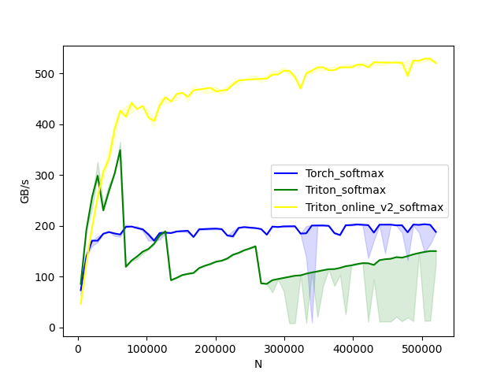
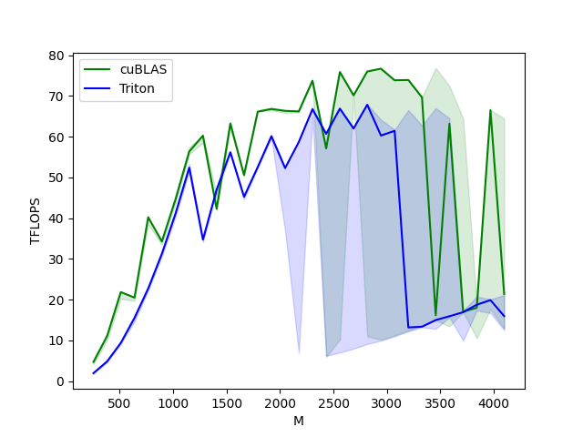
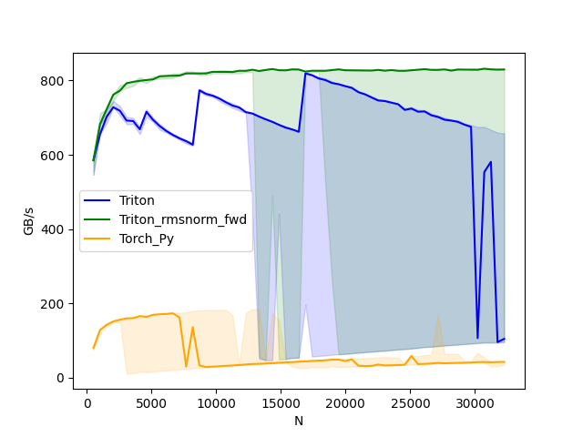
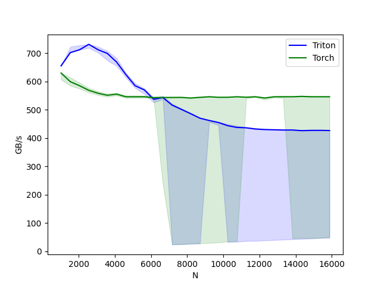
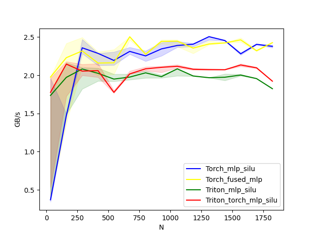
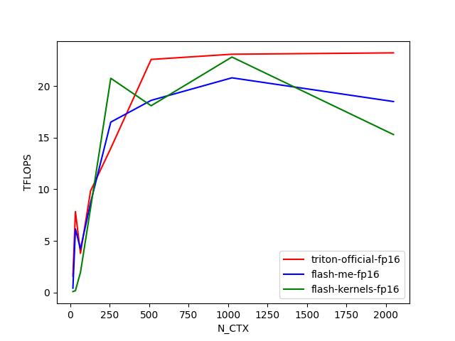
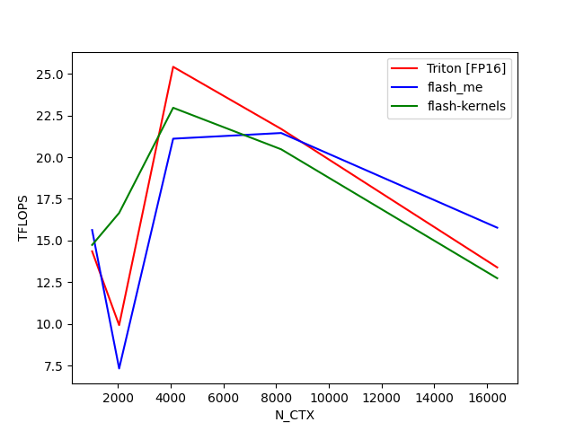
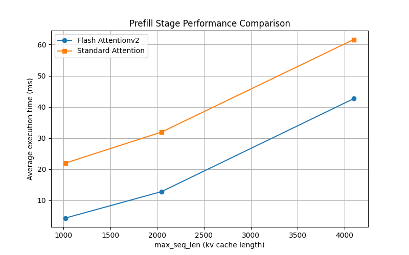
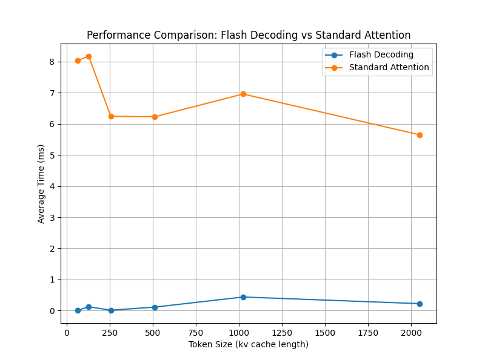

## triton 内核 benchmark 测试

### softmax

softmax benchmark test result:

### linear

linear(matmul) benchmark test result:

### rmsnorm

rmsnorm benchmark test result:

### layernorm

layernorm benchmark test result:

### mlp_silu

MLP_Silu test result:

### flashattention

flashattention benchmark test result:

### flashattentionv2_no_pad

flashattentionv2_no_pad benchmark test result:

### flashdecoding

flashdecoding benchmark test result:

