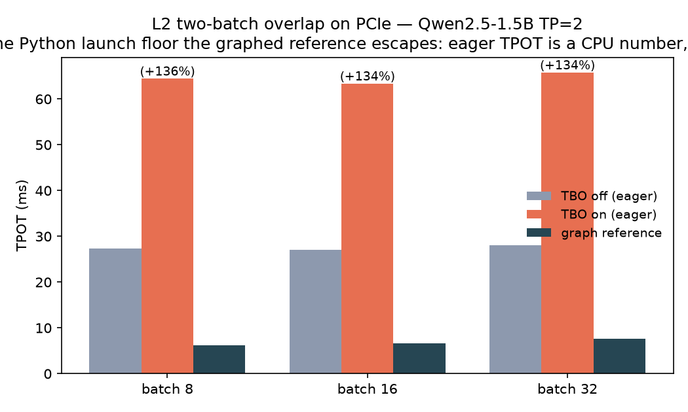
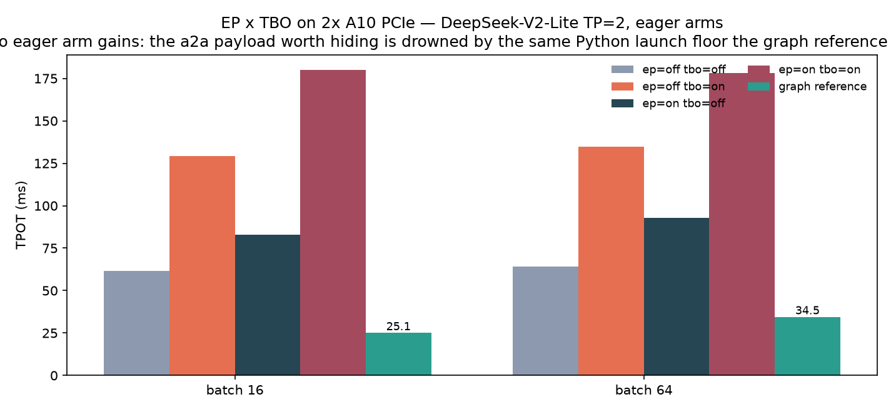
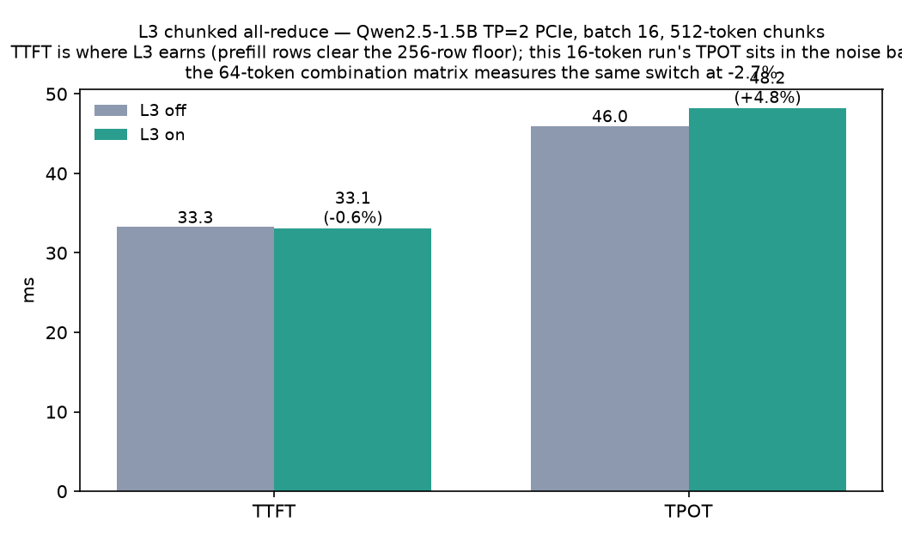
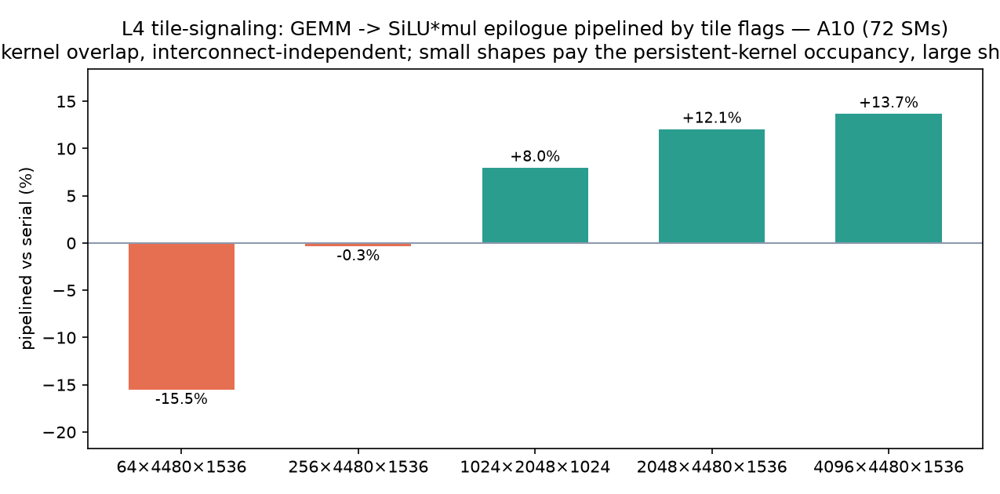
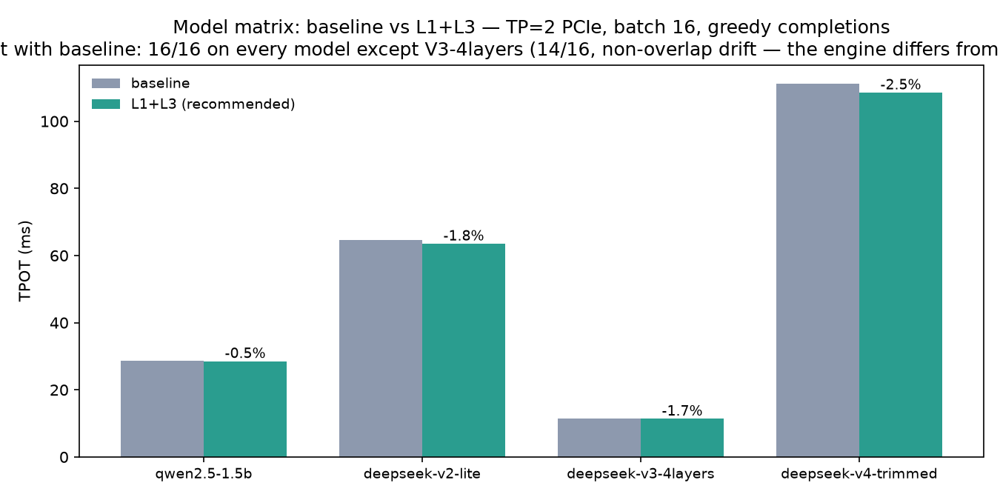
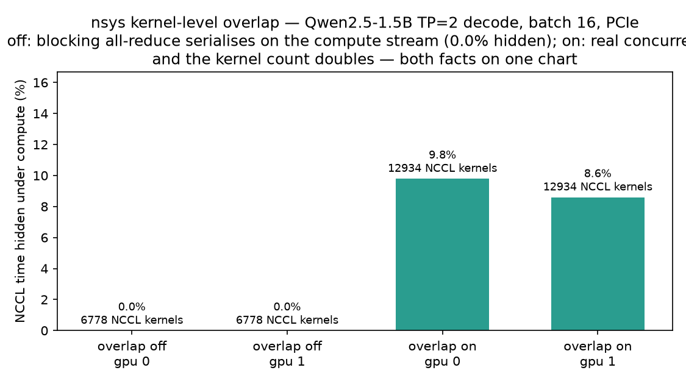

# Release v0.11.5 — 计算通信重叠

**Date:** 2026-09-03 **Branch:** `support_deepseekv4` **Theme:** 四层重叠原语（L1 host↔device、L2 TBO、L3 chunked all-reduce、L4 tile-signaling）+ DP×CUDA Graph 交叉验证 + DeepSeek V4 端到端；每个特性独立 on/off 对照数据，正收益与负收益同表发布

## Summary

v0.11.5 沿三条轴把「通信时间藏在计算后面」做成可独立开关的原语，并用一个组合矩阵把三者交叉验证——矩阵里每一个数字都是同一负载、同一引擎、只动开关的对照：

* **L1（pinned-copy 重叠，默认开）**：上传/回读走 copy stream + pinned 环形缓冲，`StreamPool` + `Timeline`（CUDA event 级证据）。
* **L2（two-batch overlap，默认关）**：TP decode 步切两半 ping-pong，半 A 的 o_proj all-reduce 在通信流上飞行时，半 B 的注意力 GEMM 占着 SM。deferred-AR 上下文 + `execute_overlapped` 交错原语。eager 形态负收益的根因是 CPU launch floor（graph 参照臂 6-8 ms 对 eager 27-66 ms），正收益路径是 graph-captured TBO（本版未实现，`TboPolicy` 排除 graph 形态）。
* **L3（chunked all-reduce，默认关）**：行并行 GEMM 输出按行分块，第 k 块的 AR 上线时第 k+1 块的 GEMM 在算。
* **L4（tile-signaling，单卡 kernel 级）**：persistent Triton 生产者每完成一个输出 tile 就 `atomic_xchg` 发布 epoch，消费者 kernel 有界自旋等 tile，GEMM→epilogue 逐 tile 流水。
* **P8（DP + CUDA Graph）**：每副本独立 capture/replay（tp=1/副本，graph 内无集合通信），TPOT -80%，DP2 吞吐 5.1×。

**质量故事（本版最有价值的产出之一）**：组合矩阵（M7）抓到了单特性测试漏掉的 TBO 数值回归——闭包在构建期快照了 `state.hidden`，所有层的 segment 都拿初始 embedding 当输入，交错输出与 eager 基线 maxdiff 27+；而「切分本身正确」的隔离证据来自 manual-halves 对照（同一 `TboSplitter` 切分、逐半顺序 forward 拼接 → maxdiff 0.0000）。修复为闭包运行时惰性读 state（`lite_llama/batch_overlap/two_batch_overlap.py` 的 `_attn_segment` docstring 记录了完整机理）。**这正是「不同优化特性做混合、交叉测试」在计划里的目的：单特性的 parity 测试过 ≠ 组合下依然对。**

**模型覆盖**：dense Qwen2.5-1.5B、DeepSeek-V2-Lite（MLA+MoE）、V3-4layers（biased noaux_tc 路由）、V4 裁剪版（mHC 残差/压缩器/Lightning Indexer/Hash MoE，transformers 5.8 随机初始化 checkpoint——V4 无公开权重）。

## 架构


*四条可独立开关的重叠路径：A 轴 L1（`executor/overlap.py`，默认开）把下一个 pass 的 H2D 上传藏进当前 forward；C 轴 L2/L3（`batch_overlap/`，默认关）分别用半批 ping-pong 与行分块把 all-reduce 挪到通信流上；B 轴 L4（`kernels/tile_signal.py`）是单卡 kernel 级的逐 tile 流水；P8 让每个 DP 副本 capture 自己的 graph。L2 与 L3 共用同一个分发点 `row_parallel_forward`（passthrough > deferred TBO > chunked L3 > blocking），四条路径最终汇进同一个组合矩阵交叉验证。*

包结构（`lite_llama/batch_overlap/`，对齐 sglang 的 `batch_overlap` 布局）：

* `operations.py` — stage/yield 交错原语（`YieldOperation` + `execute_overlapped`）
* `comm_overlap.py` — 通信流底座：`CommStreamPool`（每 device 一条 NCCL 流）、`DeferredArContext`（defer/fence/collecting/drain）、`CommOverlapPolicy`（L3 策略）与 `row_parallel_forward` 单一分发点
* `two_batch_overlap.py` — L2 executor：`TboSplitter`（行切半 + KV 元数据窄化）+ `TwoBatchOverlap`（双 op 流交错）
* 模型侧唯一侵入点：`models/base.py` 的 `DecoderLayer.forward_attn_stage/forward_mlp_stage` 两段拆分（原 `forward` = 两段顺序调用，行为不变；段边界恰好是 o_proj 的行并行 all-reduce）

## Feature

### L2 two-batch overlap（含如实发布的负收益与根因修正）

```bash
# TP2 对照（batch 8/16/32：eager on/off 两臂 + graph 参照臂 + greedy 一致性 + timeline）
python benchmarks/bench_overlap_l2.py --timeline
# EP 四臂：V2-Lite TP2 上 EP on/off × TBO on/off（每批带 graph 参照臂）
python benchmarks/bench_ep_overlap.py --json docs/benchmark_logs/overlap_ep_<ts>.json
```

2×A10 **PCIe** 上 **eager 形态的** TBO 是负收益——但复测把根因修正为 **CPU launch floor，不是「PCIe 不能重叠」**：eager TP2 decode 的 TPOT 由 Python kernel-launch 的 CPU 时间决定（off 臂 GPU util 仅 28.6%），通信原语要在 GPU 上省时间，而瓶颈根本不在 GPU。三臂数据同表发布（`docs/benchmark_logs/overlap_l2_tbo_20260904_003941.json`）：

| batch | eager off | eager TBO | graph 参照 | 变化 | greedy 一致 |
| --- | --- | --- | --- | --- | --- |
| 8 | 27.3 ms | 64.5 ms | 6.2 ms | +136% | 6/8 |
| 16 | 27.1 ms | 63.4 ms | 6.7 ms | +134% | 16/16 |
| 32 | 28.1 ms | 65.8 ms | 7.6 ms | +134% | 28/32 |

graph 参照臂与两 eager 臂同负载、同 TP2，唯一差别 `use_cuda_graph=True`（TP graph capture 已于 3e4d3deb 落地）：**6-8 ms 对 eager 的 27-66 ms——launch floor 本身就是 eager TPOT 的 4-10 倍**。三层证据钉死根因：

1. **TPOT 与 batch 无关**：诊断跑批 `--batches 8 16 32 64 128 256 512`，eager off 恒 ~29-30 ms、TBO on 恒 ~66-67 ms，差值恒 +36 ms——若瓶颈在 GPU compute 或 PCIe 通信，batch 翻倍时占比必然移动；纹丝不动只能是每步固定的 CPU 开销。
2. **kernel 拆半零收益**：nsys 显示 on 臂 compute kernel 数 40470→77622（翻倍）但平均时长 13.3→14.3 us 不变——M=8 与 M=16 的 GEMM 都坐在 kernel launch 地板上，拆半只添 launch 次数。
3. **NCCL 翻倍 × rank skew（旧版误当主因的两个次级现象）**：每步 AR 56→112；baseline 每 AR 两 rank 启动偏斜 p50=139 us（真 wire ~32 us），AR 翻倍把 spin 等待也翻倍。


*TP2 decode 的真实 CUDA-event timeline（`scripts/gen_overlap_gifs.py --level l2`）：上面两条泳道是半 A / 半 B 的 segment（`tbo.attn.*` / `tbo.mlp.*`），下面一条是通信流上的 deferred all-reduce，红带是两者在同一设备时钟上的交集——重叠确实发生，问题在于 eager 形态兑现不了它。*



*同负载三臂：eager off / eager TBO / graph 参照。两条 eager 臂都坐在 Python launch floor 上（27-66 ms），参照臂 6-8 ms；TBO 的 +134% 是 CPU 地板上的调度开销，而不是「PCIe 不能重叠」。*

**重叠本身是真实发生的**（timeline 792 对重叠共 65.5 ms；nsys kernel 级 9.8% NCCL 时间被 compute 隐藏，off 臂为 0.0%），只是 eager 形态下收益无处兑现。6/8、28/32 的分歧行是低置信度输出上「分批 AR vs 整批 AR」的 bf16 归约顺序差——与 batch16 的 16/16 完美一致同表呈现，不隐藏。

**对标 SGLang 的正收益三前提**：CUDA graph（decode 是 replay，TPOT=GPU 时间）+ EP all-to-all payload 大到值得藏 + 深 compute 模型。本 bench 的 eager 形态一个都不满足；EP 四臂（`bench_ep_overlap.py`，V2-Lite TP2）进一步证明 **eager 下 EP 也是负收益**——a2a 的 payload 优势同样被 CPU 地板淹没：

| batch | tp eager | tp+tbo | ep eager | ep+tbo | graph 参照 |
| --- | --- | --- | --- | --- | --- |
| 16 | 61.5 ms | 129.4 ms | 83.0 ms | 180.0 ms | 25.1 ms |
| 64 | 64.1 ms | 134.7 ms | 92.7 ms | 178.3 ms | 34.5 ms |

（`docs/benchmark_logs/overlap_ep_20260904_003941.json`）四个 eager 臂无一获益（TP+TBO +110%、EP 单开 +35-45%、EP+TBO +178-193%）；graph 参照臂比最快的 eager 臂还快 1.9-2.4×，且 greedy 与 baseline **16/16、64/64 完全一致**——「值得藏的 a2a payload」在 eager 形态下同样被 CPU 地板淹没。eager 各臂的 greedy 一致率（8/16、9/16、40/64 等）是 bf16 MoE 路由平坦 logits 上归约顺序差翻转 argmax，golden 门禁的 logprob 预算全绿（见下）。



*V2-Lite TP2 的四个 eager 臂（EP on/off × TBO on/off）与 graph 参照臂同图：无一获益，参照臂比最快的 eager 臂还快 1.9-2.4×——值得藏的 a2a payload 在 eager 形态下同样被 CPU 地板淹没。*

**结论修正（替换旧版「等 NVLink 机器再开」）**：NVLink 缩短 AR wire 时间，但消除不了 launch floor。正收益路径是 **TBO + CUDA graph capture**——op 流（`operations_strategy` 的 `_DENSE_OPS`/`_EP_MOE_OPS`）是静态的、可 capture 的，NCCL in-graph replay 已由 3e4d3deb 验证；`TboPolicy` 目前显式排除 graph 形态，所以 L2 保持默认 off（`LITE_LLAMA_TBO=1` 显式开启，`TboPolicy.min_rows` 默认 8 是激活阈值），直到 graph-captured TBO 落地。

### L3 chunked all-reduce

```bash
python benchmarks/bench_overlap_l3.py --json --timeline
```

GEMM 输出行分块、每块 GEMM 落地即上通信流（`docs/benchmark_logs/overlap_l3_20260903_215551.json`）：TP2 Qwen2.5-1.5B batch 16，TTFT 33.25→33.07 ms（-0.6%），timeline 记录 224 个 comm region 与 111 对真重叠（9.78 ms）。`L3_MIN_CHUNK_ROWS=256` 行下限：再细的分块在 PCIe 上付更多次小消息固定成本。分发点优先级 TBO > L3（同一 all-reduce 位点不叠加切分），组合矩阵验证退位成立（见下）。


*chunked prefill 的真实 timeline（`scripts/gen_overlap_gifs.py --level l3`）：compute 泳道是同一个行并行 GEMM 的两个行块（`l3.gemm.0/1`），通信泳道是它们各自的 all-reduce（`l3.all_reduce.0/1`）——第 0 块的 reduce 在线上时，第 1 块的 GEMM 正在算。*



*L3 单开关对照：TTFT -0.6%（prefill 的行数越过 256 行下限，是 L3 的兑现点）；这条 16-token 短跑的 TPOT +4.8% 落在噪声带里，64-token 的组合矩阵测同一开关是 -2.7%。*

### L4 tile-signaling

```bash
python benchmarks/bench_overlap_l4.py
```

单卡 kernel 级原语，与互联无关（`docs/benchmark_logs/overlap_l4_20260903_104621.json`）：GEMM→SiLU·mul 逐 tile 流水 vs 串行两 kernel，A10（72 SM）上大形状 +8.0~+13.7%（4096×4480×1536：5.85→5.05 ms），小形状负收益（64×4480×1536：-15.5%）如实入表——persistent kernel 的常驻占用在 tile 少时是纯开销。死锁规避：生产者+消费者 grid 之和 ≤ #SM，host 侧 watchdog 兜底。


*单卡上 persistent 生产者（GEMM）与消费者（SiLU·mul epilogue）两个 kernel 的设备 timeline（`scripts/gen_overlap_gifs.py --level l4`）：消费者不等 GEMM 收尾，靠 tile flag 逐块接手，红带就是逐 tile 流水的交集。*



*同一对 kernel 的串行 vs 流水按形状铺开：大形状 +8~14%，小形状负收益，两者同图——收益来自 tile 数够多时 epilogue 能被藏进 GEMM。*

### DP + CUDA Graph（P8）

```bash
python benchmarks/bench_dp_graph.py
```

`docs/benchmark_logs/dp_graph_20260903_143056.json`（Qwen3-0.6B，batch 16/副本，128 步）：

| 配置 | TPOT | 吞吐 |
| --- | --- | --- |
| dp1 eager | 25.9 ms | 618 tok/s |
| dp1 graph | 5.2 ms | 3102 tok/s |
| dp2 eager | 26.4 ms | 1200 tok/s |
| dp2 graph | 5.2 ms | **6162 tok/s** |

每副本独立 capture/replay 无锁步（tp=1/副本，graph 内无 NCCL 集合通信），DP2 下吞吐 5.1×、TPOT -80%；capture 耗时 +2.4 s、显存增量已记入 JSON。测试 `tests/engine/test_dp_cuda_graph.py` 断言双副本均有 captured graphs 且 greedy 输出一致。


*左：每副本 decode 延迟 25.9→5.2 ms（-80%，log 轴）；右：2×A10 聚合吞吐 618→6162 tok/s（5.1×）。副本各自 capture 自己的 graph，所以 DP 的线性扩展不被 graph 内的集合通信锁步吃掉。*

### DeepSeek V4（裁剪版端到端）

V4 无公开权重（仅 config.json），用 transformers 5.8 随机初始化裁剪 checkpoint（借 Qwen tokenizer）做 parity 与性能对照：

* `modules/deepseek_v4/`（按模块拆分的子包）：`rope` interleaved partial RoPE（main / compress 双频率表）、`norm` weighted + unweighted RMSNorm、`hyper_connection` mHC 残差（Sinkhorn 混合 + hc_head）、`cache` 滑窗 K==V per-layer cache（绕开 paged KV）、`compressor` Compressor（CR 累积→RMSNorm→RoPE→压缩 cache）+ Lightning Indexer（topk 选块）、`grouped_linear` O-LoRA wo_a 块对角分组、`attention` SWA/CSA 混合注意力（head_dim=512 latent KV + fused_wqa_wkv、inv-RoPE、wo_b 行并行）；`__init__` 沿用 `modules/` 的懒加载 facade 逐个转发
* `models/deepseek_v4.py`：组装 + registry + packed_modules 映射；TP2 下 heads/o_groups 整除校验；Hash MoE（num_hash_layers 层 tid2eid）+ sqrtsoftplus 路由
* 测试 `tests/models/test_deepseek_v4.py` 8 项（rotary/HC/router×2/MoE/decoder/e2e/incremental）+ `tests/distributed/test_tp2_v4.py` TP2 一致性
* benchmark：`benchmarks/bench_deepseek_v4.py`（vs transformers 速度对照，含噪声基线）
* **fp4 权重暂不支持**：本版以 bf16/fp16 unquantised 权重为 parity 基础，fp4 留待后续版本


*左：prefill 从 0.76×（seq 256）追到 1.06×（seq 2048），虚线是 transformers 基准；右：decode TPOT 0.29-0.82×——compressor/indexer 逐行走 Python，一个 batch-32 步约 8.7k 次 kernel launch，是 CPU-bound 而非 kernel 慢，如实入图。greedy 一致率 0.50 需对读 transformers 自己 fp32-vs-bf16 的 0.47（未训练 checkpoint 的平坦 logits）。*

## 组合矩阵与精度门禁（M7）

### 组合矩阵：L1×L2×L3 八格

`benchmarks/bench_overlap_matrix.py`（`docs/benchmark_logs/overlap_matrix_final.json`，Qwen2.5-1.5B TP2 batch 16，1024 tok/格）：

| 组合 | TPOT | vs baseline | 输出一致性 |
| --- | --- | --- | --- |
| baseline | 28.47 ms | — | — |
| l1 | 27.25 ms | -4.3% | 16/16 |
| l2 | 66.09 ms | +132% | 16/16 |
| l3 | 27.69 ms | -2.7% | 16/16 |
| l1l2 | 65.20 ms | +129% | 16/16 |
| l1l3 | 27.89 ms | -2.0% | 16/16 |
| l2l3 | 64.94 ms | +128% | 16/16（≡ l2） |
| all | 66.42 ms | +133% | 16/16（≡ l1l2） |

`l2l3`/`all` 两格的存在就是验证 L3 在 TBO 激活时退位：它们的输出与 `l2`/`l1l2` 逐字相同（`demotion_holds: true`），TPOT 也在 l2 的噪声带内——分发点优先级不是文档声明而是被测行为。


*同一负载、只动开关的八格：L2 参与的格子（红）全部退到 ~65 ms，l1/l3/l1l3 在 baseline 噪声带内小幅为正；`l2l3`≡`l2`、`all`≡`l1l2` 是退位规则的实测证据。*

### 模型矩阵：baseline vs 推荐组合（L1+L3）

| 模型 | TPOT 变化 | TTFT 变化 | 输出一致性 |
| --- | --- | --- | --- |
| qwen2.5-1.5b | -0.5% | +0.4 ms | 16/16 |
| deepseek-v2-lite | -1.8% | -15.9 ms | 16/16 |
| deepseek-v3-4layers | -1.7% | -0.0 ms | 14/16* |
| deepseek-v4-trimmed | -2.5% | -0.6 ms | 16/16 |

\* V3-4layers 的 14/16 与 overlap 无关：**两次全关的 baseline 互比同样 14/16**，分歧行输出为乱码 token（平坦 logits 上 argmax 的 run-to-run 抖动）。这是引擎固有噪声的测量，不是特性引入的漂移。



*推荐组合 L1+L3 在四个模型上都是小正收益（-0.5% ~ -2.5%），dense 与 MLA/MoE/裁剪 V4 栈都不例外——重叠原语不挑模型结构。*

### golden 门禁（双遍）

```bash
pytest tests/golden/ -q                                        # 默认：9 passed
LITE_LLAMA_OVERLAP=1 LITE_LLAMA_TBO=1 LITE_LLAMA_COMM_OVERLAP=1 \
LITE_LLAMA_TBO_MIN_ROWS=2 pytest tests/golden/ -q              # 全开：9 passed
```

第二遍把 TBO 激活阈值压到 2 强制 TP2 golden 走 `forward_tbo` 路径，V2-Lite 的 greedy/logprob parity 预算（mean 0.4/max 2.5 nats，2× 实测漂移校准——校准证据链见测试内注释）依然全绿。

### nsys kernel 级证据

`docs/benchmark_logs/nsys_overlap_report.md`（payload：`benchmarks/nsys_overlap_payload.py`，分析器：`benchmarks/nsys_overlap_report.py`）：

| trace | gpu | NCCL kernels | hidden under compute |
| --- | --- | --- | --- |
| overlap off | 0 | 6778 | 0.00 ms (0.0%) |
| overlap off | 1 | 6778 | 0.00 ms (0.0%) |
| overlap on | 0 | 12934 | 206.12 ms (9.8%) |
| overlap on | 1 | 12934 | 126.04 ms (8.6%) |

off 臂 NCCL 与 compute 零重叠（阻塞 AR 在 compute stream 上串行）；on 臂 kernel 级真并发出现。NCCL kernel 数翻倍（12934）同时如实呈现——这是 L2 负收益机理的直接观测。



*off 臂 0.0%（阻塞 AR 串在 compute stream 上），on 臂 9.8% / 8.6%——kernel 级真并发；柱上同时标出 NCCL kernel 数 6778→12934，两个事实同图，不只挑好看的那一半。*

## 全量回归

M7 收尾时全套测试分批跑过（本轮改动：TBO 闭包惰性读取修复、grouped_topk 单 expert 组退化、外部 batch_overlap 包重构适配、test_checkpoint_index MTP/trim 层豁免）：

* 批 1 `tests/models/ + tests/kernels/ + tests/batch_overlap/ + tests/executor/ + tests/engine/ + tests/distributed/`：1288 passed / 72 skipped（唯一失败为 HEAD 既有：V3-MTP checkpoint 的 MTP 层 key 未豁免，worktree 对照验证后修复，36 passed）
* 批 2 `tests/ops/ + tests/tools/ + tests/compile/ + tests/config/ + tests/entrypoints/ + tests/evals/ + tests/multimodal/ + tests/platform/ + tests/utils/ + tests/modules/ + tests/test_imports.py`：480 passed / 10 skipped
* `tests/golden/`：默认与 overlap 全开双遍 9 passed

## 已知边界（如实标注）

1. **互联**：全部数据来自 2×A10 **PCIe**（无 NVLink 硬件）。L2 的负收益根因已修正为 eager 形态的 CPU launch floor（graph 参照臂 6.2-7.6 ms 对 eager 臂 27-66 ms）；PCIe 只决定 AR wire 时间（~32 us/次）。NVLink 上的一切**未测**，不做推断。
2. **L2 默认 off**：eager 形态负收益；`TboPolicy` 显式排除 CUDA graph 形态，graph-captured TBO 是尚未实现的正收益路径。`LITE_LLAMA_TBO=1` 显式开启。
3. **V4 fp4**：本版仅 bf16/fp16 unquantised 权重（parity 基础）；fp4 量化加载留待后续。
4. **V4 TBO 未接线**：mHC 栈的段结构与两段拆分不匹配，本版 V4 不走 `forward_tbo`（矩阵里 V4 只测 L1+L3 组合）。
5. **裁剪 checkpoint 的 grouped_topk**：V3-4layers（8 experts/8 组）落在所有参考实现（transformers/vLLM）都会崩的几何上；lite_llama 按数学极限退化处理（单 expert 组分数 = top-2 和的极限 = 该 expert 分数），`tests/kernels/test_grouped_topk_kernel.py` 锁定该语义。

## 图表

* `docs/images/overlap_axes.png` — 三条轴与组合矩阵的原理图（开关位与重叠关系，不携带测量数字）
* `docs/images/overlap_combination_matrix.png` — 八格组合矩阵（L2 类红色标注）
* `docs/images/overlap_model_matrix.png` — 四模型 baseline vs L1+L3
* `docs/images/overlap_l2_tbo.png` — L2 三臂对照（eager on/off + graph 参照，batch 维度）
* `docs/images/overlap_ep_tbo.png` — EP×TBO 四 eager 臂 + graph 参照（V2-Lite）
* `docs/images/overlap_l3_chunked.png` — L3 TTFT/TPOT（prefill 是收益位）
* `docs/images/overlap_l4_tile_signal.png` — L4 各形状正负收益
* `docs/images/nsys_overlap_hidden.png` — NCCL 被隐藏比例（off vs on，kernel 级证据）
* `docs/images/dp_cuda_graph.png` — DP×Graph TPOT/吞吐
* `docs/images/deepseek_v4_speed.png` — V4 裁剪版 vs transformers（prefill/decode）

生成：`python benchmarks/plot_overlap_gains.py`（读 JSON logs，图数同源）。

原理 timeline GIF，生成：`python scripts/gen_overlap_gifs.py`（直接跑引擎收 CUDA-event region，逐帧揭示，底部标注本窗口实测的重叠对数与毫秒数）：

* `docs/images/overlap_l1.gif` — L1 copy stream vs compute stream（`scripts/gen_overlap_l1_gif.py`）
* `docs/images/overlap_l2.gif` — L2 半 A/半 B segment 与 deferred all-reduce（TP2 decode）
* `docs/images/overlap_l3.gif` — L3 行块 GEMM 与分块 all-reduce（TP2 chunked prefill）
* `docs/images/overlap_l4.gif` — L4 生产者/消费者 kernel（单卡）
