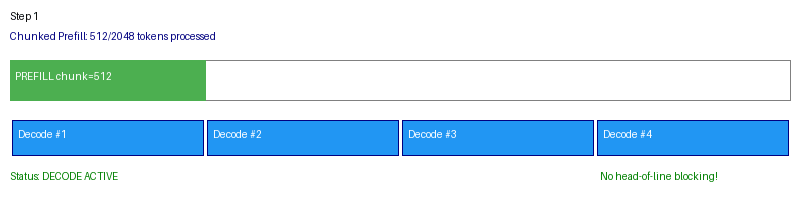

# Release v0.7.0 — 调度能力 (Chunked Prefill + Preemption)

**Date:** 2026-08-23
**Branch:** `main`
**Theme:** Chunked prefill 消除长 prompt 阻塞 + 抢占 (recompute) + 调度 policy 升级

## Summary

v0.7.0 升级调度器为 chunked-prefill 架构（参考 vLLM Scheduler v2）：长 prompt 按
`max_chunk_size` 分片处理，每个分片步骤与 decode batch 并行执行，decode 请求不再
被长 prefill 阻塞。新增抢占能力（recompute 策略）：当 KV 压力超过水位线时，最近
接入的请求被 evict 并重新排队。

## 1. Feature: Chunked Prefill

**v0.6 行为：** 一个 2000-token prompt 的 prefill 在**单个 step 内一次做完**。同 step 里的 decode 请求必须等这 2000 token 的 attention/GEMM 全部算完才能拿到自己的下一个 token，TPOT 出现 spike。

**v0.7 行为：** prefill 按 `max_chunk_size=512` 分片，单 step 承载的 prefill 工作量被封顶，decode 的等待时间由 chunk 大小决定，而不再由 prompt 长度决定。

### 可视化：同一份 scheduler 代码，只改 `max_chunk_size`



> GIF 由 `scripts/gen_chunked_prefill_gif.py` 驱动**真实 Scheduler** 录制，逐 step 打印调度决策。先播 `chunking OFF`，再播 `chunking ON`。

### 实测数据（真实 scheduler 输出）

| 配置 | Prefill 步数 | 单 step 峰值 prefill token | 每步 decode 请求数 |
|------|-------------|--------------------------|------------------|
| `max_chunk_size=0` (v0.6) | 1 | **2000** | 4 |
| `max_chunk_size=512` (v0.7) | 4 | **512** | 4 |
| `max_chunk_size=256` | 8 | **256** | 4 |

**关键结论：** decode 在两种模式下都在跑（prefill 与 decode 本就并存），真正的收益是
**单 step 最坏 prefill 工作量下降 3.9x**（2000 → 512 token）。decode 请求的尾延迟因此
从「等一个完整 prompt」变成「等一个 chunk」。

> 复现：`python scripts/gen_chunked_prefill_gif.py`
> 逐 step 原始输出与 benchmark 日志：[`docs/benchmark_logs/bench_chunked_prefill_v07.json`](benchmark_logs/bench_chunked_prefill_v07.json)

**使用方式：**

```python
from lite_llama.engine.scheduler import Scheduler, SchedulerConfig

config = SchedulerConfig(
    max_seq_len=4096,
    max_num_seqs=16,
    max_chunk_size=512,  # 0 = disable chunking (v0.6 behavior)
)
sched = Scheduler(config, num_slots=64)
```

## 2. Feature: Preemption (Recompute Strategy)

当无空闲 slot 时，调度器 evict 最近接入的 running 请求：
- 释放其 KV slot
- 清空已生成 tokens
- 重新排到 waiting 队列头部（下次优先重新 prefill）

```python
# Automatic: scheduler preempts when no slots available
sched.add_request(new_request)  # triggers preemption if full
print(f"Total preemptions: {sched.num_preemptions}")
```

对标 vLLM 的 `PreemptionMode.RECOMPUTE`。

## 3. Feature: SchedulerOutput 增强

`SchedulerOutput` 新增字段支持 chunked prefill：
- `prefill_chunk_lens: list[int]` — 每个 prefill 请求本步处理的 token 数
- `preempted: list[Request]` — 本步被抢占的请求（用于日志/监控）
- prefill + decode 可同时非空（v0.6 互斥）

调度器新增 `advance_chunks()` 方法用于推进 chunk 进度。

## 4. SchedulerConfig 新增参数

| 参数 | 默认值 | 说明 |
|------|--------|------|
| `max_chunk_size` | 512 | 每步最大 prefill token 数。0=不分片 |
| `enable_prefix_cache` | False | 预留 prefix caching 开关 |

## 5. 测试结果

```
25 passed   (test_scheduler.py, chunked prefill + preemption)
394 passed  (full CPU suite)
```

调度器测试更新：`test_prefill_takes_priority_over_decode` 验证 prefill 与 decode
并行运行（不再互斥）。

## 6. 设计参考 (vLLM)

| lite_llama v0.7 | vLLM 对应 | 说明 |
|-----------------|-----------|------|
| `SchedulerConfig.max_chunk_size` | `SchedulerConfig.max_num_batched_tokens` | 控制 prefill 粒度 |
| `Scheduler._preempt()` | `Scheduler._preempt()` | recompute 策略 |
| `SchedulerOutput.prefill_chunk_lens` | `SchedulerOutput.num_prefill_groups` | 分片元数据 |
| `advance_chunks()` | 内置在 `_schedule_running()` | 推进 chunk 状态 |

## Upgrade

```bash
git pull origin main
uv pip install -e .

# 启用 chunked prefill (默认 512 tokens/chunk)
lite-llama serve --port 8000  # scheduler 自动使用 chunked prefill

# 显式设置 chunk 大小
# SchedulerConfig(max_chunk_size=256) in engine config
```
