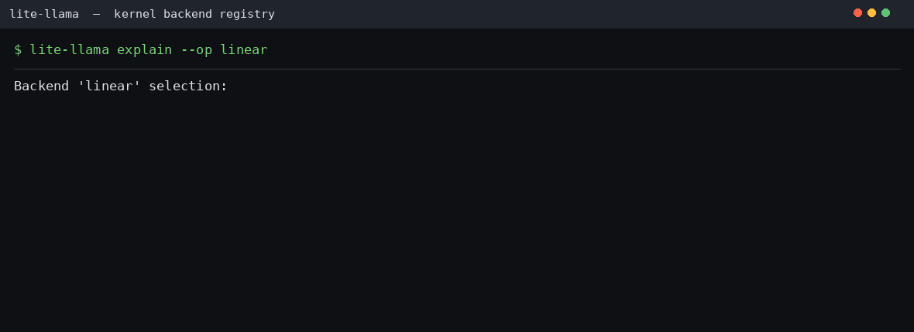

# Release v0.8.0 — 多进程隔离引擎 + 并行 module 补齐 + 多后端注册表

**Date:** 2026-08-24 **Branch:** `refactor-multi-process-engine` / `op_register` **Theme:** 把"谁来跑一次前向"收敛成一个 Executor 接缝，并补齐 vocab / qkv 两处并行 module

## Summary

v0.8.0 有两条工作线：

**Part A（本版主体，ROADMAP 地基 0 + A11）** 重做多卡执行路径。旧的"镜像进程"方案广播 prompt 字符串、让每个 rank 各自重新推导该跑哪一批，于是"两边推导一致"成了一个不变量——它一旦被破坏，表现不是报错而是**卡死在 NCCL 里**。这一版把一次前向变成一份数据（`ModelInput`），交给 `Executor`（`UniProcExecutor` / `MultiprocExecutor`）执行：plan 是唯一真相，driver 与 follower 跑同一段代码。控制面（Python 对象）走 gloo，数据面（张量）走 NCCL。并行 module 补上 `QKVParallelLinear`、`VocabParallelEmbedding` / `ParallelLMHead`，采样改成去中心化 log_softmax——每步每行只交换两个标量，不再 gather 词表规模的 logits。新增 `collective_log.py` 把这句主张变成可断言的字节数。

**Part B（`op_register` 线）** 引入 kernel backend 注册表：后端声明探测函数与优先级，启动时自动选出可用的最高优先级实现，`explain_selection()` 输出完整决策过程，未知后端降级而非崩溃。

## Part A — 多进程隔离引擎与并行（地基 0 + A11）

### A.1 Fix: 并行 bug 修复包

三个只在 DP 与 TP **复合**后才浮出水面的缺陷：

| 问题 | 症状 | 修法 |
| ------ | ------ | ------ |
| DP×TP 进程网格 | 协调器 spawn `dp_size` 个进程，而 `init_parallel(tp_size > 1)` 要 rendezvous `dp_size × tp_size` 个 rank——每一次 DP×TP 运行都**永久挂在从未启动的 rank 上** | 每个网格单元各占一个进程与请求队列，`grid_coordinates()` 从 global rank 反解 `(dp_rank, tp_rank)`；副本内 TP follower 镜像 leader 的前向，只有 `tp_rank == 0` 回复协调器 |
| `all_reduce_min` device index | 张量建在 `cuda:{tp_rank}`，而 DP×TP 下本进程拥有的是 `dp_rank * tp_size + tp_rank`（`CUDA_VISIBLE_DEVICES` 重映射下同样不成立） | 改问 `torch.cuda.current_device()` |
| DP 路由 token 估计 | 路由器把 `len(prompt)`——**字符数而非 token 数**——喂进一个从没有 balancer 读过的 `estimated_tokens` 参数 | 策略名对齐 SGLang（`round_robin` / `total_requests` / `total_tokens`），`total_tokens` 用真实 tokenizer 计数，新的 `needs_token_estimate` 契约让 `round_robin` 跳过 tokenizer |

网格约束用假的 process/queue context 在 **CPU 上**断言，所以那个死锁不需要四张卡就能复现。

### A.2 Feature: 一条接缝 —— Executor

引擎不知道模型在本进程还是在八个进程里，它只做一件事：把 plan 交给 `Executor`，拿回采样出的 token。

| 角色 | 本仓库 | vLLM |
| ------ | -------- | ------ |
| 一次前向的**数据描述** | `executor/worker.py::ModelInput` | `SchedulerOutput` / `ModelRunnerOutput` |
| 执行一次 plan（本进程） | `UniProcExecutor` | `UniProcExecutor` |
| 执行一次 plan（多进程） | `MultiprocExecutor` | `MultiprocExecutor` |
| 非 driver rank 的全部行为 | `serve_plans` | `WorkerProc.worker_busy_loop` |

接口只有三个成员：`num_slots`、`execute(model_input)`、`shutdown()`。**除返回值外任何签名里都没有张量**——这是"引擎不感知拓扑"能成立的原因。

两个原创取舍：

- **driver 兼任 rank 0**，所以 `tp=2` 只花**两个**进程而不是三个（`test_two_gpus_cost_exactly_one_extra_process`）；单卡走 `UniProcExecutor`，`mp.active_children()` 是 0，引擎循环里下一个断点就是 kernel 里的断点——单卡不该为多卡的能力付调试成本。
- **死掉的 rank 必须先于集合通信被发现。** 每个 collective 都假设所有 rank 到场，一个 rank 死了其余的只是等。所以 `execute()` 在提交昂贵的全局事实（broadcast）之前先查一个廉价的本地事实：`ensure_followers_alive()`；`shutdown()` 只在组还完整时才广播停止信号。

### A.3 Feature: 控制面走 gloo，镜像进程模式退场

plan 是 Python 对象而 NCCL 只能搬显存，用它传 plan 就得把每个 plan 在 GPU 上中转一次。`init_parallel` 在建 NCCL 组的同时为同一批 rank 再建一个 **CPU（gloo）组**承载控制面，`broadcast_object_tp` 把 pickle 后的字节从主存直接发出去。分层的结果是数据面与控制面互不知情，而**控制面在 CPU 上就能整套测出来**（`test_tp_control_plane.py`，7 个测试）。

**rendezvous 端口自选**：固定 29500 有两个都表现为"挂在 rendezvous"的坑（同机双引擎撞端口、崩溃残留 socket）。`free_port()` 向内核要空闲端口，放在生产代码里、测试 harness 反过来 import 它，让"怎么选端口"只有一处定义。

`lite_llama/cli.py` 里的镜像进程 TP 路径整段删除；`vl-chat` 的 `--tensor-parallel-size > 1` 改为直接报错退出，而不是留一个"假装 TP"的参数。

### A.4 Feature: A11 并行 module 补齐

| 模块 | 切的维度 | 每步通信 |
| ------ | --------- | --------- |
| `ColumnParallelLinear` | 输出维 | 无（保持切开） |
| `RowParallelLinear` | 输入维 | 一次 `all_reduce` |
| `QKVParallelLinear` | 输出维，**按 q / k / v 分段** | 无 |
| `VocabParallelEmbedding` | vocab 维 | 一次 `all_reduce` |
| `ParallelLMHead` | vocab 维 | 无（logits 留在本地） |

**`QKVParallelLinear` 不能写成 `ColumnParallelLinear(hidden, q + 2*kv)`。** GQA 让 query 头数远多于 kv 头数（Qwen3-8B 是 32 vs 8），两个边界各自独立；对 `q + 2*kv` 一刀均分会让低 rank 拿到清一色 query 头、高 rank 拿到清一色 kv 头。两种切法算出的**局部宽度相同**，所以下游不会报错——这正是它危险的地方（`test_qkv_parallel.py`，17 个测试盯段级边界与权重映射）。

**vocab 两端值得单独切。** `[vocab, hidden]` 在 151K × 8192 fp16 下各约 4.9 GB，而 decode 的 `lm_head` GEMM 是大词表模型里最大的那次矩阵乘。实测 `tp=2` 的 embedding 字节数正好是 `tp=1` 的一半；对 tied 模型这还是唯一正确的选择（`test_tying_survives_sharding`）。

**采样：去中心化 log_softmax。** `log_softmax(x)_i = x_i - logsumexp(x)`，而 `logsumexp` 每行只是一个数。每步每行只交换两个标量（`all_reduce_max` 求全局行最大值、`all_reduce_sum` 求 `exp(x-max)` 的行和），通信量从 `O(batch × vocab)` 降到 `O(batch)`，**与词表大小无关**。非贪心采样最后把 rank 0 采出的 id 广播回去（`worker.py::_sync_tp`），否则各 rank 对"刚生成的 token 是什么"意见不一，后面每一步都在放大分歧。

### A.5 可视化：把线路上的字节画出来


`with record_collectives() as ledger:` 打开一本账，每个集合通信把自己的 op 与 payload 报进去（`lite_llama/distributed/collective_log.py`）。四个设计点：**窗口式不是全局的**（没人开窗时埋点代价就是一个 `if`）、**窗口可嵌套且事件计入所有打开的窗口**（per-step 套在 whole-run 里，一趟拿两份数据，调用方不做减法）、**plane 是 op 的属性不是调用点的属性**、**记账点在 world-of-one 早退之后**（单卡 no-op collective 不搬字节，记它就是在量调用点而不是量线路）。

实测一次真实 tp=2 运行（Qwen2.5-1.5B-Instruct，4 条 prompt，24 步，rank 0 视角）：

```text
op                plane      calls       bytes    per call
all_reduce        data        1368     29.2 MB     21.9 KB
broadcast_object  control       24     10.0 KB       428 B
all_gather        data          24       344 B        14 B
broadcast         data          24       344 B        14 B
all_reduce_max    data          24       164 B         7 B
total                         1464     29.2 MB   (data 29.2 MB, control 10.0 KB)
```

**层拿走了全部流量**（28 层各两次 row-parallel all-reduce：decode 一步 171 KB，prefill 一步 22.7 MB）；**采样没有**（一行一步 12 B，而同一行 gather logits 是 148.4 KB —— **12,661 倍**）；"plan 走 gloo"这个选择在总账里是 **0.03%**。

数据并行侧的 GIF 见 [`docs/data_parallel.md`](data_parallel.md)。两张 GIF 分别由 `scripts/gen_collective_gif.py` / `scripts/gen_dp_gif.py` 驱动**真实引擎**录制，每个数字都是量出来的。

### A.6 精度：byte parity 到底能断言什么

分片在精确算术下是恒等变换，但 fp16 归约不满足结合律——row-parallel GEMM 加一次 all-reduce，是把同一批乘积**按另一个顺序**加起来。取证脚本在**单卡、tp=1** 下只改变 batch 的组成重跑同一条 prompt，答案就在第 56 个字符分叉，全程没有张量并行参与。所以**无条件**要求逐字节相等，断言的是 fp16 的性质而不是分片的正确性。

`test_tp_engine.py` 让测试自己测出噪声下限：每条 prompt 答两次（在它的 batch 里、单独一条），单卡引擎与自己不一致的条目就是踩在贪心平局上的条目。三层断言：

| 断言 | 范围 |
| ------ | ------ |
| tp=2 与 tp=1 **逐字节**相同（两种分组都比） | 单卡上 batched == alone 的条目 |
| 共享前缀 ≥ 16 字符 | 踩在平局上的条目——错的 shard offset 毁掉的是**第一个** token |
| 稳定条目占比 ≥ 2/3 | 防止上面那条强断言被静默架空 |

实测 `batch-shape stable: 7/9; on a tie: [('batch6', 4), ('mixed', 1)]`。第三条是关键：没有它，某天大部分 prompt 变"不稳定"后最强的断言会悄悄退化成空断言而测试依然全绿。

### A.7 性能：DP 副本 scaling（A10 ×2 实测）

| 口径 | 配置 | 总请求 | 墙钟 | 吞吐 | 加速 |
| ------ | ------ | ------- | ------ | ------ | ------ |
| weak（每副本 16 条） | dp=2 | 32 | 1.10 s | **3716 tok/s** | **2.00x** |
| strong（固定 256 条切分） | dp=2 | 256 | 1.75 s | **18695 tok/s** | **1.64x** |

weak scaling 拿到满格 ×2.00（100% 线性）——每个副本干一份独立的活、无跨卡通信，IPC 开销可忽略。strong scaling ×1.64（82%）是"切分同一批"的固有上限：每半仍要各自跑一遍 prefill，且墙钟由较慢的副本决定。`tests/distributed/test_dp_perf.py` 把这条结论变成门禁。

### A.8 Refactor: 删掉没人调用的代码，修掉画不出自己文档里那张图的代码

- 删 `skip_rmsnorm_no_view` 及其 kernel（106 行，与主路径重复）、`BackendRegistry.list_all`、`kernels/utils.py::compare_version`、`image_process.py::{load_image_from_base64, vis_images}`（后者用 `os.system` 拼文件名调外部预览器）。
- `tools/profiling/structure.py` 里躺着两个树渲染器：正确的那个零调用，被调用的那个为每个 grandchild 算出连接符后**丢掉不用**——第二层起没有分支符号，`docs/release-v0.6.0.md` 里记录的输出示例是当前代码画不出来的。改为单一递归，规则只有一条：子节点继承父的 prefix，父后面还有兄弟就加竖线，父已封口就加空隙。
- `tools/profiling/memory.py` 的 12 字段签名写了三遍 → 收进 `ModelShape` 一处；`total_bytes` 由存储字段改 property（消掉 sum 的第二真相源）；补上 `tie_word_embeddings`——不处理它会让小模型的权重**多报三分之一**。两个模块此前零测试，现有 13 个（树逐 glyph 断言，预算对手算字节数断言）。
- 清掉 `lite_llama/kernels/` 累积的 lint：pre-commit hook 只跑改动文件，所以未改动文件上新生效的规则长期无人发现，而 `make lint` 是全仓 `ruff check .`——门禁已经悄悄变红。

## Part B — Kernel Backend Registry（`op_register` 线）

**核心设计（对标 vLLM 的 MMLinearKernel 选择逻辑）：**

```python
@dataclass(frozen=True)
class Backend:
    name: str        # "triton_quant" / "torch_linear" / "fp8_native"
    op: str          # "linear" / "attention" / "overlap"
    priority: int    # 数值越大越优先
    probe: Callable  # 返回 True 表示当前机器可用
    reason: str      # 该后端的硬件/库要求说明
```

**注册的后端：**

| Op | Backend | Priority | Probe |
| ---- | --------- | ---------- | ------- |
| linear | fp8_native | 110 | sm89+ |
| linear | triton_quant | 100 | Triton + CUDA |
| linear | triton_fp16 | 90 | Triton + CUDA |
| linear | torch_linear | 10 | always |
| attention | triton_flash_v2 | 100 | Triton + CUDA |
| attention | torch_sdpa | 30 | always |
| overlap | cuda_stream | 100 | CUDA |

### 可视化：探测、选择、切换、回退



GIF 由 `scripts/gen_backend_registry_gif.py` 驱动**真实 BackendRegistry** 录制，每一行都是本机 `explain_selection()` 的实际输出。四个场景：

1. `--op linear`：A10 (sm86) 上 `fp8_native` 探测为 N/A，`triton_quant` 按优先级胜出
2. `--op attention`：选中 Triton FlashAttention-2，而非 torch SDPA
3. `LITE_LLAMA_LINEAR_BACKEND=torch_linear`：一个环境变量把箭头钉到 fallback，无需改代码
4. `LITE_LLAMA_LINEAR_BACKEND=cutlass`：未知后端不崩溃，registry 告警并回退到 triton_quant

### 实测输出（A10, sm86）

```text
$ python -c "from lite_llama.kernels.backends import explain_selection; print(explain_selection('linear'))"
Backend 'linear' selection:
  [fp8_native] pri=110 N/A (Native fp8 tensor cores (sm89+))
  [triton_quant] pri=100 OK (Triton w8a16/w4a16/w8a8/fp8 quantised GEMM)
  [triton_fp16] pri=90 OK (Triton fp16 GEMM (for unquantised))
  [torch_linear] pri=10 OK (F.linear fallback (always available))
  -> triton_quant
```

**缺库自动回退：** `fp8_native` 在 A10 (sm86) 上探测为 N/A（需 sm89+），自动降级到 `triton_quant`；无 Triton 环境时进一步降级到 `torch_linear`。

**Overlap 调度器抽象（L1 骨架）：** 注册表新增 `overlap` op 类型，为后续跨 stream 计算/通信重叠提供探测基础。当前 A10 环境下 `cuda_stream` 后端已就绪 (priority=100)，L1 timeline 实现留待后续版本。

## 测试结果

```text
655 passed                          tests/  (CPU 套件，不含 distributed / evals)
140 passed, 2 skipped in 215.61s    tests/distributed  (A10 ×2；2 个 skip 需 4 卡)
```

并行相关测试规模：

| 文件 | 数量 | 需要 |
| ------ | -----: | ------ |
| `tests/distributed/test_tp_control_plane.py` | 7 | CPU（gloo 控制面 + 存活检测） |
| `tests/distributed/test_parallel_sampling.py` | 9 | CPU（分布式采样数学） |
| `tests/distributed/test_collective_log.py` | 19 | CPU（记账窗口 + gloo 双 rank + 词表无关性） |
| `tests/distributed/test_vocab_parallel.py` | 13 | CPU + GPU（vocab 分片；2 个需 4 卡） |
| `tests/distributed/test_qkv_parallel.py` | 17 | CPU（段级切分与权重映射） |
| `tests/distributed/test_tp_engine.py` | 9 | GPU（需 2 卡，端到端 + 在线服务） |
| `tests/distributed/test_dp_perf.py` | 2 | GPU（副本吞吐门禁：weak / strong） |
| `tests/tools/test_profiling.py` | 13 | CPU（结构树 + 内存预算） |

端到端那 9 个测试由**两个 spawn 出的 probe 进程**测量（每个宽度一个）：父进程从不 `import` CUDA 也不碰 `parallel_state`，所以一个崩掉的 rank 不会把半初始化的 TP 组泄漏给同 session 里其余测试。其中一个测试专门跑在线服务路径（`AsyncLLMEngine(tensor_parallel_size=2)` 并发两条请求，从**后台线程**发起集合通信），实测不失步且与离线 tp=2 逐字节一致。

## 文件清单（Part A）

| 操作 | 路径 |
| ------ | ------ |
| 新建 | `lite_llama/executor/executor.py`（Executor / UniProc / Multiproc / serve_plans） |
| 新建 | `lite_llama/executor/worker.py`（ModelInput / ModelWorker / PassKind） |
| 新建 | `lite_llama/modules/vocab_parallel.py`（VocabParallelEmbedding / ParallelLMHead） |
| 新建 | `lite_llama/kernels/vocab_embedding.py` |
| 新建 | `lite_llama/distributed/collective_log.py` |
| 新建 | `docs/tensor_parallel.md`、`docs/images/tensor_parallel.gif`、`scripts/gen_collective_gif.py` |
| 新建 | `tests/distributed/{test_tp_engine,test_tp_control_plane,test_parallel_sampling,test_vocab_parallel,test_qkv_parallel,test_collective_log,test_dp_perf,tp_harness}.py` |
| 新建 | `tests/{executor/test_model_input,entrypoints/test_cli_wiring,tools/test_profiling}.py` |
| 修改 | `lite_llama/distributed/parallel_state.py`（dp×tp 网格、gloo 组、collective 埋点） |
| 修改 | `lite_llama/engine/{continuous_engine,data_parallel,async_engine,sampler,llm_engine}.py` |
| 修改 | `lite_llama/modules/linear.py`（QKVParallelLinear）、`modules/attention.py` |
| 修改 | `lite_llama/cli.py`（镜像进程模式退场） |
| 修改 | `lite_llama/tools/profiling/{structure,memory}.py`（树渲染修复 + ModelShape） |
| 删除 | `skip_rmsnorm_no_view`、`BackendRegistry.list_all`、`compare_version`、`load_image_from_base64`、`vis_images` |

## Upgrade

```bash
git checkout refactor-multi-process-engine && uv pip install -e .

# 张量并行（driver 兼任 rank 0，tp=2 只花两个进程）
python -m lite_llama.cli chat --model-dir my_weight/Qwen3-8B --tensor-parallel-size 2

# 数据并行 + 张量并行网格（DP 没有 CLI 入口，走 DataParallelEngine API）
python - <<'PY'
from lite_llama import DataParallelEngine, SamplingParams

with DataParallelEngine(
    model="my_weight/Qwen3-8B",
    data_parallel_size=2,
    tensor_parallel_size=2,
) as engine:
    outputs = engine.generate(["用一句话介绍你自己。"], SamplingParams(max_gen_len=64))
    print(outputs[0].text)
PY

# 查看一步到底往线路上放了多少字节
python scripts/gen_collective_gif.py

# 查看后端选择过程（Part B）
python -c "from lite_llama.kernels.backends import explain_selection; print(explain_selection('linear'))"
```

## 相关文档

- [张量并行](tensor_parallel.md)：Executor 接缝、权重切法、采样、collective 记账
- [数据并行](data_parallel.md)：常驻引擎循环、路由与负载均衡、scaling 数据
- [连续批处理](continuous_batching.md)：plan 是怎么被排出来的
- [在线服务](online_serving.md)：异步前端与 OpenAI 兼容接口
